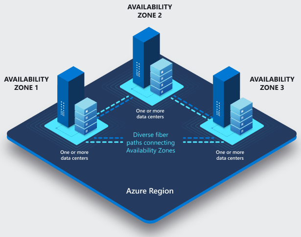
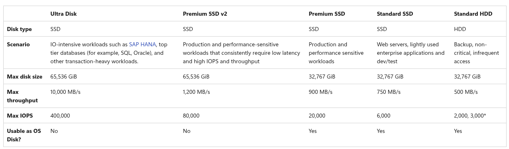
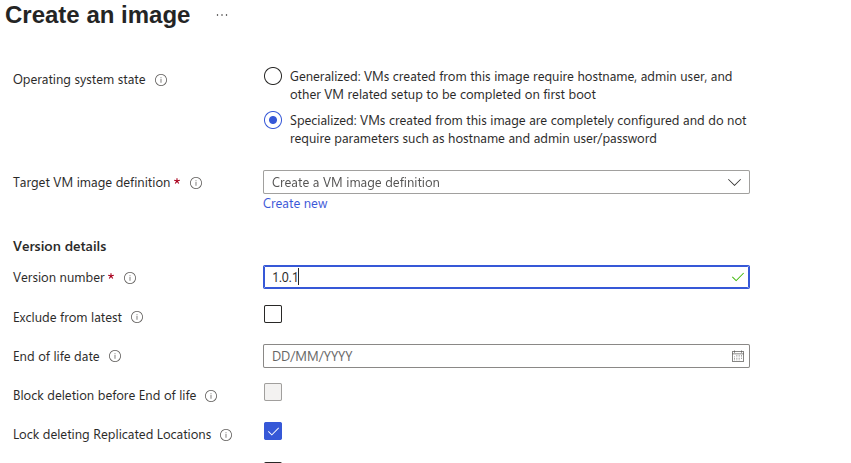
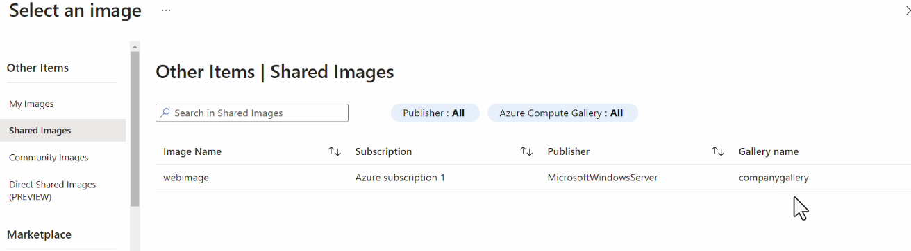
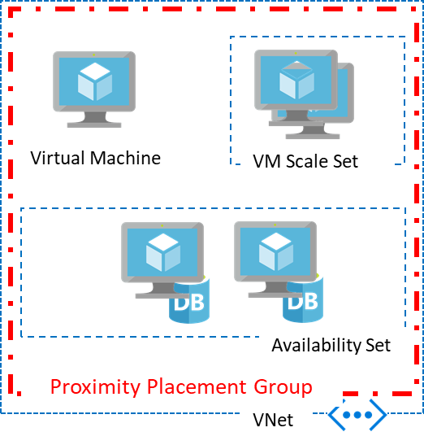

# We will learn about Deploy and manage the Azurer compute resource

# Azure Region, Single availability and availability zones.



## Azure Regions
- Regions are located across many different geographies. 
- Each geography represents a data residency boundary, for example the United States, or Europe, and may contain one or more regions. 
- Each region is a set of physical facilities that include datacenters and networking infrastructure.

## Availabilty Zones
-  Availability zones are independent sets of datacenters that contain isolated power, cooling, and network connections. 
- Availability zones are physically located close enough together to provide a low-latency network, but far enough apart to provide fault isolation from such things as storms and isolated power outages. 

## Azure VM Size for diff purposes.
[VM_Size](https://azure.microsoft.com/en-us/pricing/details/virtual-machines/series/)

| **Series**      | **What it has (CPU vs Memory vs Storage)**    | **Real-World Use Cases**                                                    |
| --------------- | --------------------------------------------- | --------------------------------------------------------------------------- |
| **B-series**    | Low CPU & RAM, bursts only when needed        | Dev/test, small websites, low-traffic apps                                  |
| **D-series**    | Balanced CPU + Memory + Disk                  | Enterprise apps, small/medium databases, web servers                        |
| **F-series**    | **More CPU**, less memory                     | Batch processing, game servers, API servers, apps needing fast calculations |
| **E-series**    | **More Memory**, balanced CPU                 | SQL databases, in-memory caching, analytics apps                            |
| **M-series**    | **Very High Memory** (hundreds of GBs to TBs) | SAP HANA, large DBs, big analytics workloads                                |
| **Lsv2-series** | High CPU + fast **local SSD storage**         | Big data, NoSQL DBs (Cassandra, MongoDB), heavy disk IOPS apps              |
| **N-series**    | GPU + normal CPU/Memory                       | AI/ML training, graphics rendering, CAD, video encoding                     |
| **H-series**    | Very High CPU, HPC tuned                      | Weather modeling, scientific computing, engineering simulations             |


# Azure Managed Disk for VM.
- These are block-level storage volumes that are managed by azure.
- These disks are highly available and durable.
- you can create and attach this disk to a VM during provision and after provision of VM.

## Disk Roles:

  **1. OS Disk**

- Every VM is comes with OS Disk while creating VM.
- This will have installed OS on it.
- Store OS-level logs and configurations.
- Stores the OS and system files.

  **2. Data Disk**

- Store user/application data.
- useful for stores large size data for Databases, app data, custom services.
- Use Premium SSD/Ultra disk for performance (e.g., SQL)

  **3. Temporary Disk**

- Bydefault the VM will get the temporary disk. It is based on VM Sizes.
- Any data is stored into this Tmp Disk will be lost during stop, restart , disaster/maintenance event and Reployed the VM.

    ## 👉 In short:

    | Disk Roles | Use Cases |
    | --------- | --------------------------------- |
    | OS Disk | for running the VM (system + boot) |
    | Data Disk | for your workloads and persistent app/user data.|

# Azure Disk Types:



- You can add data disk druing and after provision of VM.

    ## 👉 Best Recommendation for attach disk:

  **1. First stope the vm which has attached the data disk.**

  **2. Detach the data disk from that VM.**

```bash
az vm disk detach --resource-group MyRG --vm-name MyVM --name myDataDisk
```

  3. **Attach this data disk to Targeted VM.**

```bash
az vm disk attach --resource-group MyRG --vm-name TargetVM --name myDataDisk
```

# Azure Disk - Server-side Encryptions

- The data is stored in the azure disk.
- when you want to read the data the data will be decrypted and when you want to store or make data to disk, the encryption will done by using encryption keys and algorithm.
- so when a malicious users want to get the data, they would need the key and alogrithm to decrypt the data.

- you can use either **Platform managed keys** or **Custom managed keys** that will be managed by the user itself.

- you have to use Azure key vault to store the encryption keys as customer-managed keys.


## Disk Encryption Sets
**why we required use of data encryption sets ?**

- Data Encryption sets is required when you want to Centrally manage Encryption for Disk using Customer-Managed keys with **Full control, flexibility * Policy enforcement across multiple resources**.

- You have to define your key vault and encryption key into Disk Encryption Sets

**Scope:**

- VM OS/Data disks doesn't supports direct customer-managed keys links.
- you must use a data encryption set to associate a CMK with a Disk.
- Once defined key source as key vault, you can reuse it across multiple disks or VM.

**Without Customer Managed Key**
---

- Encrypts your VM Disks by Server Side.
- But key is stored & Controlled by azure.
- You can't see, rotate  or revoke key.
- You can't stop access if you suspect data risk.

**With CMK + Data Encryption Sets**
---

- You can hold/keep the key in key vault.
- Full Visible of key.
- Can rotate the key.
- Can disable / delete the key to instantly block the acces to disk.

# Way for Pre-Deployment in VM during Provision of VM ?

There are 2 ways
  1. Cloud init

```yml
#cloud-config
package_update: true
packages:
  - nginx
```

  2. Custome script extensions.

- you have to use SA where your nginx.sh file is stored in container/blob.

# What is VM Image ?

- Taking the snapshot of VM is called VM Image.
- There are 2 types of image

  1. Specialized Image
  2. Generalized VM Image

## How to create Image ?

- Chooswe VM , click on Create Image.



- You can select Specialized or Generalized Image.
- Give the Versin number for Image.

- After created this image , you can deploy a new VM with Same Configuration and data. You will not requires the reinstall the weapp etc.
- Choose img during provisions.



- Go to Shared image. here you will found your created image.
- This image will stored in azure compute gallery.

# Way for Post-deployment in VM during Provision of VM ?

There is 2 way for Post-deployment

1. Custom-Script-Extension 

- You can deploy your applications or required pkg usig custom script extensions.
- SA required to store the script file

2. Run Commands

- RDP/SSH is not required to run script.
- SA is not required.
- Working as same as custom script extensions.

Proximity Placement Group
---

- To get VMs as close as possible, achieving the lowest possible latency, you should deploy them within a proximity placement group.

- A proximity placement group is a logical grouping used to make sure that Azure compute resources are physically located close to each other. 
- Proximity placement groups are useful for workloads where low latency is a requirement.

- Low latency between stand-alone VMs.
- Low Latency between VMs in a single availability set or a virtual machine scale set.
- Low latency between stand-alone VMs, VMs in multiple Availability Sets, or multiple scale sets.



- For the lowest latency, **use proximity placement groups together with accelerated networking**. 

