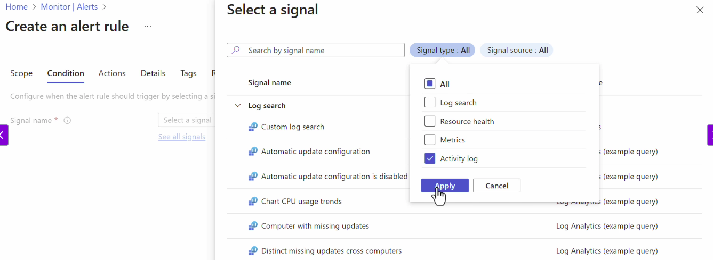
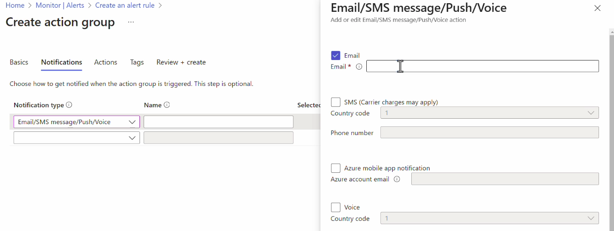
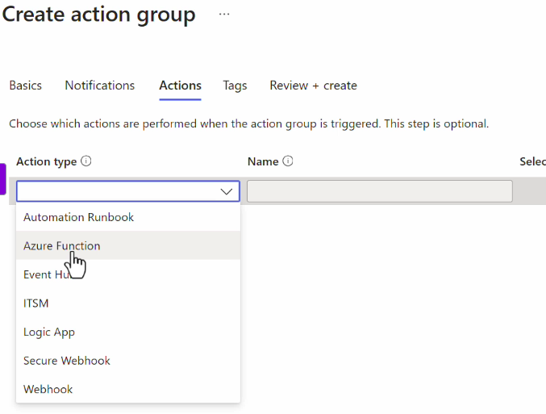
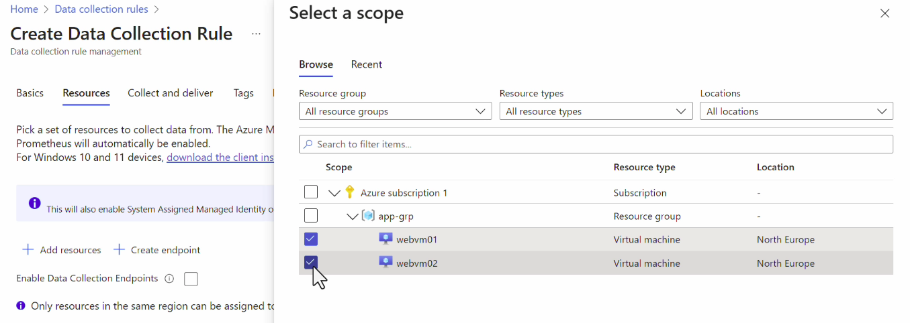
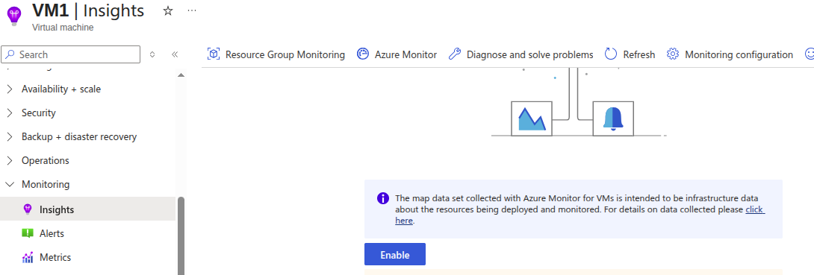
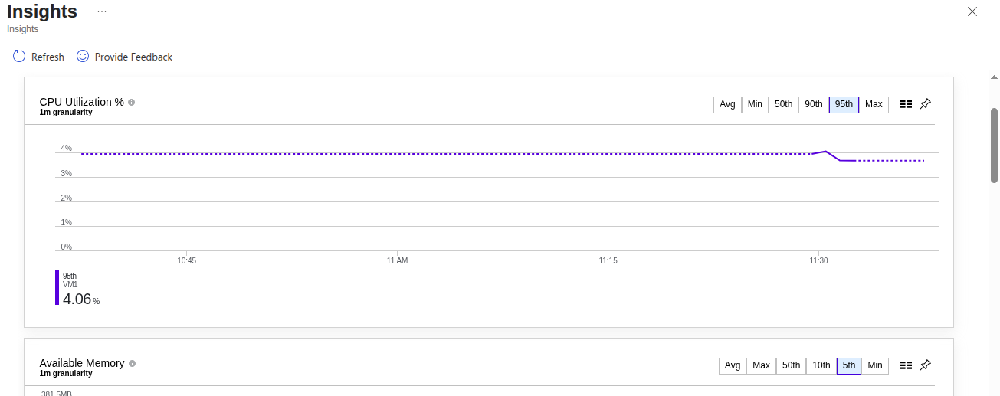
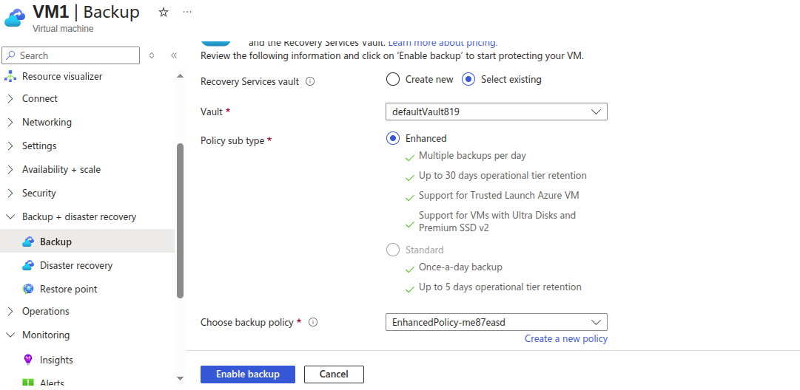
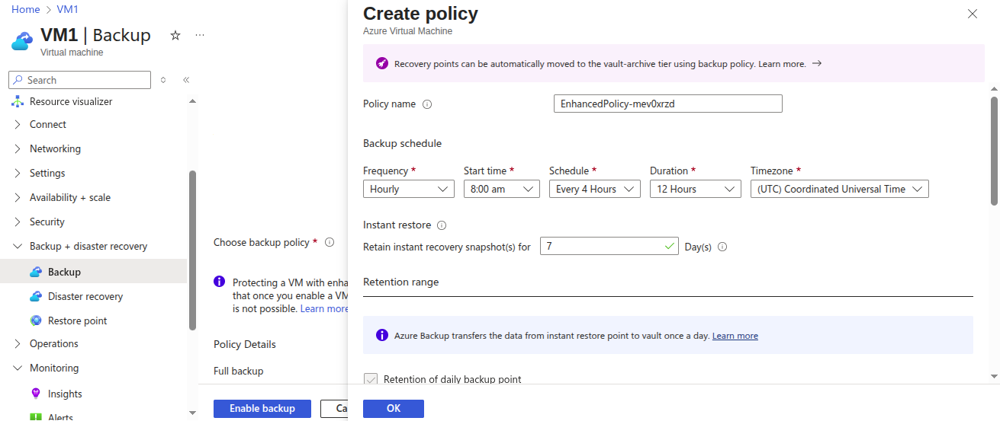
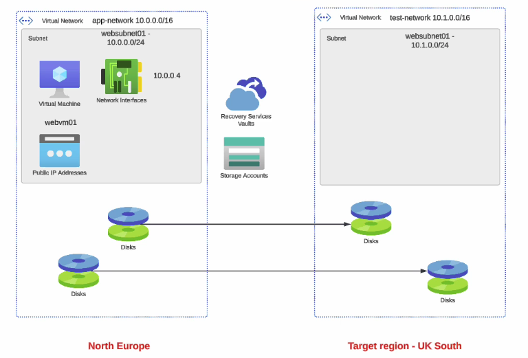

# Azure Monitor
- This service allows you to collect data for your azure resources and your on-premises resouces as well.

- You can analyze the data.

- You can look at the metrics collected for variouse resources.
- you can get insights when it comes to resurces such as virutal machines
- alerts can be genereated if metrics for resources got beyond a particular threshold.
- you can also collect the applications logs.
- you can get reports and even visualize the data.

Create Alert
---

Go to Azure Monitor > Alerts > Create Alert Rule

Selece Scope for resource like sub level, RG Level or Resource level. I will select VM1.

Condition - You can create alert for various signal like Percentage CPU, Available Memory Bytes ( Metics level ) and also select at Activity Log.

Set the CPU Percentage Threshold

- You have to create Action Group for what to do while alert triggered.
- Choose Notification types - Email/SMS/Push notifications/Voice call.

- Put your email for email notifications, put your mobile number for Voice Call or SMS notifications.

- If you are using Azure App notification in your mobile you can choose Push notifications.

- Go to Actions - Here you can choose what to do within azure resouce while alert triggerd like it should be if VM CPU reaches above 80% then Azure Function should run to Restart the VM.

Supressing the Alerts
---

While you have pre-planned maintenance, Upgradations plans, at that time your app, services will may down and cause outage for that you already created alert.

But during upgradation time you don't want to receive alert, you can do it by **Suppression alert**.

Log analytics workspace
---

This will stores all your resources, applications data, metrics, logs etc as central place.

To received the resources logs, metrics etc to this Log analytics workspace, you have to create **Data collectin rule** where you can define source as your various azure resouces and dest as **Log analytics workspace**.

Azure VM Insights
---

Azure monitor - Helps to monitor the performance and health of VM.

Identify Issues - You can identify performance and network issues based on the data collected.

Support - Works for Azure VM, VMSS, On-premises VM.

Data - Data collected is stored in azure monitor logs.

VM Insightes will create its own new data collection rule.

- Go to VM > Monitoring > Insights > Enable it

- You will see VM Metrics like CPU, Memory , Disk space available etc dashboard.

Azure Backup
---

You can backup for your VMs & its Managed disks, Azure Fileshares and also for your **On-premises back up** files, folders, system state by using / installing **Microsoft Azure Recovery Service (MARS)** agent to protect on-premises VMs (**Hyper-V and VMware** and other on-premises workloads)

## Azure VM Backup

- Backup for VM will be stored into **Azure Recovery Service Vault**.

- During backup process, a snapshot is taken and store on VM itself.

For a Windows VM, an app-consistent snapshot is taken. You can perform quick restore.

**`For Azure VM Backup, The VM and Recovery service vault should be in same regions`**.

- Create Recovery Service Vault in same regions of VM.

- Go to VM > Backup + Disaster recovery > backup > choose Recovery service valut and backup policy type.

- you can create your policy for how many interval of time you want to take multiple snapshot of vm.

- Here, you can see the bydefault the snapshot will reatins within 7 days.
- You can change it to 1 days.

**`- Default is 7 days, Max is 17 days and Min is 1 days retain of snapshot.`**

Feature of VM Backup
---

While hou accidently delete a file in a VM you can recover it by fjle recovery without restore the VM from Snapshot or backup.

- Choose recvoery point from recovery service vault.
- azure will create a script fromVM & run this script to your vm.
- It will mount the backup as a local drive.\

- You can open the mounted drive and copy that file which is deleted.
- unmount disk.

Restore VM from Backup
---

You can restore VM from taken backup of VM.

This time you will requires a storage account. bcz, while restoring process, the VM's backup of OS/Disk data or file is stored to VM itslef.

So, It will requires a temporary storage account to store this data temporary during restore whole VM or restores disks.

Take backup for on-premise server & bring backup to azure recovery vault
---

1. Install MARS Agent to on-premise server.
2. Register with a recovery service vault.

  - Download vault creds from recovery service vault and use them to register agents.
  - This creates a TRUST LINK between Azure vault ad On-prem server.
3. Encrypt data locally.
4. Restorings.

Web App Backup
---

**`Backup and restores option is only supported in Basic or Higher Plans`**

## Backup Reports
- Create audits for "Backup and restores".
- All of log data for Recovery service vault will be sent to a "Log analytics workspace".

- Doesn't required for same regions for **Recovery service vault & Log analytics workspace**.

- It may be a diff regions.

- To sent the all logs of the backup & restores to recovery service vaults, you will requires to enable **Diagnostic Settings** for service vault.

Azure Site Recovery for backup of worksloads.
---

Azure Site Recovery is used to replicate workload that run on physical and VM

Ex. You have an apps running into VMs in one regions.
If VM will goes down, then the application is no longer available.

With Azure Backup, it takes time to perform a restore.
It could take hours to get the infrasturcture back in place.

The Backup are taken at specific point in time. so you will not lost the data till the recent time.

Azure Site Recovery helps to mitigate such as replicating the data from one regions to another regions to continuously.

So if Primary Regions is goes down, you have your setup of infrastructure is running in another regions with latest data.

It means, It is replicating the real time data from primary to secondary regions.

**Zero Downtime** - by azure site recovery

## Understood by diagram

All data like VM data, Disks data are replicating to anoter regions with same infrastructure with real time.

- Azure storage account is used as cache storage.
- During the replication process , the VM changes are first stored in the cahce storage before they are sent to the target storage.

- This will done by choosing **Disaster Recvoery** in VM > Backup.

