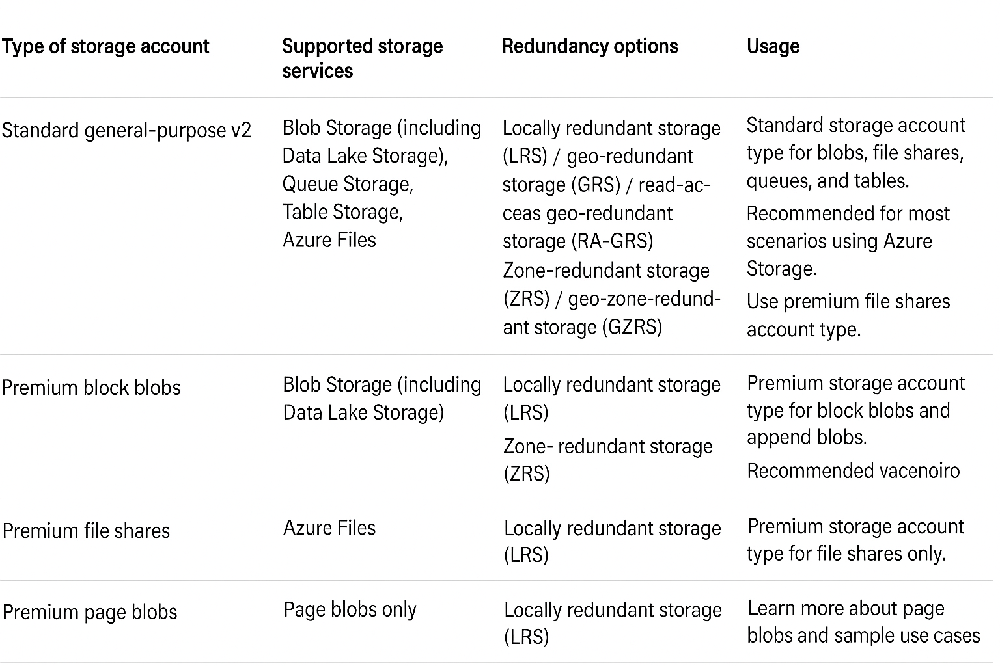
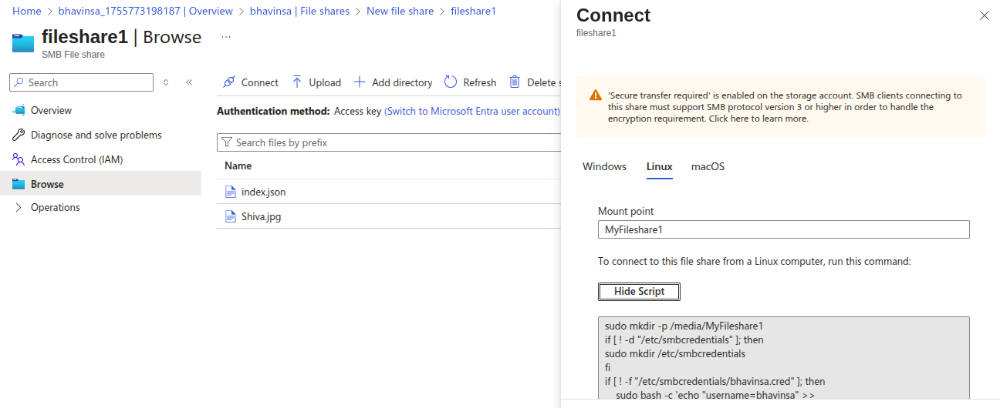
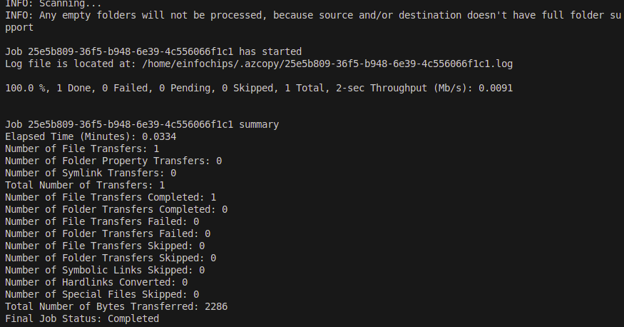
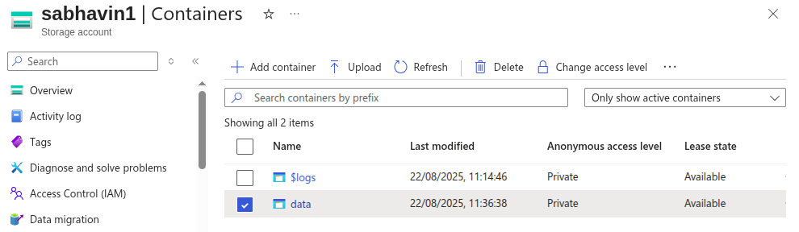
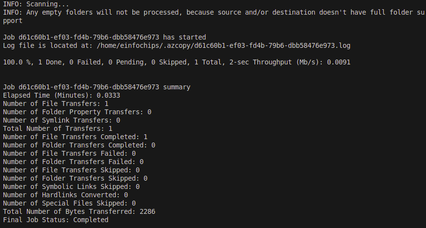
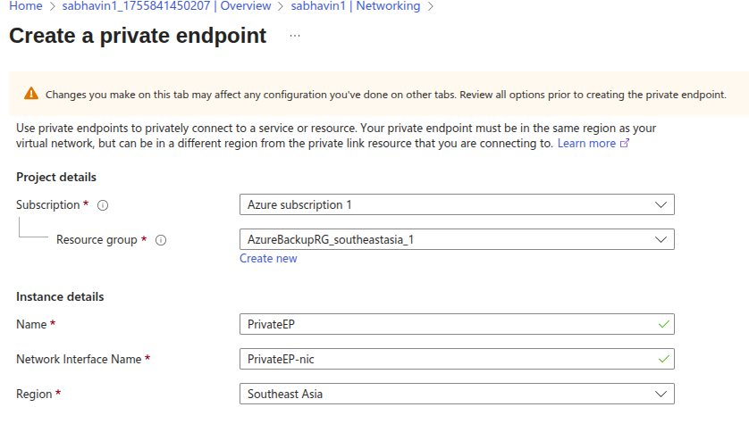
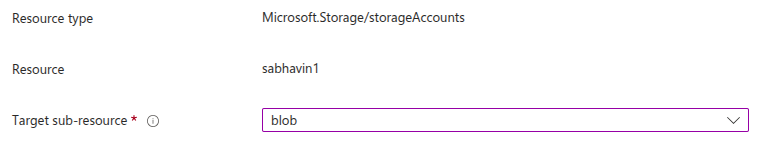
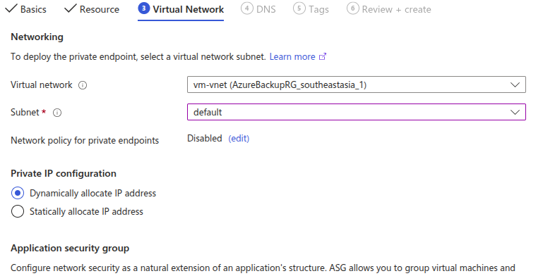
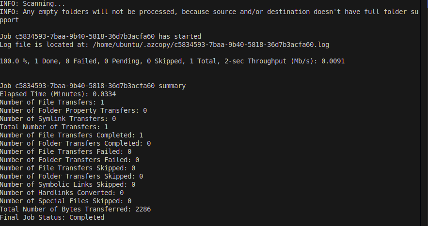
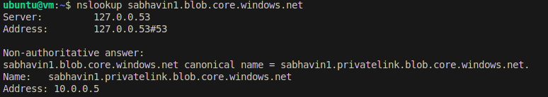

# Here will will learn about AZ-104 azure services like storage account, Virtual Networking, VM, Log analytics workspace etc.

# 1. Storage Accounts

This is storage on azure cloud for store your blobs, files, queues and tables.


- Azure storage account types



# How to access blob on browser

## 1. Enable anonymous access on blob level and from configurations at storage account level.

This is **not recommended for productions** env.

  **1. Enabled from configuretions**


  **2. Enable at blob level by selecting change access level > blob**


  **3. Paste blob URL on browser**


# 2. Use SAS at container or blob Level , keep Container priate.
- Here, you can disable anonymous at sa and container level to keep your sa private.
- you can still access your blob using SAS URL.

**2.1 Choose blob and select Generate SAS.**


**2.2 give time range to access any anonymous user.**


**2.3 here you can also provide your pc or org level ip address to access privatly.**

**2.4 Click on Generate URL and copy SAS URL for that blob and paste on browser.**


#### You can also create SAS URL at Container level and Storage Account Level with same above steps.

### `Now, How to make more secure this blob/container While this SAS URL is goes to wrong hands ?`
### What should we do ?

## Here, the Stored Access Policy is comes

# 3. Storage Access Policy
- Storage Access Policy is and extra security layer on SAS URL to protect at real-time SAS Protections while it goes to wrong hand.
- you can restrict SAS Permission without recreate SAS by Deleting this Access Policy or Edit Time range.
- While you delete this access policy the anonymous user can't access your blobs.

- How it works Access Policy with SAS  ?

## 3.1 Choose container/blob > Access Poliy

## 3.2 Give Read and List permissions and time range.


## 3.3 Create SAS at container/blob level and attach this Access Policy.


## 3.3 check on browser


## 3.4 After delete this access policy.
- It will give error


# 3.1.1 Storage Immutable blob access policy
`1. Legal hold`

- Use while do investigetions for audit purpose. Legal hold will hold your blobs for unknown time.
- when the investigation is complete then you can release the legal hold by just removing the tags.

`2. Time-based retentions`

- You know how much time will take by investigations like min 1 days.
- you can set period for least 1 days.
- after 1 days it will auto remove.

`You can create new blobs & reads only for both the legal hold and Time-based retentions.`

# Storage Tier

`Hot`  
  - Immediatly access the blob - Costly 0.15$/GB.

`Cool0`
  - For frequently access blob will store to cool tier 
  - Object need to stored for a `min 30 days`.

`Cold` 
  - Object will rerely accessed or modified. you can access a& retrive them.
  - Object need to stored for `min 90 days`.

`Archive`
  - Object will no longer required for next 6 month or 1 year / rrely access.
  - You can't download / access the object immediatly.
  - It may take too much time based on object size.
  - You have to go to **Dehydrazaion process** by chang the tier from Archive to Cold/Cool/Hot.
  - Object stores for `min 180 days`.


# LifeCycle Management.
- This feature will helps you to cost optimize by the transition into Hot to Cool to Cold to Archive itself by setting Lifecycle Rule.

- You can set rule for,

  1. All object within Storage Account.
  2. Specific containers blobs by Limit the blobs with filters. Ex. blob prefix - "mycontainer/blob_name"


# Object Replications

- Object will replicated aynchronously between a Source (Primary SA) to Dest (Seconday SA).
- You create a replication policy to replicate the objects.

- Storage accounts should support.

    - General Purpose V2 or Premium block blob SA Types.

- Some Configurations should be enabled for Object Replicatoins as below

    - Source and Dest SA Should enabled - Blob versionning.
    - Source SA should enabled - Change feed.

- Bydefault while you configure the object replication rules, the bydefault option for repliacate the blob to dest storage accouunt is choosed is, **Newer blob**.

- So, **your existing blob will not be repliacated to Dest SA.**
- Only newly created blobs will be replicated.

- To repilcate thos existing blobs to dest SA, you have to copy that blob manually via **AzCopy**.
- After update it, it will get sync and newer blobs will be replicate to Dest SA.

```bash
azcopy copy "https://<sourceaccount>.blob.core.windows.net/<container>/*?<SAS-token>" \
"https://<destaccount>.blob.core.windows.net/<container>?<SAS-token>" \
--recursive=true
```


# Azure Fileshare
- It is Storage service for files will be shared between VMs.

- You have uploded files to your azure fileshare and want to mount it on your vm or local.
- Click on connect - it will generate a .sh scirpt which you have to run on your vm or local.



- Copy this script to vm or local.


# Copy/Transfer the data to cloud

## 1. AzCopy

- while you want to copy/transfer data to cloud.
Common use cases include:

  - Copying data from an on-premises source to an Azure storage account
  - Copying data from an Azure storage account to an on-premises source
  - Copying data from one storage account to another storage account


- To copy blob to cloud you will required SAS URL
- The least SAS Permission will be like this - Container & Object, Create and Blob.
- Without Object - your PUT request for copy blob from local to cloud will now allowed.

```bash
azcopy copy "file_path" "blob_sas_url"
```

**OutPut:**




- To create container
```bash
azcopy make "file_path" "blob_sas_url"
```
**OutPut:**



- To download the blob
```bash
azcopy copy 'https://<storage-account-name>.<blob or dfs>.core.windows.net/<container-name>/<blob-path>' '<local-file-path>'

# The least SAS Permissios for only for download the blob, Read and list and resource type must be container and object.
```

**OutPut:**




## 2. Data Box like AWS SnowBall
- While want to Transfer data like above 40 GB.
- No Internat required to connections to data box.
- Make a request from azure portal search for **Azure Data Box** and fill the required details.

# Private EndPoint

- To make private communications between azure resources by using resource's private ip only.

- Create private ip 



- choose target-sub-resource as blob



- Choose Vnets and subnet.



- Now, ssh to vm and try to download .json file from Storage Account.
```bash
azcopy copy "https:<storage-account-name>.blob.core.windows.net/<container-name>?<SAS_URL>
```

**OutPut:**



- You can confirm that you are configured correctly the Priavt EndPoint by, if you try to connect to your storage account from the vm inside.
- It should give the private ip of Private EndPoint from Private EndPoint's NIC.
```bash
nslookup <storage-account-name>.blob.core.windows.net
```

**OutPut**:




