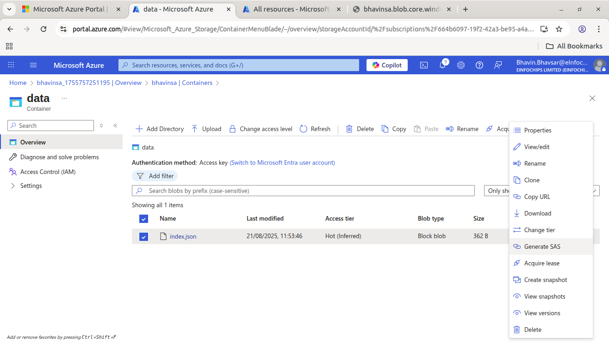

# Here will will learn about AZ-104 azure services like storage account, Virtual Networking, VM, Log analytics workspace etc.

# 1. Storage Accounts

This is storage on azure cloud for store your blobs, files, queues and tables.

- Azure storage account types

# How to access blob on browser

## 1. Enable anonymous access on blob level and from configurations at storage account level.**

This is **not recommended for productions** env.

  **1. Enabled from configuretions**

  **2. Enable at blob level by selecting change access level > blob**

  **3. Paste blob URL on browser**

# 2. Use SAS at container or blob Level , keep Container priate.
- Here, you can disable anonymous at sa and container level to keep your sa private.
- you can still access your blob using SAS URL.

**2.1 Choose blob and select Generate SAS.**

**2.2 give time range to access any anonymous user.**

**2.3 here you can also provide your pc or org level ip address to access privatly.**

**2.4 Click on Generate URL and copy SAS URL for that blob and paste on browser.**

#### You can also create SAS URL at Container level and Storage Account Level with same above steps.

### `Now, How to make more secure this blob/container While this SAS URL is goes to wrong hands ?`
### What should we do ?

## Here, the Stored Access Policy is comes

# 3. Storage Access Policy
- Storage Access Policy is and extra security layer on SAS URL to protect at real-time SAS Protections while it goes to wrong hand.
- you can restrict SAS Permission without recreate SAS by Deleting this Access Policy or Edit Time range.
- While you delete this access policy the anonymous user can't access your blobs.

- How it works Access Policy with SAS  ?

## 3.1 Choose container/blob > Access Poliy

## 3.2 Give Read and List permissions and time range.

## 3.3 Create SAS at container/blob level and attach this Access Policy.

## 3.3 check on browser

## 3.4 After delete this access policy.
- It will give error

