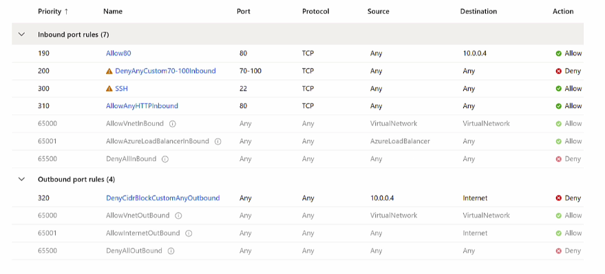
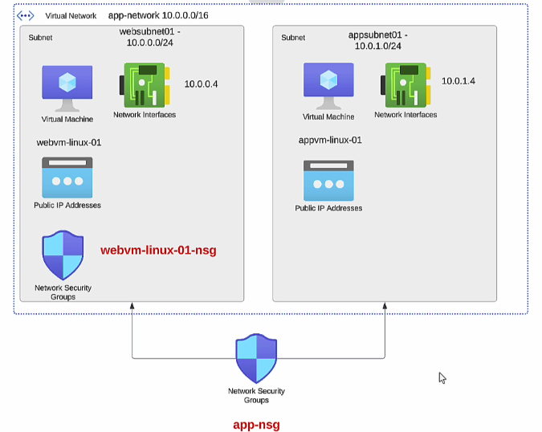
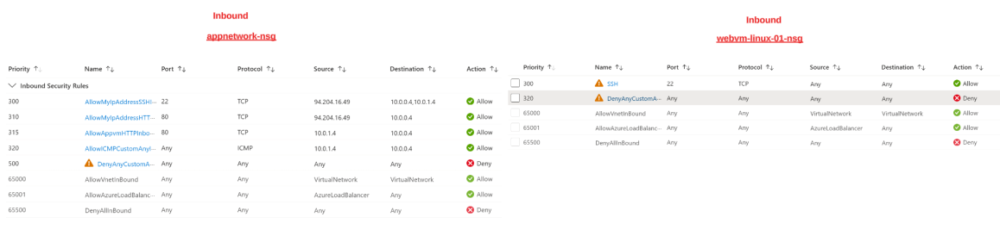
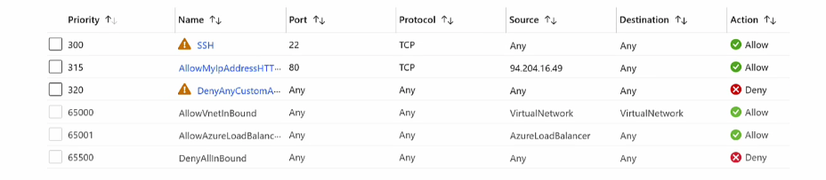

# How the deny rule will affect in NSG ?

- Let look into the belwo NSG Rule

**For Inbound**
- HTTP, SSH is allowed and Deny from 70 - 100 port from anywhere.

**For OutBound**
- Deny from any protocol to dest of VM Private IP 10.0.0.4
- If nginx is installed on VM, Will it visible ?
**Yes** How ?

- While Inbound rule for HTTP is allowed so automatically OutBound Rule will also allowed.

- But Not allowed for VM itself if the VM is sending request (OutBound) to internet to install any of pkg from internet.
- Try to update your software repository, it will not update.

Attach NSG at Subnet Level
---

- This is use while you have same inbound and outbound rule for multiple VMs.
- You can use either Application security group or Attach NSG at Subnet Level.
- Firstly, The Inbound/Outbound rule is varified from Subnet level then it varify at VM NIC Level.

- 

- App NSG is attached to Subnet level.

- Webapp NSG is attached to VM NIC.

- so first, Subnet level inbond will be varify then it comes to VM NIC level and will be varify.

- Look for inbound rule for Subnet level and VM Level as below

- 

- In WebApp NSG the HTTP 80 is not defined. and HTTP 80 is defined in the AppNetwork NSG at subnet level.
- So, Traffic for HTTP request will be denied from VM NIC.
- To allow traffic for HTTP request you have to add HTTP Rule to VM NSG.

