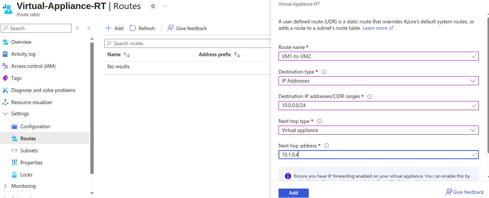

# How the deny rule will affect in NSG ?

- Let look into the belwo NSG Rule


**For Inbound**
- HTTP, SSH is allowed and Deny from 70 - 100 port from anywhere.

**For OutBound**
- Deny from any protocol to dest of VM Private IP 10.0.0.4
- If nginx is installed on VM, Will it visible ?
**Yes** How ?

- While Inbound rule for HTTP is allowed so automatically OutBound Rule will also allowed.

- But Not allowed for VM itself if the VM is sending request (OutBound) to internet to install any of pkg from internet.
- Try to update your software repository, it will not update.


Attach NSG at Subnet Level
---

- This is use while you have same inbound and outbound rule for multiple VMs.
- You can use either Application security group or Attach NSG at Subnet Level.
- Firstly, The Inbound/Outbound rule is varified from Subnet level then it varify at VM NIC Level.

- 

- App NSG is attached to Subnet level.

- Webapp NSG is attached to VM NIC.

- so first, Subnet level inbond will be varify then it comes to VM NIC level and will be varify.

- Look for inbound rule for Subnet level and VM Level as below

- 

- In WebApp NSG the HTTP 80 is not defined. and HTTP 80 is defined in the AppNetwork NSG at subnet level.
- So, Traffic for HTTP request will be denied from VM NIC.
- To allow traffic for HTTP request you have to add HTTP Rule to VM NSG.


Application Security Group
---

- You have multiple Vm and have a same Inbound and Outbound rule in NSG or for specific port request you want to inbound in all VM, you can use ASG.

- create ASG.


- Attache this ASG to VM1 and VM2.


- Instead of give the VMs Private IP as dest, use ASG for Dest.


**The rule means:**

- Traffic from your IP → allowed to port 80 of any NIC that belongs to ASG1.

- Since VM1’s NIC is in ASG1 → rule applies to VM1.

- So yes, you can access Nginx on VM1 via port 80


- It looks up which NICs are in ASG1 (VM1’s NIC in your case).

- Then it expands the rule to mean: **“Allow traffic from your IP → VM1’s private IP (because NIC is in ASG1) on port 80.”**

Azure Bastion Hosts
---

It is provides secure communications to VMs without the need of Public IP Address.

You can establish RDP and SSH to VMs from Azure Portal.

You will required the Public IP address for **Azure Bastion Hosts** not for VMs.


**Different SKUs for Azure Bastions service**


- you need a empty subnet for this bastion service.
- in this empty subnet, the bastion will deploy their VMs which will use to connect your VMs in your network privatly via Private IP.

- so you will establish a secure connenction from azure portal on to your bastion's public ip and azure bastions will manage connections internally or privately to your VMs.


- The minimam size of AzureBastionEmptySubnet should /24.
- We have to DisAssociate the public ip of all VM.
- after DisAssociate the Public IP of VM we will not be able to reach that VM via Internet.

- Go to VM1 > Connect > Bastions > Give VMs Credentials > click on Connect


- you can connect all vm which are part of that Vnet where the bastions is deployed via bastions service 
- you can't connect to another Vnets VM via bastions without Vnet Peering.
- you have to ensure you had enable Vnet Peering to establish the connection from Bastion Subnet Vnet to Another vnet VM.

**NOTE** - `To make SSH connection via bastions using AZ CLI, you must have to Std or Premium SKUs. Basic SKU supports only from Azure portal.`

User defined routes
---

You want to transfer the pkg1 from sub1 VM1 to sub2 VM2.
How they are trasfering the pkg between subents and its VMs ?
Bydefault there is **Systems Routes** in place which ensure the traffics is routed correctly across the subnets in the Vnets.

But What if your company have a VM hosting a virtual appliance - FireWall and all traffics/pkgs have to be routed through this Virtual Appliance ?

You can define your own routes by **user-defined routes** which will ensure all traffics will routed through this Virtual Appliance.

- Created 2 VM in diff subnet.
- To route the traffic through Appliance, you have to create route table.


- Create a new route and mentions the destinations as Dest VMs Subnet CIDR.
- Choose next hope type is Virtual Appliance and its Private IP.



- Associate this RT to VM1 Subnet due to VM1 want to Route Traffic to VM2.
- Try to ssh from Bastion Host VM to Dest VM VM2.
- It will not connected bcz, The central vm (Virtual Appliance) need to have capability of taking the pkg and forward to next hop dest is VM2.
- For that perform the few stpes

  - Enable IP Forwading for Central VM by Settings > IP Configurations.


  - SSH to Central VM via Bastions and Edit /etc/sysctl.conf enalbe IP Forwarding for IP Version for OS Level.


  - Restart the Central VM to reload the system conf changes.

Azure Network Watcher
---

- Azure Network Watcher is a service offering tools to monitor, diagnose, and visualize Azure Infrastructure-as-a-Service (IaaS) networks, helping to troubleshoot connectivity and performance issues. 

- Network Watcher has various feature for Monitoring, Traffic analysis and connectivity troubleshooting as below.


**1. Connection Monitor (Monitoring)**

What it does: Continuously checks if connections between resources (VMs, apps, on-prem) are healthy.

Use Case Example: Your web app in Azure can’t connect to a SQL database — use Connection Monitor to see if there’s packet loss, high latency, or disconnection.

**2. Topology (Monitoring)**

What it does: Visualizes your entire network setup (VNets, subnets, NICs, NSGs, etc.).

Use Case Example: New team member joins and doesn’t understand your network design — use Topology to quickly show how all resources are connected.

**3. NSG Diagnostics (Network Diagnostic Tools)**

What it does: Checks if Network Security Groups (NSGs) are blocking or allowing traffic.

Use Case Example: A VM can’t be reached on port 443 — NSG Diagnostics reveals an inbound rule blocking HTTPS.

**4. Effective Security Rules (Network Diagnostic Tools)**

What it does: Shows combined NSG rules that actually apply to a network interface (after merging subnet + NIC rules).

Use Case Example: You added an allow rule on the subnet but VM is still blocked — Effective Security Rules shows that a NIC rule is overriding it.

**5. VPN Troubleshoot (Network Diagnostic Tools)**

What it does: Diagnoses issues with VPN gateways and connections.

Use Case Example: Your on-prem users can’t connect to Azure via site-to-site VPN — VPN Troubleshoot shows the tunnel is down due to wrong shared key.

**6. Connection Troubleshoot (Network Diagnostic Tools)**

What it does: Tests connectivity between two points (VM to VM, VM to database, etc.).

Use Case Example: VM in subnet A can’t reach VM in subnet B — Connection Troubleshoot shows the packet is dropped by a firewall.

**7. IP Flow Verify (Network Diagnostic Tools)**

What it does: Tests if a packet with a specific source/destination IP and port would be allowed or denied.

Use Case Example: You want to check if a web server can accept inbound traffic on port 80 — IP Flow Verify tells you if NSG allows it.

**8. Packet Capture (Network Diagnostic Tools)**

What it does: Captures packets directly from a VM for deep network analysis.

Use Case Example: Application is running slow — capture packets to see if there are retransmissions or suspicious traffic.

**9. Next Hop (Network Diagnostic Tools)**

What it does: Tells you where traffic will go next (e.g., internet, VPN, virtual appliance).

Use Case Example: Traffic from VM should go to firewall, but it’s going directly to the internet — Next Hop reveals misconfigured routing.

**10. Flow Logs (Traffic)**

What it does: Logs all allowed/denied traffic through an NSG.

Use Case Example: Security team wants to see which IPs are scanning your VM — Flow Logs show repeated denied attempts from suspicious IPs.

**11. Traffic Analytics (Traffic)**

What it does: Uses Flow Logs + Log Analytics to show traffic patterns, hotspots, and threats.

Use Case Example: Company wants to optimize costs by analyzing which regions send the most traffic — Traffic Analytics shows unnecessary cross-region traffic.


Network Watcher feature with table
---

| **Feature**                  | **Group**                | **What it Does**                             | **Real-World Use Case**                                          |
| ---------------------------- | ------------------------ | -------------------------------------------- | ---------------------------------------------------------------- |
| **Connection Monitor**       | Monitoring               | Monitors connection health between resources | Check if web app can reach database (latency/packet loss).       |
| **Topology**                 | Monitoring               | Visualizes network architecture              | Show new team member the full Azure network setup.               |
| **NSG Diagnostics**          | Network Diagnostic Tools | Tests NSG rules                              | VM can’t be reached on HTTPS due to NSG block.                   |
| **Effective Security Rules** | Network Diagnostic Tools | Shows combined NSG rules on NIC/subnet       | Subnet allow rule overridden by NIC deny rule.                   |
| **VPN Troubleshoot**         | Network Diagnostic Tools | Diagnoses VPN gateway issues                 | Site-to-site VPN down due to wrong shared key.                   |
| **Connection Troubleshoot**  | Network Diagnostic Tools | Tests point-to-point connectivity            | VM in subnet A blocked by firewall when reaching VM in subnet B. |
| **IP Flow Verify**           | Network Diagnostic Tools | Tests if traffic is allowed/denied           | Verify if inbound port 80 is open on web server.                 |
| **Packet Capture**           | Network Diagnostic Tools | Captures packets for analysis                | Find retransmissions causing slow app performance.               |
| **Next Hop**                 | Network Diagnostic Tools | Shows where traffic goes next                | Traffic bypassing firewall and going to internet directly.       |
| **Flow Logs**                | Traffic                  | Logs all NSG traffic                         | Detect repeated denied access attempts from hackers.             |
| **Traffic Analytics**        | Traffic                  | Analyzes traffic flow & patterns             | Identify unnecessary cross-region traffic to save costs.         |


Azure Load Balancers
---

| Feature | Std Load Balancer | Application Gateway LB |
| ------- | ----------------- | ---------------------- |
| OSI Layer | Layer 4 (Transport) | Layer 7 (Applications) |
| Protocol | TCP, UDP | HTTP, HTTPS, WebSocket |
| Use Cases | Distributes traffic based on IP/Port | Distributes Traffics based on HTTP/S, URL, Header, Path etc |
| Health Probes | Yes requires | Not required | 
| URL-Based Routing | No | Yes |
| Multi-Site Hosting | No | Yes |
| Seperate Empty subnet required ? | No | Yes |
| Backend Port mapping | Static IP:Port | Listener → Rule → Backend Mappings |
| Auto-Scaling Backend Pools | VMSS | VMSS, App services |
| NAT InBound/OutBound Support | Yes | No |
| Diagnostics | via NSG Flow Logs | Via Access, logs, Performance logs, Firewall logs |

When to use What for Load Balancer ?
---

Load balancing for TCP, RDP, SSH, Custom Port → Std Load Balancer

High-Performance, low latency → Std load balancer

Hosting Multiple website on same IP → Application Gateway LB

Custom header, URL Based Routing → Applicatoin Gateway LB

Need WAF Protections → Applicatoin Gateway LB

NAT Rules
---

**NAT Supports only for Azure Std Load Balancer**

- While your backend pools doesn;t have public IP and want to same install tool in backend pools.

- Required to SSH into Backend but public ip is not associated to backends.

- SSH via LB IP

- Required NAT Inbound rule / Outbound rule

- Backedn port → 80 → Nginx

- Frontend port → Custom port → 4000-4004

```
ssh ubuntu@Lb_IP -p 4000
```

Azure Private DNS Zones
---

- It is managed servde used for Internal Domain name resolutions

- You don't requires to deploy your owns infrastructure to host a domain name mng. system

- You can create a link between Azure Private DNS Zone and the Vnets.

- After enabled DNS Zone Link , you can enabled **Auto-Registrations** for DNS Link.

- While you create new VM as part of this Vnet where DNS Zone is linked, that new VM will be auto-registered in the domains.

- So, Vnet becomes a **Registrations Vnets**

- You can also link a Vnet without Auto-Reg.

- This becomes a **Resolutions Vnets**

What happens after Enable Auto-Registering ?
---

- Will create DNS Records for each VM.

| VM1 | 10.1.0.5 | vm1.internal.contoso.com |
| --- | -------- | ------------------------ |
| VM2 | 10.1.0.0 | vm2.internal.contoso.com |

**Usefull while**,
 
  1. You want to service to service communications within your private network by **using Names**, not IPs.
  2. You can install an app, the DNS is already working.
  3. If already intalled an apps on that VM, DNS will routing traffics using that DNS name.
  4. DNS records is already created, you can use your own domain name.
  5. You don;t required to buy domains, while using **Azure DNS ZZones Servies**.
