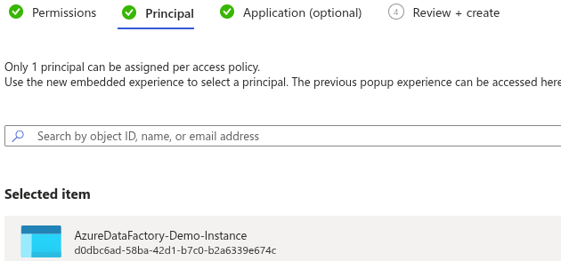

# We will learn about

  - Types of activity within ADF
  - Key concept of copy activity
  - Expressions and Variables and parameter - How they can make pipeline generic and dynamic
  - Pass secrets parameters as runtime - We need to provide login details to our storage resource or SQL DB. This sensitive data should be stored into Azure key vault
  - Importing data - Implement pipeline with loops and metadata activity


# Types of activity

  **1. Data movement activities**

  - Taks to move data fom a Source to Dest/Sink like Copy activity

  **2. Data Transformation activities**

  - External ADF activities like Databrick Notebooks, Azure Functions etc.
  - Mapping data flow activity within ADF.

  **3. Control flow activities**

  - Activities to loop , branching or set variables.

## Activity Dependencies
- Activity is depends on one or more previous activities and dependencies conditions.
- Dependencies conditions like Success, Failure, Completion , Skipped.

- Ex. If pipeline has 2 activity like Activity A and Activity B. In case of success dpendencies , Activity B will runs only if Activity A is Successed.

- Ex. For Error Handling - Activity B will only run while Activity A is failed.

Create pipeline for validating data source
---

- Pipeline for Activity A for Validate data under cleansed > salesdata is exists then execute Activity B Set variables.

- ADF > Drag and Drop Validation Activity

- Choose Dataset for validations


- Execute it


Key Concept of Copy Activity
---

- Ability to inference schema from data source. we didn't required to definde schema of data.

- `Data conversions`

- Debug Mode - Allows to run a pipeline interactively from data factory studio and set breakpoints and view the output of an activity at every stage.

- Data integratino unit - When we works with large amount of data, performance can become a focus point. The power of copy data activity is based on **Data integration unit (DIS)** . This is combinations of CPU, Memory and network usage. If Copy data activity's powe is increase to perform it, we can allocate it by increasing the no. of DIS Available.

  Copy Activity Examples
  ---
    
  ## Derive Schema Inference in Copy data activity

  - For import all schemas from dataset.

  - Choose any pipeline
  - Go to Mappings > Look for Import Schemas
  - You can see all schemas of dataset in preview
  


  - you can changes shhemas types and dest.

  - Increase DIS and Degree of copy parallelism


  - you can increase DIS as per your power required for copy activity based on data size
  - you can also set how many data should copy in parallel. 10 out of 32 ? 20 out of 32.
  - Max data parallel is 32


Expressions and Variables
---

- Make pipeline more flexible and dynamic.
- Instead of hard coding value like Accesskey, filepath, we can use expressions to detemint them at runtime.

**Variables** - Are properties that can be set and modified during a pipeline runs.

- Expressions can be specified for a variables.

- Variables can defined at pipeline level to access all activities in the pipelines.

## - Example: Add function for give current utc time as value of variable VarTest1

- Choose any of activity like set variable and move your mouse to value in settings
- Here, you will see **Add dynamic content**


- Go to Functions > Data functions > utcNow - Will give current time


- OutPut:
 ```bash
{
	"name": "VarTest1",
	"value": "2025-08-29T17:24:15.1423461Z"
}
```

**Parameters**


## Runtime Parameter - Ask you to enter value during runtime.

- Create parameter by click anywhere in activity 
- Go to Parameter and create. Leave for its value.


- Choose activity and go to Parameter.
- Here you will see your created parameter.


- click on it.

- This will ask to enter the params value while you run it.


- OutPut
```bash
{
	"name": "VarTest1",
	"value": "Parameter 1"
}
```

## Global Parameter - Use and sharable to all pipeline.

- Go to Manage > Global parameters


- Set global parameters 


- Go to variables > set function concate and pass global and runtime parameter.


**`OutPut`**


Importing Data using secrete via Azure Key Vault
---

- Create key vault
- Create secrets


- Create Key vault access policy for retrive secrets by read and list permissions.


- Choose principle as your ADF Name.



- we give the access of key vault to ou ADF via access policy permissions of read and list

- To connect our ADF to Key vault we need to create link service within ADF

- Go to manage > create > Linked service 


- Now Edit new-connection for storage account we already created.
- Edit new-connection for SA for switch from storage account to key vault for access the storage key from secrets from key vault.


Excercise
---

`Create Pipeline for copy Verde JSON file from raw to cleansed container and transform to CSV formate.`

`Use ForEach and the metadata acitivity`

`Use Parameter and Azure key vault to provide access key of SA using secrets`

  ### 1. Get all files

  - Use Get Metadata activity on your Raw container folder.

  - Configure it with Child Items.

- Output

```json
  "childItems": [
  { "name": "verde1.json", "type": "File" },
  { "name": "verde2.json", "type": "File" }
]
```

- Create new pipeline and drag & drop activity named **Get Metadata**

- Rename it to Get File List

- Go to Settings > New > Choose Gen2 > JSON

- Browse the path for Varde Json files from raw container as source.


  ### 2. Use ForEach Activity drag and drop it

  - Add Activity **GetFiles ChileItems** in settings of ForEach Activity

  

  - Give Source and Dest/Sink browse path.

  ### 3. Pass filename to dataset dynamically

  - Go to Parameter and Create Source parameter name**filename** and type **string** value leave.

  - Use this parameter in dataset connections
  
  - Go to Connections and look into File path for **Add dynamic content**

  

  - Choose parameter **filename**

  ### 4. Pass the value from ForEach to dataset

  - Click the Source dataset → FileName parameter → Dynamic content:

```yaml
@item().name

# That means

# On first loop → FileName = "verde1.json"
# On second loop → FileName = "verde2.json"
```

  ### 5. Dynamic Output filename

```yaml

# strips .json and append .csv
@concat(substring(item().name, 0, sub(length(item().name),5)), '.csv')
```

**OutPut for GetFileList Activiry**


- This will work as input for ForEach activity
