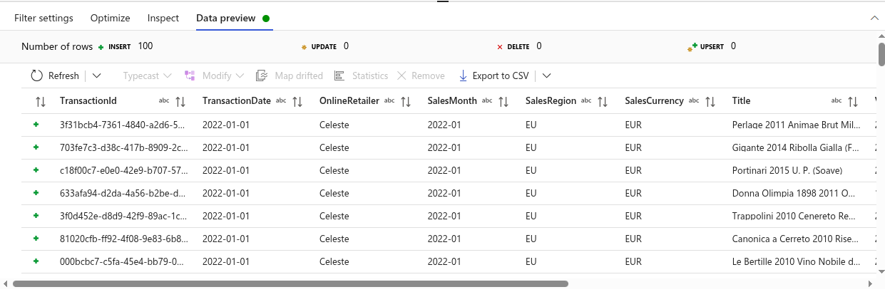

# Azure Data Factory - Copy Activity vs Data Flow Transformations

## 📌 Overview
This README explains the difference between:
- **Copy Activity (Pipeline)**  
- **Mapping Data Flow (Transformations)**  

We use the example of copying **JSON files** from the **Raw container** to the **Cleansed container** and converting them into **CSV format**.

---

## 🚀 1. Copy Activity (Simple Pipeline)

- **Purpose:** Move data from Source → Destination.  
- **Supported Features:**
  - File format conversion (e.g., JSON → CSV, Parquet → Delta).
  - Simple schema mapping.
- **Best For:** Quick data movement without complex logic.

### Example Flow:
1. **Get Metadata Activity** → List JSON files in Raw container.  
2. **ForEach Activity** → Iterate over file list.  
3. **Copy Activity** → Copy each JSON file to Cleansed container in CSV format.  

👉 **What happens?**  
- File is copied as-is, only the format changes from `.json` → `.csv`.

---

## 🔧 2. Mapping Data Flow (Transformations)

- **Purpose:** Perform **complex ETL transformations**.  
- **Runs On:** Azure-managed **Spark clusters**.  
- **Supported Features:**
  - Filter rows
  - Derived columns (calculate new fields)
  - Joins (combine data from multiple sources)
  - Aggregations
  - Conditional split
  - Data cleansing (remove nulls, rename, reformat)

### Example Flow:
1. **Data Flow Source:** Read JSON files from Raw container.  
2. **Transformations:**  
   - Filter out empty records.  
   - Convert date fields into standard format.  
   - Join with Product lookup table.  
   - Keep only records with `Status = "Completed"`.  
3. **Data Flow Sink:** Write final output as CSV in Cleansed container.  

👉 **What happens?**  
- Data is cleaned, filtered, joined, and reshaped before being stored in CSV.

---

## Key Differences between Copy Activity and Data Flows Transformations

| Feature | **Copy Activity** | **Data Flow Transformations** |
|---------|------------------|-------------------------------|
| **Purpose** | Simple copy, schema & format conversion | Full ETL (Extract, Transform, Load) |
| **Transformations** | Limited (column mapping, file format conversion) | Advanced (Filter, Join, Aggregate, Derived Columns, etc.) |
| **Performance** | Lightweight, faster (no Spark cluster) | Heavier, runs on Spark cluster |
| **Use Case** | Just move/convert data | Clean, filter, join, enrich, aggregate |

---

## When to Use

- Use **Copy Activity** if:  
  - You only need to move data between containers/tables.  
  - You just need format conversion (e.g., JSON → CSV).  

- Use **Data Flow Transformations** if:  
  - You need to clean/filter/enrich data.  
  - You need to join with other sources.  
  - You need advanced ETL logic before saving.  

---

## Example Scenarios

- **Copy Activity Only:**  
  Copy `orders.json` → `orders.csv` in Cleansed container.

- **Data Flow Transformations:**  
  - Load `orders.json`.  
  - Remove records with missing `OrderID`.  
  - Join with `products.csv`.  
  - Keep only last 30 days data.  
  - Save output as `orders_transformed.csv` in Cleansed container.


Use case of Mappings Data Flows


Excercise - Load / Read the csv file as it is.
---

Data Transformations will remove data like missing data, null values, Extra space, Wrong datatypes etc.

We will just load and read csv file as it is even they contains tha data like above.


- Create data set for source as below and choose .csv file also.


- Turn on the Data flow debug which will start spark cluster behind this.


- Under the Data Review , Refresh page.


**We will create Data Transformations Now**

To remove summery line from csv file add **filter** transformations

Choose filter name TranscationDate from Filter On and put your summery.

```bash
left(TransactionDate, 21) != 'Total Sales Quantity:'
```


Go to Data Preview and refresh



**Lets Aggregate data from daily sales to monthly sales**

**Add Aggregate Transformations**

- You required Group by and then Aggregate columns.

**- Group by** means, How do you want to Aggregate data like you have data for Jan and Feb month with daily transcation means total 61 transactions.

- You want to group by Jan and Feb.
- So choose columns Jan and Feb in Group by.

- Now , Aggragate Column: By Jan - Total Transcation is 400 , Jan Avg Amount - 200, Feb Total - 500, Feb Avg 250.

- So i will choose all column except Transcation Transaction Date and Quantity.


**- Aggregate By** - Column Quantity


- Data preview


**Add Sink Transformation for destinations of CSV files**

- Crate new data set as below


**Now Pipeline is created completly and run this pipeiline by debug**

**If you want to add new column in csv file like columne named is "Payable" = Quantity * Price**

### Use derrivedColumn Transformations


- I will add ColumnName is FileName for `OnlineRetailer`, `SalesMonth`, `SalesYear`.

Use Expression - `concat(OnlineRetailer, '_', substring(SalesMonth, 1, 4), '_', substring(SalesMonth, 6,2))`


- Go to Aggregate Transformations and add column FileName in Group By


- So This will save the new value of our expression in new column named FileName but not written in CSV File.

- For that we have to define `Column Data` in Sink Transformations.


`OutPut`


# SchemaDrift - Mapping Data Flow Example
### Handling missing/extra or unstructured schema - Enabled SchemaDrift

- Connect to Azure SQL via Azure Data Studio
- Run query form SchemaDrift_CreateTable.sql


- Create > Add source > Create New Data set > Choose Azure SQL DB > Create New Link connection for connect to Sql db.

- Give Sql db cred like username, db name

- Add sqldb table name and choose Import schema as From connection/store


- Uncheck the box for `Allow Schemadrift`

- Create Sink Transformation to send this sqldb data to our ASDL Raw Container

- Create Data Set for Sink > Choose Gen2 > CSV > Path - Raw Container > Write StoreListSql.txt as path.

- This will create StoreListSql.txt in Raw container like Raw > StoreListSql.txt


**NOTE - Here, You must have to choose Select sample file > Schema_StoreList.txt - Here, schema is defined.**


**NOTE - Here Check the box for Allow Schema Drift** Why ?

**In Source we choose Sql db we did not allowed schemadraft bcz we want to whatever data in sql table that data have to be copy in our raw container.**

**At this time to copy in raw container > *.txt file that file have to same schema which in sql table**


- You can confirm that your sql table schema is allowed and added to source dataset by Source > Projections


- Go to Sink > Mapping > Allow auto mapping


- This will **Map column/schema the sink and source or ignore if extra column is not exitst in source or sink**

- Data Review and Refresh


`This is we done the Early schema - Defined at desing time, for stable data`

**Late Binding** - Resolved at run time, for dynamic data

- Choose script SchemaDrift_AlterTable.sql and run this query on Azure data studio

- It will add column **OnlineStore  -  boolean** in same table dbo.StoreList

- Go to source > Projections > Import Projections


**Varify while Don't allow schema drift in sink dest**

- New table **OnlineStore  -  boolean** will not added


**Varify while Allowed Schema Drift in sink dest**

**Allowed from source**


Differance between Allow Schema Drift and Auto Mapping
---

Suppose:

Source file has: OrderID, Customer, Amount, Discount

Sink table has: OrderID, Customer, Amount

✔️ Schema Drift ON 
Let handle the extra , not existing or missing or unstructured schema during pipeline.

✔️ Auto Mapping ON
Map your schema if the column of sink and source is matches.
Ignore schema if the column of sink and source is diff

✔️ Schema Drift ON + Auto Mapping ON

ADF will automatically map the matching columns (OrderID, Customer, Amount)

Extra column (Discount) will be ignored (unless you explicitly keep/use it).

❌ Schema Drift OFF + Auto Mapping ON

If source has extra column (Discount), pipeline may fail (since not in defined schema).