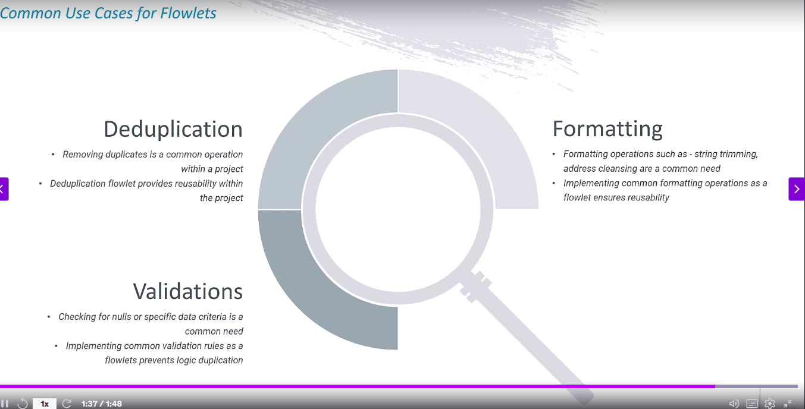

What is FlowLets ?
---

A modular, reusable transformation logic unit.

Works just like a function/procedure in programming.

Can take parameters (input values), perform transformations, and return results.

You can reuse it across multiple data flows instead of building the same logic again and again.

**Example**

You need to calculate NetAmount = Amount – Discount + Tax in multiple data flows.

- Instead of repeating this derive column logic everywhere:

- Create a Flowlet that takes Amount, Discount, Tax as parameters.

- Inside the flowlet → derive column NetAmount.

- Return the transformed stream.

- In different data flows, just call this flowlet with your columns.

