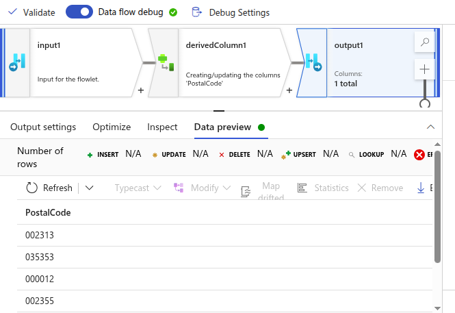

What is FlowLets ?
---

A modular, reusable transformation logic unit.

Works just like a function/procedure in programming.

Can take parameters (input values), perform transformations, and return results.

You can reuse it across multiple data flows instead of building the same logic again and again.

**Example**

You need to calculate NetAmount = Amount – Discount + Tax in multiple data flows.

- Instead of repeating this derive column logic everywhere:

- Create a Flowlet that takes Amount, Discount, Tax as parameters.

- Inside the flowlet → derive column NetAmount.

- Return the transformed stream.

- In different data flows, just call this flowlet with your columns.

Create Demo FlowLets
---

Create new FlowLet in Data flows > a=Add input , Add derived column and Add Outout as sink

Go to Input > Give output stream name & Give Columns name "PostalCode"

Go to derived column & Select `PostalCode` in the columns.

Add expressions in same column name PostalCode

**Debug Settings** - We can define value for Column `PostalCode` as input.

`OutPut`

What will lpad do ?
---

It makes sure the string has a minimum length by adding characters to the left.

👉 Breakdown:

- PostalCode → your column or string value

- 6 → final length you want

- '0' → character used to pad (fill)

| PostalCode | `lpad(PostalCode, 6, '0')`  |
| ---------- | --------------------------- |
| `123`      | `000123`                    |
| `98765`    | `098765`                    |
| `456789`   | `456789` (already length 6) |

Excercise
---
Remove all data which have column Quantity is 0.

Use this flowlets into new created pipeline , dataflow is organized in 05-Excercise

- Create new filter in the pipelinnes

- Give Expression for remove all data which have Quantity is 0

- Review and Refresh

- Delete TransactionID and TransactionDate column from this flowlets for RemoveZerosValues

- Why removed this columns ?

- Change data type of Quantity from String to Long
- Add FileName as string

- Add input in debug settings

- Like this create 2 columns with Quantity 0 and 10
- We are looking for remove that data which contains Quantity 10 in runtime.

`OutPut`

`FlowLets is created`

**Use this FlowLets in our pipelines**

- Delete filter and replace with flowlets

- Choose Flowlets

`OutPut`

