We will learn about
---

1. Data process for How to bring data into data warehouse
2. Use one approch to build data ware house

Overview of Data Process
---

Data process involves three main steps **Extraction**, **Transformatin** and **Loading**

In building a data warehouse, source data from diff OLTP source systems is integrated into one or more **Staging Area**.

The data is then Scrubbed to address any data quality issue and further processed before being loaded into a data warehouse.

There are few variations in which the Extractions, Transformation and loading is handled.

The Two common approaches are
---

  1. Extract, Transformation and load - ETL and
  2. Extract, Load, Transformations - ELT

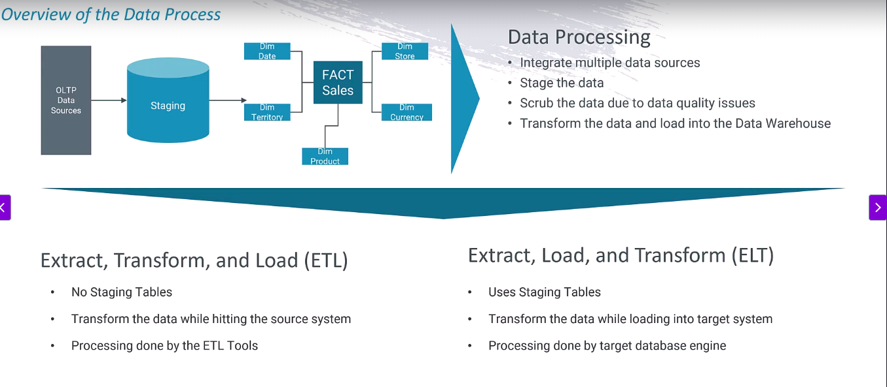

What is staging area ?

A **Staging Area** is a temporary storage location where raw data is collected before being transformed and moved into the final data warehouse tables.

**1. ETL**

- There are No Staging tables. Due to it is transform data before loading into db.
- So Transformations will done by ETL Tool such as Informatica, SSIS, Talend etc.
- Transform the data ETL Tool while hitting the source System.

**2. ELT - Better Approach**

- Use Staging Tables. Bcz, Data is loading into db before transformatinos.
- Data is extracted and loaded into a staging area and then it is transformed when it is loaded into the targeted system.
- Transformation is handled by the Target Database Engine.

In short

| Feature            | ETL (Transform before Load)          | ELT (Transform after Load)                 |
| ------------------ | ------------------------------------ | ------------------------------------------ |
| Transform Location | ETL Tool (ADF Data Flow, SSIS, etc.) | Inside Target DW (SQL, Synapse, Snowflake) |
| Staging Area       | Not required                         | Required (staging tables)                  |
| Best for           | Small/medium datasets, legacy DBs    | Large datasets, modern cloud DWs           |
| Speed              | Slower (extra movement)              | Faster (DW engine power)                   |

Overview of ELT Process
---

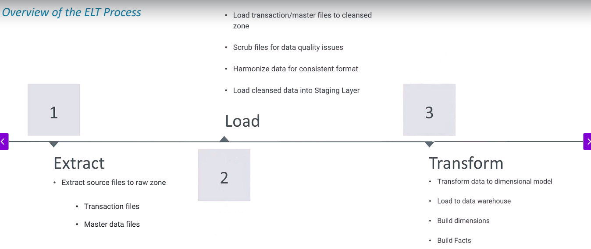

**Step 1** - We will extract the source data and load it without any Transformatinos into Azure Data lake storage Gen2. 

- Extract source files to Raw containers

**Stpe 2** - We will refine the data by cleansing and harmonizing it and loading into the cleansed container.

- In this step, we will also **load the data into Staging layer** in Azure SQL DB.

**Step 3** - We will leverage the target database engine to do some of transformations.

- We will build the dimenstions and facts to build the data warehouse.

Building staging tables and data warehouse tables in Azure SQL DB.
---

The tabels in the staging layer are prefixed with schema stage.

We will load the processed file from cleansed container into staging layer in Azure SQL DB.

We will also build the tables for data warehouse

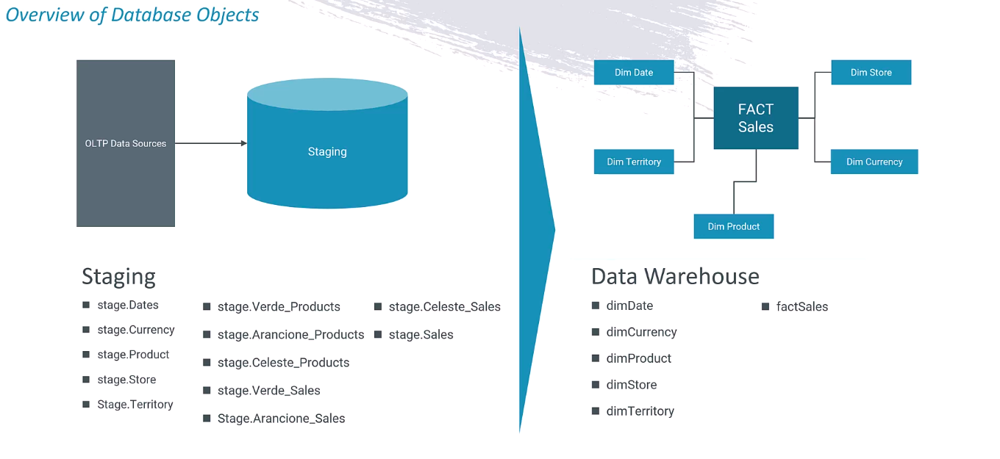

1. Establish connection to Azure SQL DB via Azure Data Studio and run script `stage.CreateStageScehmaAndTables.Table.sql`. **Build Staging tables into Azure SQL DB**
  - It will create stage tables 
  - securtiy > schemas > stage tables is created

  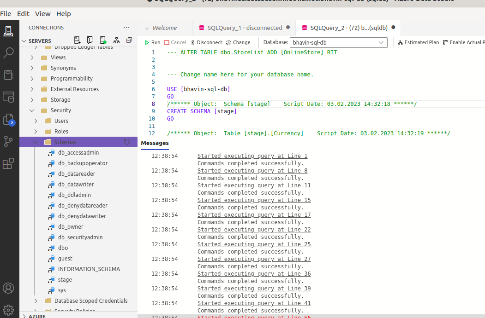

**2. Build data warehouse tables**

  - 2.1 New query > create dimension and facts tables for our data warehouse.
  - Use script `dbo.CreateDimensionsAndFactTables.sql`

  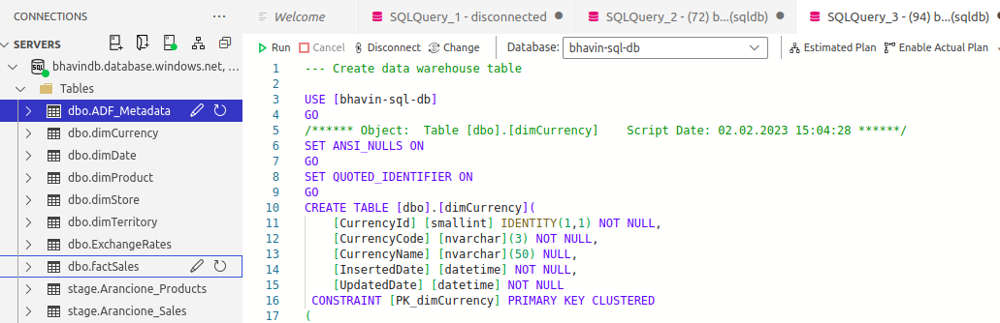

Build ADF Pipeline to copy master data files from raw conatiner to cleansed container
---

- Create new pipeline and Add activity Copy for copy master data from raw container to cleansed container

- Create source dataset > Gen2 > CSV

- We will copy all *.csv files using wildcard filepath

- Source > Wildcard FilePath > raw/MasterData and *.csv

- Check the box **Recursively**

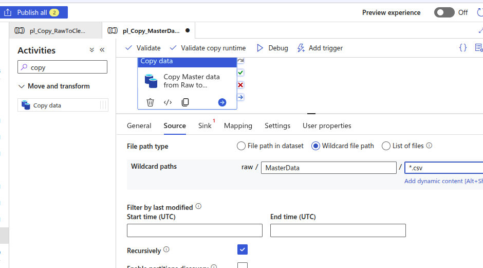

- Add sink settings for File Path as Cleansed > masterdata.

**NOTE** - At this time we want to copy the mastertdata CSV file from raw container to cleansed container as CSV file. So, we dont required **Copy Behavior** to transform CSV to txt or txt to CSV.

**Keep Copy Behavior as None**

- Keep File Extensions as *.csv

- The file extension used to name the output files. 

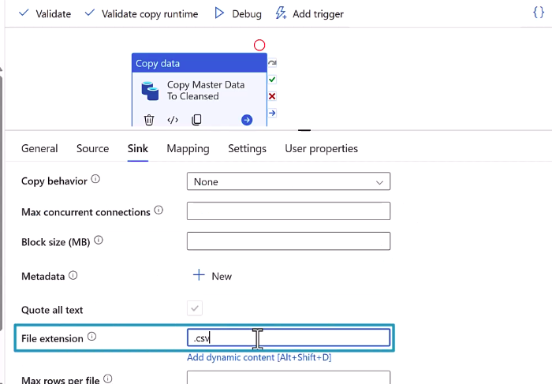

- Run pipeline and view it

- You can see here that all *.csv is copied from raw to cleansed contaier as it is.

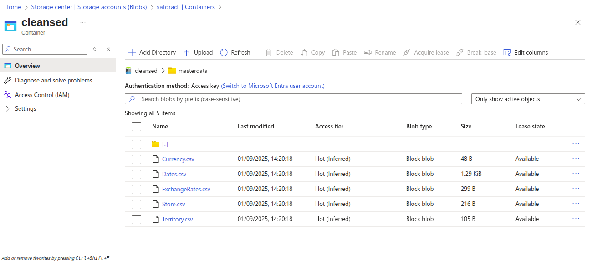

Copy ProductData > 3 *.csv files from Raw container to cleansed container
---

- Create new pipeline for ProductData

- Add source and dataset Binary to copy as binary

- Give File Path as raw / ProductData / *.csv

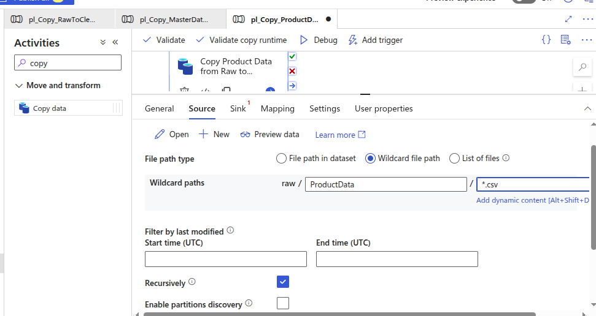

- Keep Copy Behavior as None in Sink

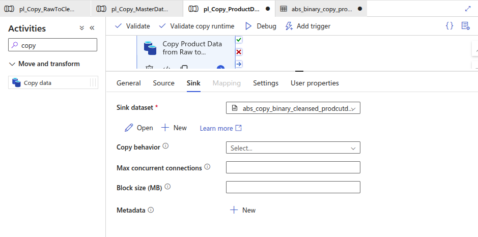

- Run pipeline and varify to cleansed > productdata containers.

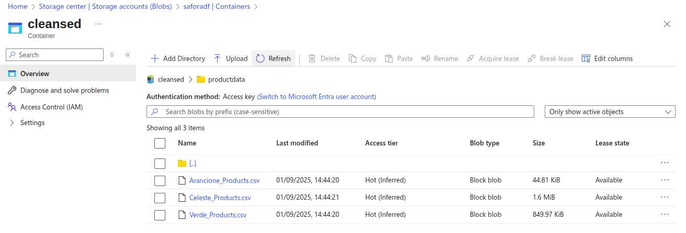

We will learn about Loading files from cleansed containers into the staging tables in Azure SQL DB.
---

`We will loading data using single source datasets and single sink datasets`
`To do this we will use ForEach and metadata activity`

We don't required the metadata activity , we already have a created tabled in sql db for that.

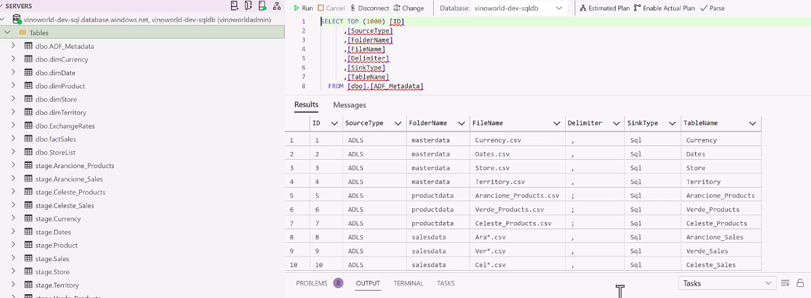

- Create dataset for source in New folder 07-Excercise for cleansed container.
- Choose Gen2 and CSV
- Keep blank or leave the file path for container, folder name and file name
- Bcz, we want to configure name of container folder and file name and Delimiter at run time

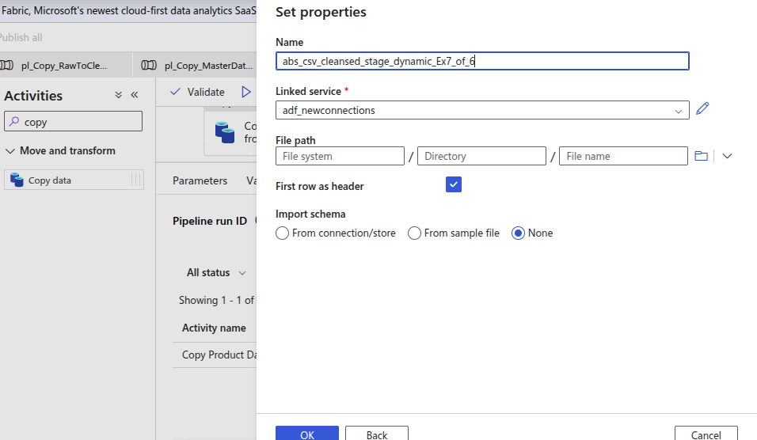

- Create Parameters Foldername, Filename and Delimiter

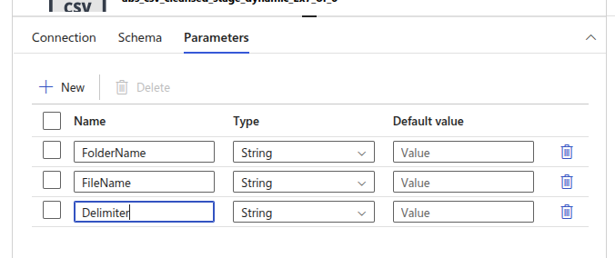

- Assign this parameter into our dataset

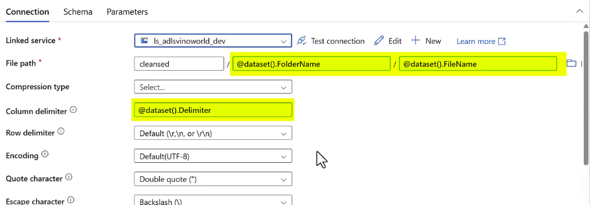

- Create new dataset for Data warehouse in the SQL DB.

- Choose Azure SQL DB in the dataset
- Create new connections for sql db
- Check the box for Edit manually for we can add dynamically the tablename
- For that we have to create parameter

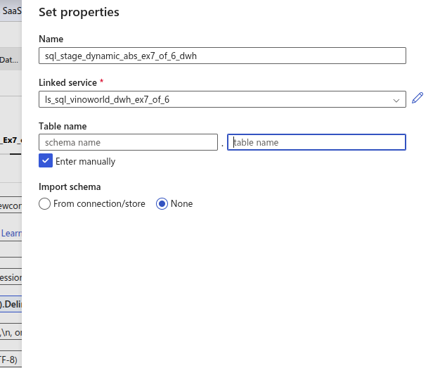

- Create Parameter named `TableName` for sqldb table
- Add this parameter as dynamically as below

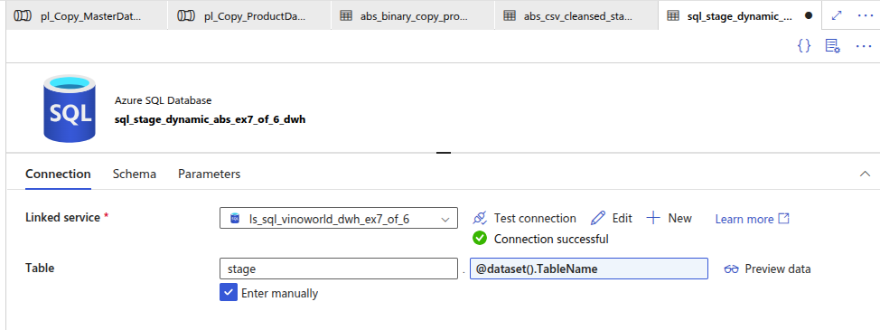

- Here, `stage` is schema