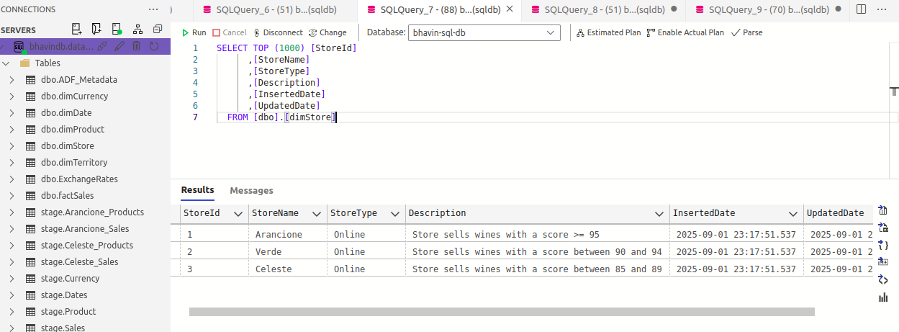

What is Dimensions and Facts ?
---

You sell products (like shoes, bags, clothes).

Customers buy them on different dates.

You want to analyze:

- **How much sales you made?**

- **Which product sells most?**

- **Which customer buys more?**

**Dimensions = Descriptions (the “details”)**

- They describe things in your business.

- Customer Dimension → customer name, age, city

- Product Dimension → product name, category, price

- Date Dimension → date, month, year

**Facts = Numbers (the “transactions”)**

- They store the actual measurable business events.

- Sales Fact → how many items sold, how much money made

**Example row in Sales Fact:**

| DateKey |	CustomerID | ProductID | Quantity |	Amount |
| ------- | ---------- | --------- | -------- | ------ |
| 20250101 | 101 | 5001 | 2 | 2000 |

⚡ What is Slowly Changing Dimension (SCD)?
---

A dimension table (like Customer, Product, Employee) stores descriptive data.

Sometimes this data changes slowly over time (not every day).

Example: Customer changes address, Employee changes department.

These are slow changes compared to fact tables (which update daily/hourly).

So, SCD = the method to handle changes in dimension tables while deciding if we keep history or overwrite.

🔹 Types of SCD (Total 6)
---

**1. SCD Type 0 (Fixed Dimension)**

Do nothing, never update.

Example: Date dimension (Jan 1, 2025 will never change).

**2. SCD Type 1 (Overwrite)**

Update the old value with the new one (no history).

Example: If customer city changes, just overwrite.

**3. SCD Type 2 (Add New Row)**

Keep old record + insert new record with validity (start_date, end_date).

Tracks full history.

**4. SCD Type 3 (Add New Column)**

Add extra columns like PreviousCity.

Tracks limited history (only last change).

**5. SCD Type 4 (History Table)**

Keep current data in main dimension table.

Move old records to a separate history table.

**6. SCD Type 6 (Hybrid: 1+2+3)**

Combination of Type 1, 2, and 3.

Stores full history (Type 2), keeps current and previous values (Type 3), and may overwrite some columns (Type 1).

How to implement SCD Type 1 Dimensions ?
---

- There are 3 steps to implement Type 1 Dimensions
  
  1. Read Source - We requires to read the new data for dimensions from the **Stage Table**.
  2. Compare Target - Stage Table needs to be compared against the target dim table on the natural key.

  3. Load Target
  
  - If the stage data doesn't exist int the target dim we have to create a new dim record.

  - If the stage data exist and only specific type one attribute have changed, then the target dim record is updated with the changes.

  

Building a Type 1 Dimensions with two diff approaches
---

1. Using ADF Mapping Data Flows

2. Using SLQ DB Tables in Stored Procedures

- Our source table is `stage.Store` > Column > StoreName, StoreType, Descriptions.

- Our Dest table is `dbo.dimStore`


Create the pipelines


1.Using ADF Mapping Data Flows
---

- Create 09-Excercise and create new pipelines named `pl_Build_dimStore_Ex9`

- Drag and Drop `Data Flow` activity

- Go to Settings > Create New Data Flows


- Go to Projections and see the schema of table stage.Store 


- Now we need to compare the stage.Store data and dimStore data to see there are any new records.

- For that add another source named `dimStore` and create new dataset named `sql_dim_store_ex9`


- See data set of dimstore & there is 2 more columns InsertedDate and UpdatedDate.


- Update Lookup settings like below


`OutPut is Expected`


here, Input and Output Date is NULL value bcz

**On the left side (stage source data):**

StoreName = Arancione, Verde, Celeste

StoreType = Online

Description = text values

**On the right side (dimStore lookup result):**

All columns (StoreName, StoreType, Description, StoreId, InsertedDate, UpdatedDate) are NULL

**Why NULL on Right Side?**

Because:

- You used a Lookup transformation.

- Lookup tries to match stage data with dimension data (dimStore).

- Since your dimStore is empty right now, no match is found.

- That’s why Lookup returns NULL for all dimStore columns.

To Update filed Insertdate and updateDate we will use **derivecolumn** to create this fields

- 

- For Insert Date

```sql
iif(isNull(InsertedDate), currentTimestamp(), InsertedDate)
```

- For UpdateDate
```sql
currentTimestamp()
```

- You can see the **InsertedDate** and **UpdatedDate** is have value and added


Explains
---

`1. Why we added InsertedDate and UpdatedDate with Derived Column?`

InsertedDate = first time the row was added into dimStore.

UpdatedDate = whenever the row changes in future (for slowly changing dimension handling).

Right now, both show the same timestamp because this is the first insert.

`3. What’s happening in your screenshot`

Stage data (Arancione, Verde, Celeste) went through Lookup.

Lookup found no matches in dimStore → means new stores.

Derived column step added system columns (InsertedDate, UpdatedDate).


**Now we will use Alter raw Transformation for auto decide what to do with data**
---

**What Alter Row does in ADF Mapping Data Flow?**

- It decides what should happen with each row when loading into the destination (sink table).

**Actions:**

- INSERT → new rows (not in dim table yet).

- UPDATE → existing rows but with changes.

- DELETE → mark as deleted.

- UPSERT → update if exists, insert if not.

- IGNORE → skip row.

**Why in your case (dimension load)?**

- Lookup found if a store already exists in dimStore.

- If not found → it’s a new dimension member → mark row for INSERT.

- If found but values changed → mark row for UPDATE.

**Alter Row applies this rule:**

  - **New rows (Arancione, Verde, Celeste) → INSERT.**

- **If next time Verde changes from Online → Retail, then that row will be UPDATE.**

- Add Alter Raw Transformations

- add condition for update raw if required and insert if new value is required.
- This will done by condtion name **upsert**

- Give upsert conditions is **true()**


- Run pipeline and see result

- It is considered as Insert 


Now, Send this data to database using sink
---

- Create Sink and choose dataset we created `sql_dimstore`


- Go to Settings and check for Upsert CheckBox and key column should be as **StoreName**


- Go to Mapping and map the column for StoreName, StoreType and Descriptions


- Preview and see result


- Execute pipeline and see result


2.Using SLQ DB Tables in Stored Procedures
---

- use script `usp_Load_dimStore.sql` and run it

- Clean dimStore table before run this query

- Create Store Procedure and add its store procedure named 


- Execute pipeline and see result



- Re Execute this pipeline and see result


Type 2 Dimensions
---


