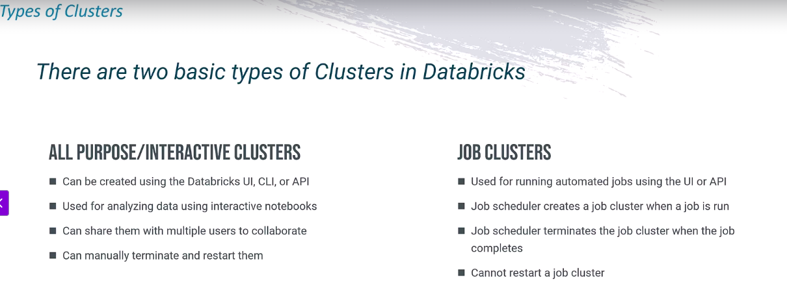
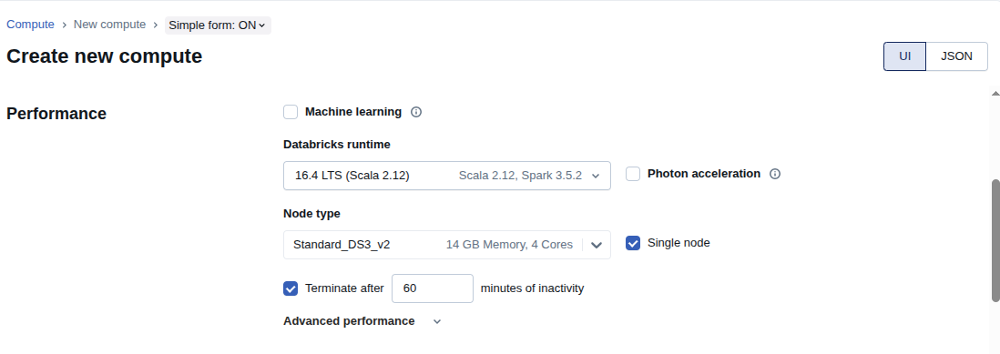

What is Azure Databricks ?
---

- Azure Databricks is a data and analytics platform on Azure that lets you:

  - Store, process, and analyze big data

  - Run machine learning (AI) models

  - Work with data in notebooks (like Jupyter) using Python, SQL, R, Scala

It combines:

  - Apache Spark (powerful open-source big data engine)

  - Azure cloud services (security, storage, integration with ADF, Synapse, Power BI, etc.)

Core Artifacts of Azure Databricks
---

**1.Cluster** - Two types of cluster - Interactive and Job cluster

**2.Workspaces** - Enables users to organize/share theri notebooks, libraries and dashboards

**3.Notbooks** - Web based interface containinng runnable spark code, visualize data

**4.Libraries** - Containers residing within workspaces, holding python, R, java/scala lib

**5.Jobs** - Provides the mechanism to run a notebook or Jar on the databricks cluster

Setting up the Databricks Env
---

1. Setup Databrick service in azure

2. Create the Azure databricks cluster

3. Mount the Data lake storage for mount storage

What is databrick cluster ?
---

Databrick cluster consists of compute resources on which workloads such as ETL Process or ML can be executed.

Databrick cluster consists of a driver node and one or more worker nodes.

The nodes are all built usig VM Image and pre-specified libraries.

Driver run the user's process/functions in parallel on worker nodes.

The wokrer nodes read and write data from the data sources.

Worker node also caches any transformed data in memory.

Results of the execution will be collected by driver node.

There are two types of cluster

- Create Databrick and its cluster with single node.

- Now we have to mount our data lake Gen2 Storage to our databrick

**Step 1 - To mount storage account to our databrick we have to create **Service Principal**

- Then we need to grant the Azure service principal to Azure Data lake storage account.

- Provide the role `Storage blob data contributor`

**Step 2** - To mount storage account to databrick through the Azure Service principal

**To create Service Principle follow below steps**

- Go to Entra ID > App Registrations > New Registrations > Give it name and register.

- Go to SA > Access Control > Gir role of Blob data contributor > choose vino-service-principle we created.

- so now our SP can access our SA.

- Mount SA to our Databrick
- Go to databrick > workspace > create folder vinoworld/ setup/