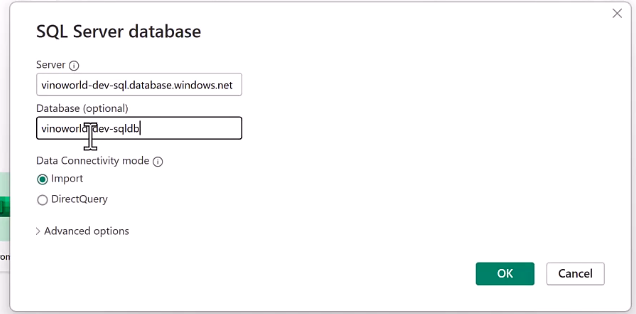

Modern Data WareHouse Architecture
---

The Data is ready for server to customer or applications via serve from either Data WareHouse  to PowerBI or connected from Machine Learning Model to PowerBI or Directly connected to our Data lake cleansed container to PowerBI Presentations layer.

How to connect PowerBI to Azure SQL DB Data WareHouse
---

Open PowerBI > Go to Home > Get Data > Choose Azure SQL DB

You will Prompted for enter sql db cred and Provide cred

Choose **DirectQuery** Data connectiviy mode and click on ok.

You will promted for Azure SQL DB Password and user name and give it

You can see all the tables into sql db as below

