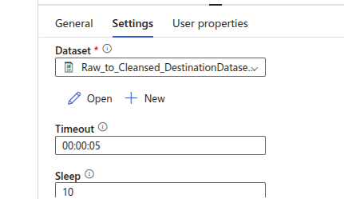
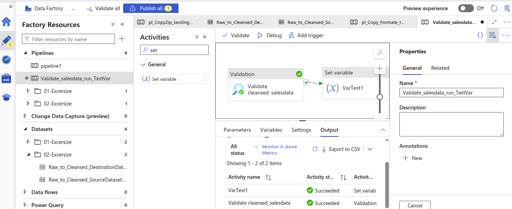
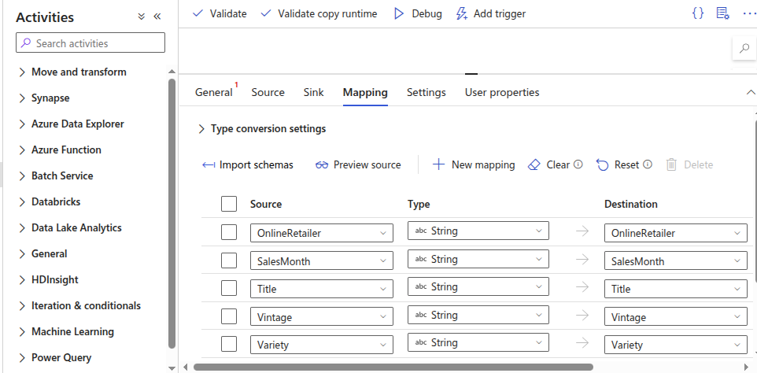
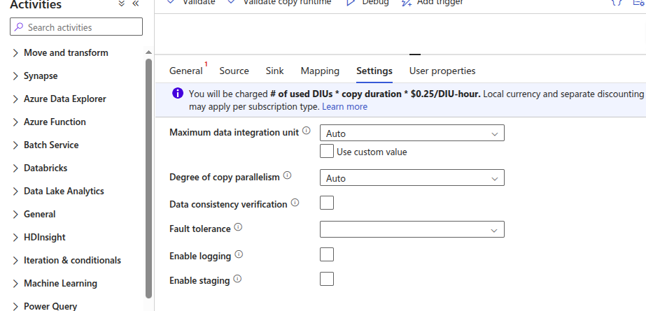

# We will learn about

  - Types of activity within ADF
  - Key concept of copy activity
  - Expressions and Variables and parameter - How they can make pipeline generic and dynamic
  - Pass secrets parameters as runtime - We need to provide login details to our storage resource or SQL DB. This sensitive data should be stored into Azure key vault
  - Importing data - Implement pipeline with loops and metadata activity

# Types of activity

  **1. Data movement activities**

  - Taks to move data fom a Source to Dest/Sink like Copy activity

  **2. Data Transformation activities**

  - External ADF activities like Databrick Notebooks, Azure Functions etc.
  - Mapping data flow activity within ADF.

  **3. Control flow activities**

  - Activities to loop , branching or set variables.

## Activity Dependencies
- Activity is depends on one or more previous activities and dependencies conditions.
- Dependencies conditions like Success, Failure, Completion , Skipped.

- Ex. If pipeline has 2 activity like Activity A and Activity B. In case of success dpendencies , Activity B will runs only if Activity A is Successed.

- Ex. For Error Handling - Activity B will only run while Activity A is failed.

Create pipeline for validating data source
---

- Pipeline for Activity A for Validate data under cleansed > salesdata is exists then execute Activity B Set variables.

- ADF > Drag and Drop Validation Activity

- Choose Dataset for validations

- Execute it

Key Concept of Copy Activity
---

- Ability to inference schema from data source. we didn't required to definde schema of data.

- `Data conversions`

- Debug Mode - Allows to run a pipeline interactively from data factory studio and set breakpoints and view the output of an activity at every stage.

- Data integratino unit - When we works with large amount of data, performance can become a focus point. The power of copy data activity is based on **Data integration unit (DIS)** . This is combinations of CPU, Memory and network usage. If Copy data activity's powe is increase to perform it, we can allocate it by increasing the no. of DIS Available.

  Copy Activity Examples
  ---
    
  ## Derive Schema Inference in Copy data activity

  - For import all schemas from dataset.

  - Choose any pipeline
  - Go to Mappings > Look for Import Schemas
  - You can see all schemas of dataset in preview
  

  - you can changes shhemas types and dest.

  - Increase DIS and Degree of copy parallelism

  - you can increase DIS as per your power required for copy activity based on data size
  - you can also set how many data should copy in parallel. 10 out of 32 ? 20 out of 32.
  - Max data parallel is 32

