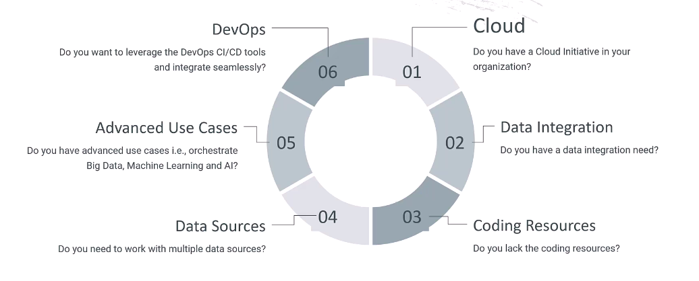
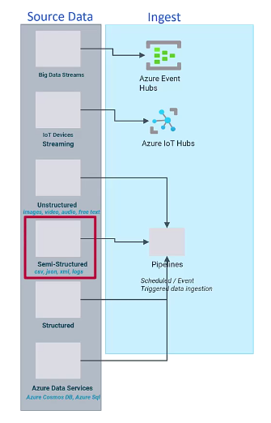
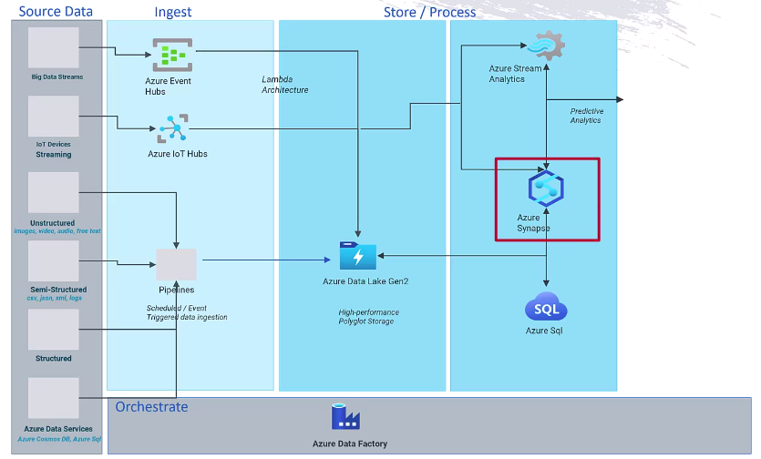
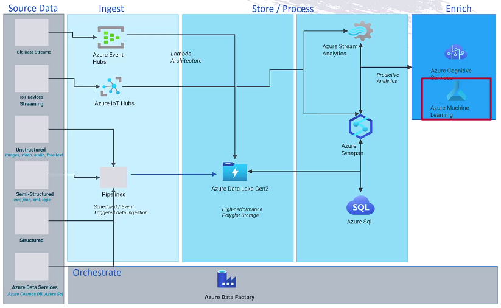
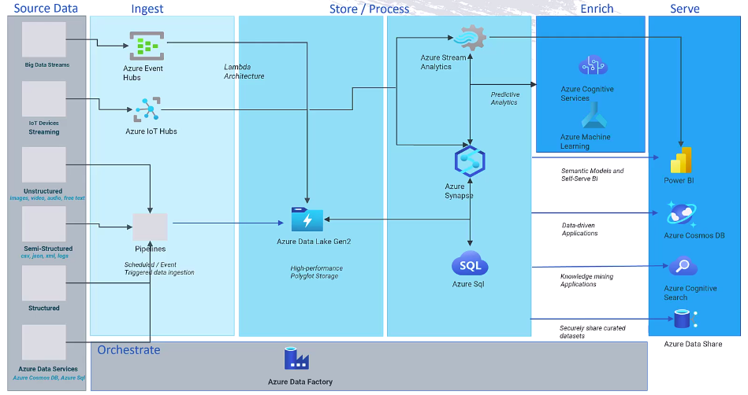
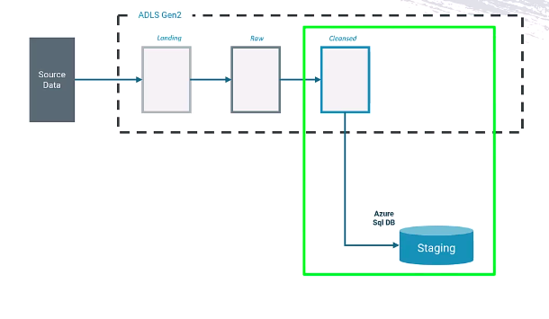
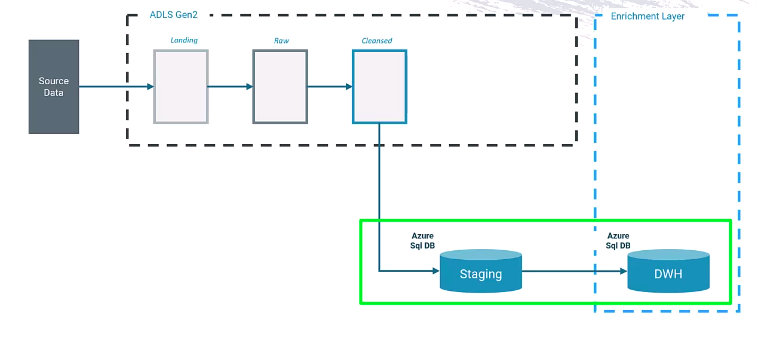
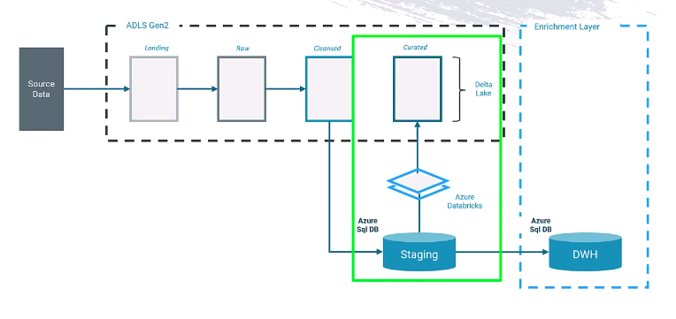
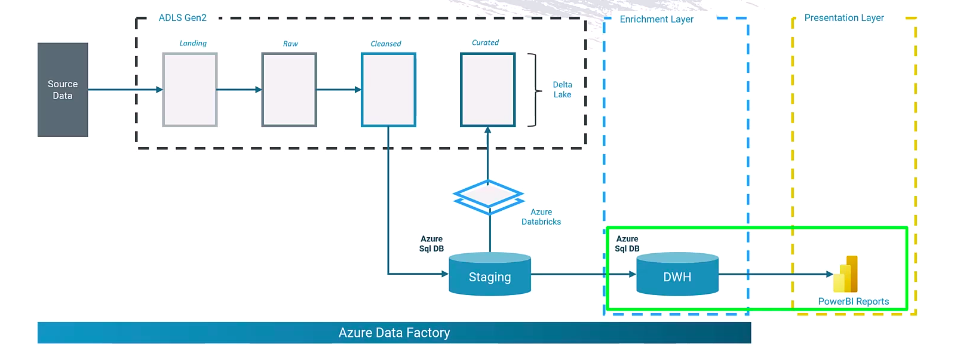

Why Azure Data Factory ?
---

your org want to combine diff types of data sources such as batch and real time data or your org has more orchestrations requirement such as creating process flows between big data, machine learning and AI use cases or want to integrate seamlessly with continuous intergrations and DevOps tools.

In all such cases, Azure data factory is required.

What is Azure Data Factory ?
- Azure Data Factory is the managed service in cloud for scale-out serverless data integration, data transformation and orchestrations.

Azure data factory is PaaS service , so we don't requried to manage the patching , upgrading, maintaining and provisioning infrastructure on cloud and on-premises etc and there is no upfront costs.

Benefits of Azure Data Factory
---

1. ADF can connect to 100 diff data sources for on-premise and on cloud
2. ADF can provide common operations such as filtering, joining or aggregating data using code-free , drag and drop interface that runs on distributed sparks clusters.

3. Data Orchestratinos
- ADF can create and schedule data pipelines that invoke other compute services, such as Azure Databricks, Azure Machine Learning or run native data factory data flows on demands.

4. External compute integratios - ADF can work with Azure HDInsight Hadoop, Azure Databricks etc to supports transforming massive amounts of data or building delta lake.

5. Code-free data flows - you can choose code for programming language like Python, Scala, SQL, R etc.

6. Version control & Deployment - can integrate with git repo like azure devops or github and easily deploy from dev to prod.

7. ADF can also monitor pipeline executions visually and review pipeline executino history.

8. Lift & Shift - It provides compatibility with SQL server integrations services (SSIS).

Example

An e-commerce company stores data in many places:

  - Customer orders → SQL Server (on-premises)

  - Website clickstream logs → Azure Blob Storage

  - Marketing campaign data → Salesforce (SaaS app)

The company wants to:

  - Combine all this data in one place (Azure Data Lake or Azure SQL Database).

  - Clean and transform it (remove duplicates, standardize formats).

  - Use it for Power BI dashboards (sales trends, customer behavior).

Architectural Pattens for Analytics Sol.
---

**1. Ingest layer** - This is where we collect source data from diff sources and formats.

We can get Structured data from an On-premise Database.

We can get semi-structured data like CSV, JSON files.

We can use Azure Data Factory to create ETL Pipeline to Ingest batch job data.

We can also use Azure Event hubs to ingest streaming data like tweets or change data updates.

We can Orchestrate this using ADF.

**2. Store / Process layer**
- Stores the Ingested data in Azure data lake Gen2 Storage type.

- We can process the data using azure databrick and azure synapse analytics or we can use azure stream analytics.

**3. Enrich layer**

- We transform and enrich those processed data using Azure machine learning to apply ML Models on processed data.

- We will refine, reshape the data for diff purposes like data warehouse and Machine Learning.

**4. Serve layer**

- We can serve data for diff purpose for diff users and apps.

- We can use Power BI to create dashboards and create reports on the data,

- We can use Azure data share to share the data with external parteners.

- Data will stored in Azure Data Leak Gen2 Storage type in storage account.

- Here we will use 3 diff container for diff purposes.

1. Landing - The data arrive to this containers.

Just drop data as it is. No changes.

2. Raw - The raw data like json and csv file will be stored here without process.

Data is still unstructured but you organized it by folders, date etc.

3. Cleansed - Cleaned, stores Unique data and remove duplicates.

we will process the data from cleansed contianer into a staging layer within Azure SQL DB.

**Staging layer (Azure SQL DB)**
- Before holding into the data warehouse, data is stored in staging area where:

  - Temporary holding place for data
  - Used for validation, consistency check,
  - Make sure data is clean before final load to warehouses like **Azure SQL DB**

This architecture shows the final data warehouse DWH. from this DWH we can serve the data for end user and applications via creating dashboard by Power BI.

For delta lake, we will process the data from staging layer and bring it into **Curated container** in a delta lake formate using **Azure Databricks**.

The delta lake supports for transactions like a DB.

We will serve the data to end user via dashboards using Power BI.

**Azure Data Bricks** for build the delta lake structure in azure delta lake storage Gen2

**Azure Data Factory** - For Data pipeline and Orchestrations.

**Azure Data lake storage Gen2** - for Store the lot of data from 100+ Data Sources.

**Azure SQL DB** - For data warehouse