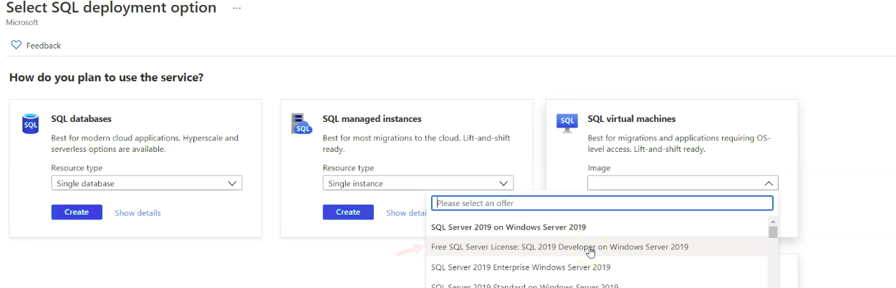
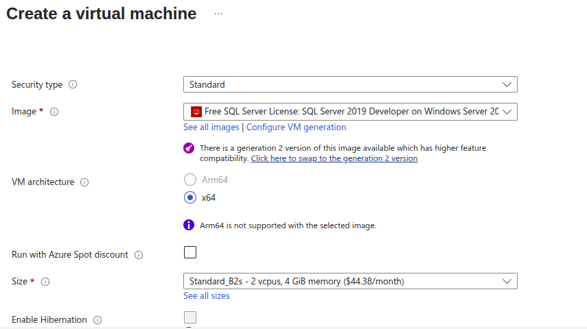
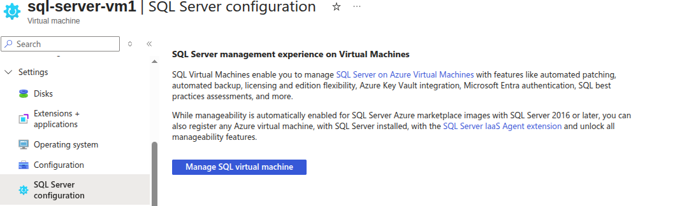
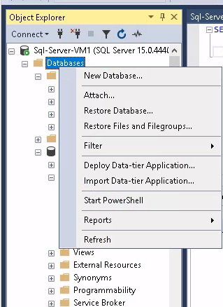
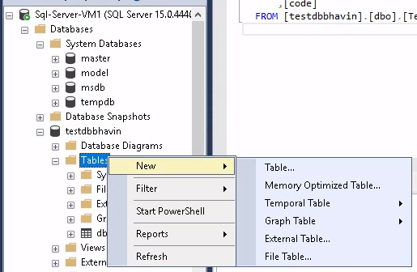
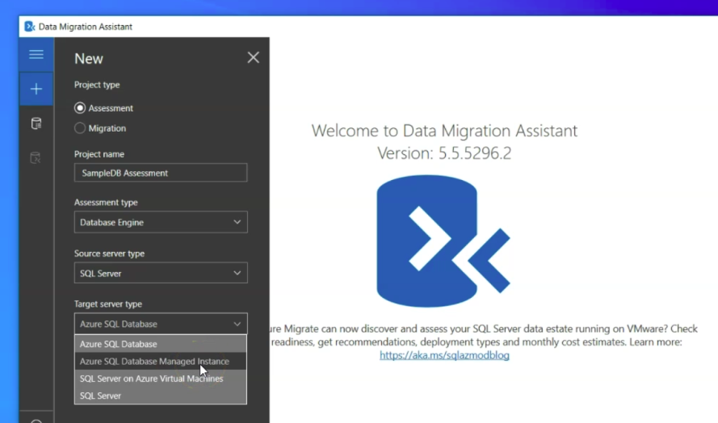
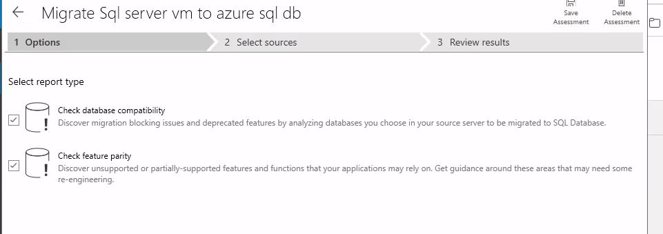
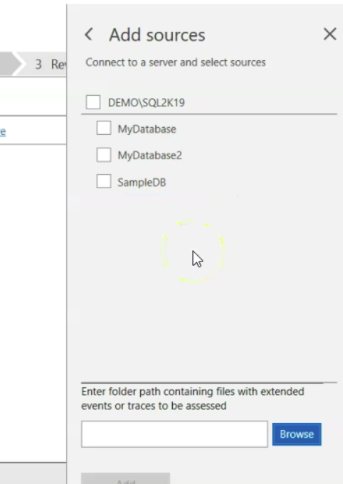
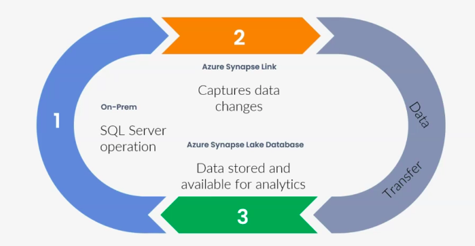

What is Read/Write Grade Period in Azure SQL Server / FailOver Group ?


- When your database is in the serverless tier, it can auto-pause after a period of inactivity (no connections, no CPU usage).

- When a connection request comes in, Azure will resume (warm up) the database.

- The read/write grace period (default: 1 hour) is the minimum time your database stays online after it resumes, even if no activity is happening.

Example

- DB is paused.You connect → DB resumes (cold start).

- Even if you disconnect immediately, the DB will stay up for at least 1 hour (grace period).

- After the grace period, if there’s still no activity, the DB can auto-pause again.

What is Read/write listener endpoint and Read only listener endpoint ?
---
**Read-Write Listener Endpoint**

- DNS name that always points to the current primary database.

- Used by applications that need to perform INSERT, UPDATE, DELETE, and SELECT (i.e., full read-write operations).

```bash
myapp-fog.database.windows.net   → always points to the primary
```

**Read-Only Listener Endpoint**

- DNS name that always points to the secondary database.

- Used for read-only workloads like reporting, dashboards, or analytics queries.

```bash
myapp-fog.secondary.database.windows.net   → always points to the secondary
```
- Ensures that heavy reporting queries don’t overload the primary database.

- During failover, it will automatically redirect to whichever server is now the replica (secondary).

Azure SQL Server Security Feature
---

**Azure SQL Auditing**
- Helps to maintain regulatory compliance
- You can analyze and understand db activity
- Audit log destinations is `Azure Storage, Log Analytics workspace, Event hub`.

**Firewall and Vnets**
- control for allowed traffics from specific Vnet and client IPs.

**Transparent Data Encryptions**
- Encrypt your DB, Backups and logs at rest withhout any changes to your apps.

**Auditing**
- Tracks your database events and write them to an audit log in your Azure storage accounts, Log analytics workspace or event hub.

**Intelligent Performance Feature**

**Auto Tunning**

- It continuously monitors query performance, identifies issues, and can automatically apply fixes such as:

  1. Create Index → Automatically adds missing indexes to improve query performance.

  2. Drop Index → Removes unused or duplicate indexes to reduce overhead.

  3. Force Last Good Plan → If a query’s new execution plan causes regression (slower performance), Azure forces the last known good plan to keep performance stable.


**Automation Tasks**

- To send resource monthly cost to admin by email

How to create new SQL User ?
---

1. SQL Server Management Studio (On-Premises Tool)
2. Azure Data Studio
3. Query Editor in Azure Portal

You can use script into this 3 steps

```sql
CREATE USER [user1]
FROM LOGIN [user1]
WITH DEFAULT_SCHMA=db0;
ALTER ROLE db_owner ADD MEMBER user1
```

SQL Server on Azure Virtual Machine (IaaS)
---

- Infrastructure as a Service (IaaS) → You get a full Windows VM with SQL Server installed.

- You manage the OS, SQL Server instance, patching, backups, HA, etc.

- Works just like an on-prem SQL Server VM.

- You can use:

  - Agent jobs

  - Cross-database queries

  - Full SQL Server features not available in Azure SQL DB

- Billed for:

  - VM compute (cores, RAM, storage)

  - SQL Server license (included or BYOL)


Azure SQL Server Virtual Machines
---

- Choose server img



- Choose VM and Sql Server Img



**To connect this Windows VM via RDP**
- Go to remminia and new connections. Put your VM IP.
- Enter Your VM Credentials.

<!-- **To connect your SQL Server VM**
- Go to that VM > Settings > SQL Server Configurations


 -->

**To connect your sql server VM**

1. RDP - Just open remminia > Put your VM Public IP.
2. Give VMs Creds.

**To connect your SQL Server instance DB**

1. RDP into VM
2. Look for SQL Server Management service > Give SQL DB Creds > Check the box of `Trust Certificate`.

**To create database**



**To create table**



Stretch DATABASE
---

**Normal Setup (without Stretch Database)**

- You have SQL Server (on your VM).

- Inside SQL Server, you have databases.

- Users authenticate to SQL Server → then access the databases → then the tables.

- Everything (hot + cold data) is stored locally inside the VM’s disk.

**With Stretch Database**

- You still authenticate to your SQL Server instance (the same way as before).

- But, for certain tables that are very large, you enable Stretch Database.

- **After enabling:**

- Hot data (recent rows) → stays inside your VM database.

- Cold data (old rows) → gets moved to Azure SQL Database storage.

👉 Important: You don’t connect separately to Azure SQL Database for this — SQL Server (your VM) handles it.


**NOTE: Strech database feature is already deprecated and retired.**


Migrate your on-Premises sql database to azure cloud
---

1. Use Data Migration Assistance
2. Azure Data Migration service

1. Data Migration Assistance
---

- Can run assessments for migratig from on-premise sql server to azure cloud.
- Supported target server types:

  - Azure SQL Database 
  - Azure SQL Database Managed instance
  - SQL Server on Azure VM
  - SQL Server On premises

- You required to instll data migration Assistance

- First, before migrate your database to azure cloud , you required to assess that source db.



- Select report types



- Provide Source SQL db cred

- Add Database



- Start assessment


What is azure synapse analytics ?
---

It is a analytics service on the azure and combines: Data integration, Enterprise data warehousing, Big data analytics

What is Azure Synapse Link for SQL Server ?
---

It will automatically captures data changes in SQL Server and sends it to azure synapse analytics



You have a on-prem SQL server and have updated and latest data.

Azure Synapse Link will cpture this chagnes and via `Data Transfer` it will send to Azure Synapse Lake Database.

Azure Synapse Lake Database will store this data and serve for analytics.