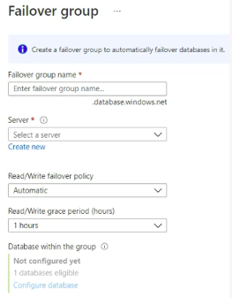

What is Read/Write Grade Period in Azure SQL Server / FailOver Group ?


- When your database is in the serverless tier, it can auto-pause after a period of inactivity (no connections, no CPU usage).

- When a connection request comes in, Azure will resume (warm up) the database.

- The read/write grace period (default: 1 hour) is the minimum time your database stays online after it resumes, even if no activity is happening.

Example

- DB is paused.You connect → DB resumes (cold start).

- Even if you disconnect immediately, the DB will stay up for at least 1 hour (grace period).

- After the grace period, if there’s still no activity, the DB can auto-pause again.

What is Read/write listener endpoint and Read only listener endpoint ?
---
**Read-Write Listener Endpoint**

- DNS name that always points to the current primary database.

- Used by applications that need to perform INSERT, UPDATE, DELETE, and SELECT (i.e., full read-write operations).

```bash
myapp-fog.database.windows.net   → always points to the primary
```

**Read-Only Listener Endpoint**

- DNS name that always points to the secondary database.

- Used for read-only workloads like reporting, dashboards, or analytics queries.

```bash
myapp-fog.secondary.database.windows.net   → always points to the secondary
```
- Ensures that heavy reporting queries don’t overload the primary database.

- During failover, it will automatically redirect to whichever server is now the replica (secondary).

Azure SQL Server Security Feature
---

**Azure SQL Auditing**
- Helps to maintain regulatory compliance
- You can analyze and understand db activity
- Audit log destinations is `Azure Storage, Log Analytics workspace, Event hub`.

**Firewall and Vnets**
- control for allowed traffics from specific Vnet and client IPs.

**Transparent Data Encryptions**
- Encrypt your DB, Backups and logs at rest withhout any changes to your apps.

**Auditing**
- Tracks your database events and write them to an audit log in your Azure storage accounts, Log analytics workspace or event hub.

**Intelligent Performance Feature**

**Auto Tunning**

- It continuously monitors query performance, identifies issues, and can automatically apply fixes such as:

  1. Create Index → Automatically adds missing indexes to improve query performance.

  2. Drop Index → Removes unused or duplicate indexes to reduce overhead.

  3. Force Last Good Plan → If a query’s new execution plan causes regression (slower performance), Azure forces the last known good plan to keep performance stable.


**Automation Tasks**

- To send resource monthly cost to admin by email

How to create new SQL User ?
---

1. SQL Server Management Studio (On-Premises Tool)
2. Azure Data Studio
3. Query Editor in Azure Portal

You can use script into this 3 steps

```sql
CREATE USER [user1]
FROM LOGIN [user1]
WITH DEFAULT_SCHMA=db0;
ALTER ROLE db_owner ADD MEMBER user1
```

