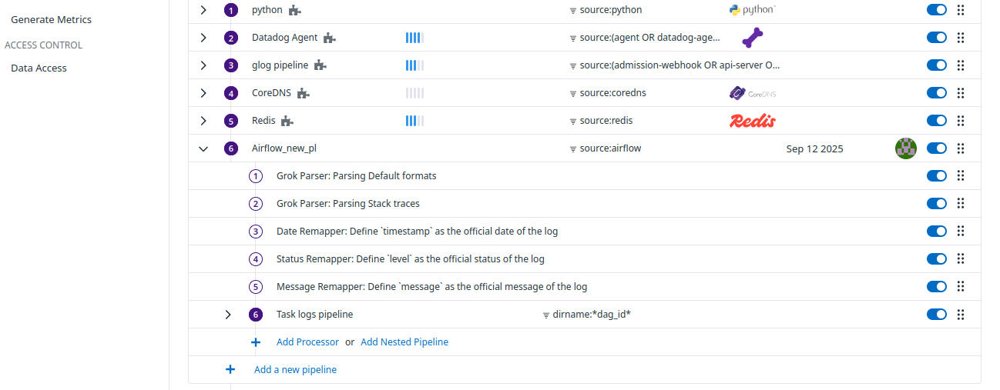

# 📘 Datadog Log Pipeline

A **Datadog log pipeline** is a processing workflow that takes raw logs and transforms them into structured, searchable, and enriched data.  
It allows you to parse, filter, mask, enrich, and route logs before they are indexed or forwarded.

## What Does a Log Pipeline Do?

1. **Ingest raw logs**  
   Logs are collected from applications, containers, servers, or cloud services.

2. **Process logs step by step** using processors:  
   - **Parsing** → Extract fields like `timestamp`, `status_code`, `error_message`.  
   - **Remapping** → Rename or normalize fields.  
   - **Masking** → Remove sensitive data (e.g., passwords, API keys).  
   - **Enriching** → Add metadata (e.g., environment, service, team).  

3. **Route logs**  
   - Keep or drop logs based on filters.  
   - Send logs to specific **indexes**, **archives**, or **destinations**.

---

## 🔹 Why Pipelines Are Important

- ✅ Make logs **searchable** by structuring them.  
- ✅ Reduce **costs** by filtering unnecessary logs.  
- ✅ Ensure **compliance & security** by masking PII/secrets.  
- ✅ Enable better **dashboards, alerts, and monitors** with normalized fields.  

---

## 🔹 Example

### Raw Log:
```log
2025-09-12 12:15:03 ERROR user=xyz id=12345 action=login_failed
```

A pipeline can:

- Parse ERROR → status: error

- Extract user → user.name: bhavin

- Extract id → user.id: 12345

- Normalize action → event: login_failed

- Drop debug logs if not needed

Now, in Datadog you can search:

```log
status:error AND event:login_failed AND user.name:xyz
```

- Go to APM > Logs configurations.
- Clone Airflow Pieline and cick on create processor for parsing, remapping etc tasks.



Processor Grok will use

- **Grok Parser Rule**

Rule format: `rule_name % {MATCHER:EXTRACT:FILTER}`

**Rule_name**
- Unique rule names within the same Grok parser.
- Rule name must start with an alphanumeric and can contains only alphanumeric and underscore, dot.

**Matcher**
- Common matcher includes **notSpace, word, number, data and regex**.

**Extract**
- Optional identifier representing the captured value for the text matched by the Matcher.

**Filter**
- Optionally added as a post processor of the match to extract key value or embedded JSON.

How Grok parser rule works ?
---
```log
2025-09-12 12:15:03 ERROR user=user1 id=12345 action=login_failed
```

Your parser rule will be

```bash
%{date("yyyy-MM-dd HH:mm:ss"):timestamp} %{word:log_level} %{word:user}=%{notSpace:user_name} %{word:id}=%{number:user_id} %{word:action}=%{notSpace:action_name}
```

- `%{date("yyyy-MM-dd HH:mm:ss"):timestamp}`: This pattern extracts the date and time from the log.

- `date`: The Grok pattern for a date.

- `"yyyy-MM-dd HH:mm:ss"`: The specific format of your timestamp.

- `timestamp`: The name of the new field where the extracted value will be stored.

- `  `: This is static text. It matches the literal space in your log line.

- `%{word:log_level}`: This matches and extracts the word "ERROR" and assigns it to a field named log_level.

- `  `: Static text for the space.

- `%{word:user}`: This matches and extracts the word "user".

- `=`: This is static text, matching the equals sign.

- `%{notSpace:user_name}`: This matches any characters until the next space (bhavin) and stores it in a field named user_name.


- create parser rule


- Create pipeline


**Grok First**: Your Grok Processor runs first. It finds the word INFO and saves it to a custom attribute you named log_level.

**Re-mapper Second**: After the Grok processor, a Log Re-mapper Processor runs. Its job is to take the value from your log_level attribute and copy it into the std attribute.

