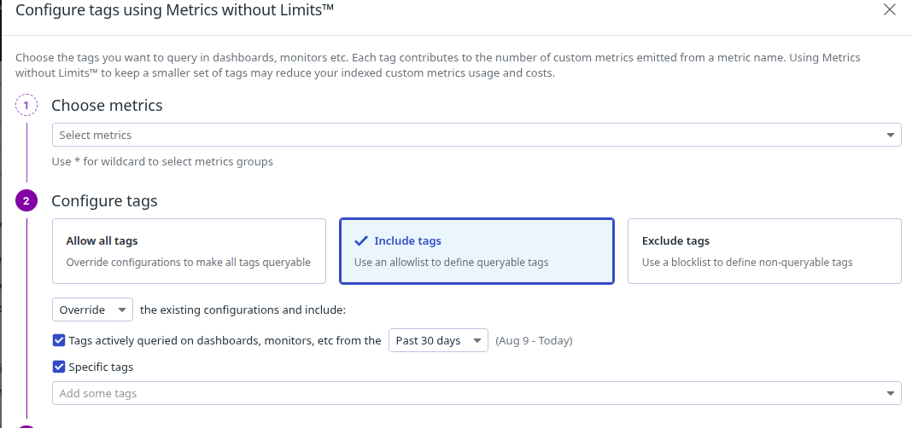

What is Datadog ?
---

Datadog is the essential monitoring and security platform for cloud applications.
It brigns together end-to-end traces, metrics and logs to make Observable of your entire applications, infrastructure and third-party service.

It is an observability service for cloud applications, Providing monitoring of servers, databases, tools and services through a SaaS based data analytics platform.

`It's just a Datadog Agent service will be installed on the application site to collect the metrics and that agent ships those metrics to datadog hosted on cloude.`

- **End-to-End monitoring Solutions** -collection of metrics, alerting system, troubleshooting and build-in dashboard to visualize the metircs.

- Datadog covers wide range of monitoring for:
  - Infrastructure monitoring,
  - Database monitoring,
  - Cloud monitoring,
  - Log monitoring,
  - Application performance monitoring,
  - Real user monitoring,
  - Container monitoring,
  - Security monitoring,
  - Synthetic monitoring.

- Datadog comes with pre-defined dashboards.

- Basic terminology


Datadog Architecture
---


- In your host the datadog agent is run and responsible for collecting the events, metrics and logs from the host and sending them to data backend to which user interact.

- Based on requirement, the metrics can be filtered, can be grouped and converted to dashboards.

🔹 Components in the Diagram

**1. Host (Server / VM / Container)**

- This is where your application (Python, Java, R, etc.) is running.

- Your code (via libraries, integrations, or APIs) sends metrics and logs to Datadog.

**2. DogStatsD**

- A statsd-compatible service bundled with the Datadog Agent.

- Applications send custom metrics via UDP (fast, low-overhead).

- Example: your app reports response time, errors, or custom counters.

**3. Collector**

- Collects system-level metrics (CPU, memory, disk, network, etc.) from the host.

- Also gathers integration data (databases, Docker, Kubernetes, etc.) using configuration files.

**4. Forwarder**

- Both Collector and DogStatsD send their metrics to the Forwarder.

- The Forwarder prepares the data (batching, compressing, encrypting).

- Communication to Forwarder happens over TCP/HTTP internally.

- **Forwarder will shift the collector's data to the cloud via memory buffer through HTTPS connections**.

**5. Buffer**

- Temporary queue in case of connectivity issues.

- If the Datadog backend is unreachable, data is buffered and retried later.

- **Once the data reached to Datadog backend, users can access to data dog website `https://datadoghq.com` and perform aggregations on that data or filter them to triggers alert to the users and create dashboard.**

**6. Agent**

- The Agent is the overall process running on the host (contains Collector, DogStatsD, Forwarder, Buffer).

- Responsible for collecting, processing, and sending metrics/logs/traces to Datadog.

**7. Datadog Backend**

- Metrics, logs, and traces are sent via HTTPS (port 443) to Datadog’s cloud platform (https://www.datadoghq.com).

- Once there, the data is stored, visualized, and used for dashboards, alerts, and analytics.

**8. User**

- The end user (you) logs into Datadog’s web UI to see dashboards, create monitors, set alerts, and analyze system/application health.

There is 3 more agent works if it is enabled in conf file.

APM Agent - Process to collect traces.
Process Agent - Process to collect live process info.

UI Agent - It is UI Side of data dog agent. If you want to see the datails of Datadog agent in UI, then Datadog provides you UI component which runs directly on the host where the datadog agent is running.

Datadog conf file is located at `/etc/datadog-agent/datadog.yaml`

`/etc/datadog-agent/conf.d/` - contains config files related to integrations that are run on the host where the datadog agent is running.

The metrics coming from the host is divided into 3 apps
1. Agent related metrics
2. ntp metrics
3. system metrics

What is Tagging ?
---

Tags are a way of adding dimensions to datadog telemetries so they can be filtered, aggragated and compared in datadog visualizations.

In Datadog, tagging is the process of attaching key-value metadata (labels) to your metrics, traces, logs, and other monitored data. Tags help you organize, filter, group, and search your data in dashboards, monitors, and alerts.


You can assing tags via Datadog UI , datadog.yaml

By datadog.yaml , write tags anywhere in yaml file

```yaml
tags:
  - "os":"ubuntu"
  - "os-version": "20.04"
```

**Processes**
Datadog’s Live Processes gives you real-time visibility into the processes running on your infrastructure. Use Live Processes to:

- View all of your running processes in one place
- Break down the resource consumption on your hosts and containers at the process level
- Query for processes running on a specific host, in a specific zone, or running a specific workload
- Monitor the performance of the internal and third-party software you run using system metrics at two-second granularity
- Add context to your dashboards and notebooks

Bydefault this live process is disabled, if you have installed datadog-agent 6 or 7 version follow the below steps:

- Edit main config file located at `/etc/datadog-agent/system-probe.yaml`
```yaml
process_config:
  process_collection:
    enabled: true
```

- To apply this changes , restart the datadog agent
```bash
sudo systemctl restart datadog-agent.service
```


- You can filter the process by tags


- You can filter by AND, OR, !


What is Scrumbing ?
---

- your applications and processes might contain some sensitive data like passwords, access tokens and all, which should not be visible in any of the views on data.

- When the Datadog Agent collects process information (via process_agent), it can capture the full command line used to start processes.

- This command line might contain secrets. Without scrubbing, these secrets could show up in Datadog dashboards, logs, or traces.

- Scrumb will hide this sensitive data and bydefault datadog has enabled this scrumb.
- This is reserved key used by datadog.


**What about custom sensitive words ?**

- Go to main config file and add lines to enable scrumb and our custom sensitive words
```yaml
process_config:
  process_collection:
    enabled: true
    scrub_args: true
    custom_sensitive_words: ['type', 'user']
```

- To create cutome process 
- Click on New metrics and fileter for process, choose metrics name and create


- But , This is not good approach. bcz this is work at single os level.
- What if you have to monitor all containers running of 100+ Hosts ?

- Here, You have to use Docker-Agent

- For datadog-agent 6+ , pull image from docker hub.
```bash
docker pull datadog/agent
```

- To setup docker-agent you have to pass your DD_API_KEY and DD_SITE.
```bash
docker run -d --cgroupns host --pid host --name dd-agent -v /var/run/docker.sock:/var/run/docker.sock:ro -v /proc/:/host/proc/:ro -v /sys/fs/cgroup/:/host/sys/fs/cgroup:ro -e DD_SITE=<DATADOG_SITE> -e DD_API_KEY=<DATADOG_API_KEY> gcr.io/datadoghq/agent:7
```


**Metrics Types:**

1. Count - Represents the total number of event occurences in one time interval.
Ex. Total no. of connections made to db

2. Rate - Represents the total number of event occurences in Given Time Interval.

Rate = Total count in the interval / Length of the time interval.

3. Gauge - Gauge takes the last value reported int the interval.
Ex. system.temp[71,71,71,72]
Gauge = system.temp[72]


- Gauge used for measuring values like temperature, current memory usage, the number of active threads.

4. Sets - Sets count the number of unique values passed to a key.

5. Histogram - Represent the statistical distribution of a set of values calculated in one time interval.
- The agent aggregates and generates new metrics using the data of flush interval of 10 sec.


**Customer Metrics**
- Customer metrics are useful in monitoring critical applications KPIs like:

  - No. of visitors on website.
  - Avg customer cart size.
  - Request latency.
  - Performance distributions.

**Customer Metrics Properties**
- **Metric Name** - Name of the custom metrics.
- **Metric Values** - Value of cusom metrics. Must be 32-bit and should not reflect dates or timestamps.

- **TimeStamp** - Can't be more than 10 minutes in the future or more than 1 hr in the past.

- **Tags** - Tags associated to the metrics.
- **Metric Type** - can be count, rate, gauge, set, histogra, or distributions.

- **Interval** - Flush interval for rate and count type.

**Custom Metrics Submission Type**
- Custom metrics can be sent to datadog using multiple submission types.

- There are 4 submission types
**1. Agent Check** - You can submit metrics like count, gauge, rate, histogram.
**2. DogstatsD** -
**3. Powershell** - 
**4. API** - 

  - **Count** - To submit count type metrics, `monotonic count` or `count function` is used.
  - `monotonic count()` - Used to track a new COUNT metrics that **Always increases**.
  - Sample that have a lower value than the previous samples are ingnored.
  - `count` is used to represent the metrics like - **No. of requests served, task completed or errors encountered.**

  - Stored with a COUNT Mertics type in datadog.

  `monotonic count functions template`

```bash
self.monotonic_count(name, value, tags=None, hostname=None, device_name=None)
```

- Examples: First execution [3,5,9] -- (9-3)=6 , Second executions [10,11] -- (11-9) =2.

  `count function` - **count()** - Submit the **No. of events** that occured during that check interval.

  - Ex. First Execution [3,5,9] -- 3
        Second Execution [10,11] -- 2
  `count function` - 
```bash
self.count(name,value,tags=None, hostname=None, device_name=None)
```

- A custom metric in Datadog is not just the metric name.
It’s identified by: `metric_name + all tag value combinations`

- So if you change a tag’s value, Datadog considers it a different custom metric.
- Suppose you emit this metric in your Python check: `self.count("file.modified.count", 5, tags=["env:prod", "region:us"])`  → counts as 1 custom metric.

- If you assing multiple tags:
- Even though the metric name is the same (file.modified.count), you have 3 unique tag sets → 3 custom metrics.
```py
file.modified.count{env:prod, region:us}
file.modified.count{env:prod, region:eu}
file.modified.count{env:dev, region:us}
```


What if you want to query only that metrics having new tags and remaining all other tags shall be non variable.
---

- At this time, you have to index that new tags to keep it variable for this mertics and remaining all other tags will be non-variables.

- Choose custom metrics on datdog UI
- Click on mamanged tags


- Choose new tags from include tags


- If you want to **index a bulk of tags**, go to **Configure Metrics** and choose your tags




- **Rate()**


- To create custom_rate metrics
- add custom_rate.yaml at /etc/datadog-agent/checks.d/custom_rate.py

- There are 2 ways to submit our custom metrics to datadog.
- This is the `1st way` of submit our custom metrics using **Agent check** in py.
- add /etc/datadog-agent/conf.d/custom_rate.d/custom_rate.yaml
```yml
init_config:

instances:
  - min_collection_interval: 60
```
- restart the datadog-agent
```bash
sudo systemctl restart datadog-agent
```


- **Histogram**

- Use this function to create histogram
```py
self.histogram(name,value,tags=None,hostname=None,device_name=None)
```

- The `2nd way` of submit our custom metrics is using **`DogstatsD`**.

- To submit our custom metrics we will use python web applications code.

```py
import http.server

APP_PORT = 81

class HandleRequests(http.server.BaseHTTPRequestHandler):

    def do_GET(self):
        self.send_response(200)
        self.send_header("Content-type", "text/html")
        self.end_headers()
        self.wfile.write(bytes("<html><head><title>First Application</title></head><body style='color: #333; margin-top: 30px;'><center><h2>Welcome to Datadog-Python application.</center></h2></body></html>", "utf-8"))

if __name__ == "__main__":
    server = http.server.HTTPServer(('localhost', APP_PORT), HandleRequests)
    server.serve_forever()
```

- **DogstatsD Metircs supported** is
  - count
  - Gauge
  - Set
  - Timer
  - Histogram
  - Distributions

DogstatsD - Count
---

**Increment()**
- Used to increment a COUNT metric.
- Used to represents **Monotonically increasing** counter whose value **Can only increase** or it can be **reset to zero on restart**.
- Use cases - **Number of requests served, task completed or errors encountered**.

```bash
increment(<METRIC_NAME>,<SAMPLE_RATE>,<TAGS>)
```

- Sample rate specifies **What percent of generated metrics are sent to Datadog**.

**decrement()**
- Used to decrement a COUNT Metrics.

```bash
decrement(<METRIC_NAME>,<SAMPLE_RATE>,<TAGS>)
```

Now, add or make instrumentation to our web app for DogstatsD
---

```py
import http.server
from datadog import initialize, statsd # This is added

APP_PORT = 81
options = {'statsd_host':'localhost', 'statsd_port':8125} # Bydefault, DogstatsD is enabled over Port 8125

class HandleRequests(http.server.BaseHTTPRequestHandler):

    def do_GET(self):
        statsd.increment('app.http.request.count', sample_rate=1, tags=["env:dev", "app:pythonapp"]) # This is we instrumented our apps, to serve the total requests counts.
        self.send_response(200)
        self.send_header("Content-type", "text/html")
        self.end_headers()
        self.wfile.write(bytes("<html><head><title>First Application</title></head><body style='color: #333; margin-top: 30px;'><center><h2>Welcome to Datadog-Python application.</center></h2></body></html>", "utf-8"))

if __name__ == "__main__":'
    initialize(**options)
    server = http.server.HTTPServer(('localhost', APP_PORT), HandleRequests)
    server.serve_forever()
```

- You have to install datadog library for pythons.
```bash
sudo pip install datadog
```
