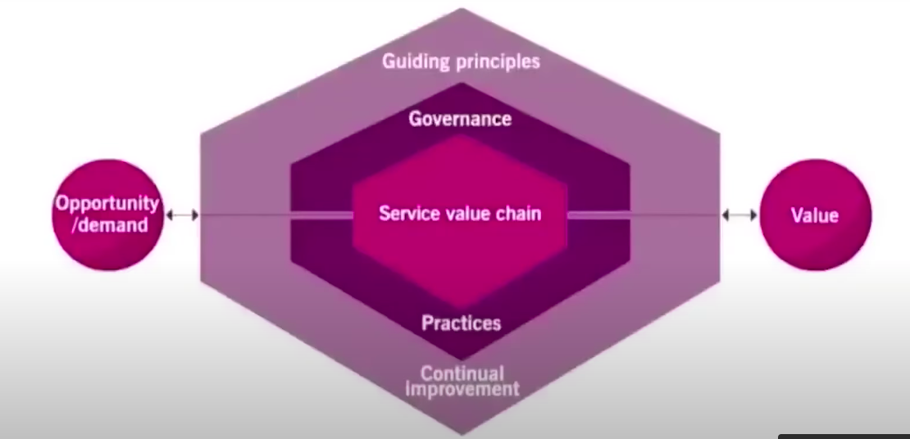
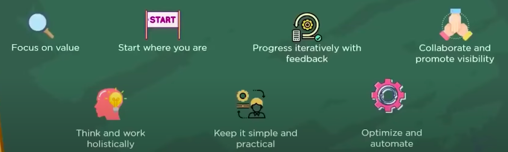
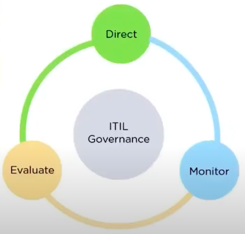

Information Technology Infrastructure Library
---

This is a Globally recognized framework for managing IT Services effectively and efficiently.
ITIL 4 is the latest iterations of the framwork introduces the new concept and best practices.

# What is IT Service Management and its Benifits
- Large, medium and small org uses ITIL in order to improve the value of their services.
- But,  How can ITIL improve an org performance ?
 
  - Reduced IT costs
  - Enhanced IT Services
  - Improved Productivity
  - Better management of business risk and service disruptions
  - Improved customer satisfactions by delivering efficient services
  - Provides guidance to address service management challenges.

- ITIL 4 is the latest framwork which was released in Feb 2019.
- It focused on:

  - Practical approch on how to manage the core principle of quality service.
  - How to implement ITIL from large to small org.
  - How ITIL Can be utilized with framwork such as Agile, Lean and DevOps.

## What is ITIL 4 ?
- ITIL is a set of framworks for IT service management that helps in aligning IT services with  requirement of busines.
- ITIL 4 helps to org to deliver IT services using most effcient methods 

## What is ITSM ?
- IT service management is fouces on how an org maintains IT services for customers.
- Also it controls the various activity like planning, designing, delivering, deploying and managing services.

## How to Identify whether a service is delivering value to the consumer and meeting their requirements ?

- This can be identified by evaluating the **Utility** and **Warranty of the service**.

- **Utility** is the functionality offered by a product in order to meet a specific requirement.

- **Warranty** provides customers with a **Assurance of produce or services**.

- Warranty is ensuring that 

  - Service Availability
  - Information Security
  - Service Capacity
  - Service Continuity

Elements of ITIL 4
---

The key elements of ITIL 4 are:
1. Four dimentinos
2. ITIL Service value systems.

**1. The four dimentinos are:**
- Org and People
- Informations and Technology
- Partners and Suppliers
- Value streams and processes

**Org and People**
- This refers the Org structure, culture, people , principles, the values revoling around the people and org structure which makes for providing better outcomes for creating better outcomes for the services.

**Information and Technology**
- Involess information and knowledge which is required along with technology to provide a required servcies and service management

**Partners and Suppliers**
- Focuses on those stackholders who supply the services for service provider. So that the service provider can provide the better services to their consumers of the services.

**Values and Streams**
- Refers to the series of steps org takes to create, deliver product thoughout the services to a consumer

**2. ITIL Service value systems.**

The components of Servcie Value Systems

**Guiding Principles**
- Providing a comprehensive vision of how an org should manage a service.

There is 7 guiding priciple

**Focus on value** - It means Everything we do as part of services. Every tasks an org does , should create value for stackholders especially it should fouces on user experience and give better consumer experience so that thete can be continuity continually the value will realized by the consumers.

👉 Always do things that bring value to customers or the business.

**Start where you are** - Ensure that org assess and analyze the current scenario to identify and improve thing on a continual basis.

👉 If your company already has a helpdesk system, improve it instead of buying a new one immediately.

**Progress iteratively with feedback**
👉 Take small steps, test, get feedback, then move forward.
Ex. Instead of building a whole new website in 6 months, release a small part, get user feedback, then improve further.

**Collaborate and promote visibility**
👉 Work together, share knowledge, and avoid working in silos.
Ex. Developers, testers, and support teams should communicate openly so issues are solved faster.

**Think and work holistically**
👉 Look at the big picture, not just one part.
Ex. If email is down, don’t just check the server; think about networks, security, and user devices too.

**Keep it simple and practical**
👉 Don’t make things more complicated than needed.

**Optimize and automate**
👉 First make processes efficient, then automate them.
Ex. If password reset takes too much time, first simplify the process, then set up a self-service reset system.

**Governance**
It is reponsivle for Evaulating, Directing & Monitoring the ITSM, by adopting the Guiding principles defined in ITIL 4 Framework.

There are three main activity in Governance

1. Evaluate, 2. Direct, 3. Monitor

  **1. Evaluate** - This performes a regular review of the services based on the stackholder's requirements.

  👉 Check the situation, options, and risks before making decisions.
  Ex. Management reviews if a new cloud service is secure, cost-effective, and useful before approving it.
  
  **2. Direct** - whatever is provided based on the evaluations done for the ITSM org. Accordingly the required directions can be accomplished.

  👉 Give instructions, set goals, and make policies for teams to follow.
  Ex. Management decides “We must move 50% of apps to the cloud in 1 year” and tells IT teams what to do.

  **3. Monitor** - 
  - It monitors the performance of the org and checks whether its practices, products and services are inline withthe direction given by the governing body.

  👉 Watch results, check performance, and see if goals are being achieved.
  Ex. Management checks reports every month to see if apps are really moving to the cloud as planned.

**Service Value Chain**

A set of Interconnected activities that an org performes to deliver a valuable product or service to its consumers.

It have activities like Engage, Plan, Improve, Design and transistions, Obtain/Build, Deliver & Support, Product & Services.

**Plan** - Refers to the activites involving like creating plans, protfolios, architectures, policies etc provided by the org.

You will be enabled to get the clarity in terms of to get detail about the services and what are those results which are required to be established.

📖 Definition: Ensure a shared understanding of vision, current status, and improvement direction for all activities.

Ex. An IT company plans how to launch a new food delivery mobile app — setting budgets, timelines, and objectives.

**Engage** - Engaging with stackholders reequires clear focus on understancing the requirements as needed by the consumers.

📖 Definition: Build a good understanding of stakeholder needs, maintain transparency, and manage relationships.

Ex. Talking to restaurant owners, delivery partners, and customers to understand what features they need in the app.

**Desing and Transitions** - Focuses on creating and releasing new and changed services.

📖 Definition: Design new or changed services and ensure they meet quality, cost, and time requirements before going live.

Ex. Designing the food delivery app, testing it, and preparing for release on the App Store/Play Store.

**Obtain/Build**

📖 Definition: Ensure service components (apps, infrastructure, tools, resources) are available when and where needed.
Ex. Developers write code, build the mobile app, set up cloud servers, and integrate payment gateways.

**Deliver & Support**

📖 Definition: Deliver services and provide support according to agreed specifications and expectations.
Ex. Customers download the app, place orders, and get 24/7 support if payments fail or delivery is late.

**Improve**

📖 Definition: Ensure continual improvement of products, services, and practices across all activities.
Ex. After launch, the company collects user feedback (slow checkout, missing tracking feature) and continuously improves the app.

## Bringing it all together (Flow Example):

  - **Plan** → Decide to build a food delivery app.

  - **Engage** → Ask restaurants and customers what they need.

  - **Design & Transition** → Design, test, and prepare app for launch.

  - **Obtain/Build** → Developers code the app, servers are set up.

  - **Deliver & Support** → Customers use the app, and IT support helps.

  - **Improve** → Collect feedback and keep upgrading.

**Practices**

A practice is a set of organizational resources designed for performing work or accomplishing an objective.

👉 In short: Practices are the capabilities, processes, people, and tools an organization uses to get specific outcomes.

The practices are divided into 3 categories:

1. General Management Practice (14 Practices)

You want examples to help you understand the three types of ITIL 4 practices. Think of a company that sells software online. Here’s how the three practice categories would work in that company.

These are like the foundation of the company itself. They're not just about IT; they're about how the entire business is run.

    Example: Project Management 👷
    The company wants to launch a new version of its software. The project management practice is used to plan all the steps: setting deadlines, assigning tasks (like coding the new features and writing the marketing materials), and making sure the project stays on budget. This practice is used by many parts of the business, not just the IT department.

    Example: Risk Management 🚨
    Before launching the new software, the company uses the risk management practice to think about what could go wrong. They might identify risks like a competitor releasing a similar product first, or a bug in the new version causing a major outage. They then plan how to handle these risks.

14 Practices are:

    Architecture Management

    Continual Improvement

    Information Security Management

    Knowledge Management

    Measurement & Reporting

    Organizational Change Management

    Portfolio Management

    Project Management

    Relationship Management

    Risk Management

    Service Financial Management

    Strategy Management

    Supplier Management

    Workforce & Talent Management

2. Service Management Practice

These practices are all about how the company's IT department delivers and supports the software as a service to its customers. They are the core of IT service management.

    Example: Incident Management 🆘
    A customer calls the support line because the software is crashing every time they try to save a file. The incident management practice kicks in. A support agent (from the service desk) logs the incident, tries to find a quick fix, and if they can't, they escalate it to a technical team to get the service working again as fast as possible. The goal is to restore normal service operation quickly.

    Example: Service Level Management (SLM) 🤝
    The company has an agreement with its enterprise customers (Service Level Agreement or SLA) that their support requests will be answered within one hour. The SLM practice is used to monitor this performance, ensuring the support team consistently meets or exceeds this target. It's about setting and meeting expectations for service quality.

    Example: Change Enablement 🔄
    When the company wants to release a new feature for the software, they don't just put it on the website. The change enablement practice ensures the update is planned and tested to prevent it from causing new problems. They evaluate the risk of the change and get approval before it goes live to make sure it won't break anything for existing users.

  Availability Management

  Business Analysis

  Capacity & Performance Management

  Change Enablement

  Incident Management

  IT Asset Management

  Monitoring & Event Management

  Problem Management

  Release Management

  Service Catalog Management

  Service Configuration Management

  Service Continuity Management

  Service Design

  Service Desk

  Service Level Management

  Service Request Management

  Service Validation & Testing

3. Technical Management Practice

  - Deployment Management

  - Infrastructure & Platform Management

  - Software Development & Management

These are the most hands-on, technical practices that deal with the actual technology and infrastructure. They're what makes the services run.

    Example: Infrastructure and Platform Management 💻
    The company's software is hosted on cloud servers. The infrastructure and platform management practice is used to manage these servers. This includes things like making sure there's enough server space to handle a large number of users and keeping the operating systems updated to prevent security vulnerabilities.

    Example: Deployment Management 🚀
    After a new software feature has been approved through change enablement, the deployment management practice is used to move the new code from the development environment to the live, production environment that customers use. This is the act of physically putting the new feature "out there" for everyone to use, and it's done in a controlled way to minimize disruption.

    Example: Software Development and Management 🧑‍💻
    This practice covers everything from writing the code for the new software features to testing them to make sure they work correctly and don't introduce bugs. It's the technical work of actually building and maintaining the software itself.

