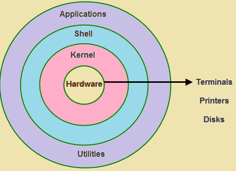

# 🐧 Linux Kernel

## 📌 What is Kernel?
The **Kernel** is the **core component of the Linux Operating System**.  
It acts as a **bridge between hardware and software**, managing how applications interact with physical resources (CPU, memory, disk, devices).
kernal is a program that is stored inside of your OS. It takes command from shell and talks with hardware which is inside of your PC. Shell and kernal together that software built together in one package is called OS.

You can also say that,
**It is an programm which is run all time like calender, clock, window updations, scanning etc.**

---

## 🎯 Kernel Responsibilities
1. **Process Management** – Handles execution, multitasking, scheduling, and termination of processes.  
2. **Memory Management** – Allocates and frees RAM, ensures processes don’t overwrite each other.  
3. **Device Management** – Uses drivers to control hardware devices (keyboard, printer, disk, network card).  
4. **File System Management** – Reads/writes files, manages permissions, organizes data on disks.  

---

## 🌀 Kernel in Linux Architecture

Here’s a layered view of where the kernel sits:



#### See which kernel version is running
```bash
uname -r
```

#### Show full system + kernel info
```bash
uname -a
```

#### Check Linux distribution + kernel version
```bash
cat /etc/os-release && uname -r
```

#### View kernel log messages (requires root)
```bash
dmesg | less
```

### What is linux and why linux ?
- It is an OS is set of instruction that tell the computer what to do or supports computer functinos like executig applications and manage the hardware.
- OS Allows applications to store informations, send docs to pritnters and interect to users.

- Linux can runs on many hardware.
- It allows to runs on older hardware or on embedded system. which means it allow to run on hardwae with least pre-requisites.

# Linux Directory Structure

**/** - Root, the top of the file system hierarchy.

**/bin** - Binraries & Excecutable programs.

**/etc** - System Configurations files for Applications , OS. ex. /etc/nginx/nginx.conf

**/var** - Variable data, apps logs file. /var/log/nginx/access.log or error.log

**/usr** - User related programs.

**/opt** - Third party software installed pkg.

**/home** - Home Directory.

**/boot** - Files requires to boot the OS.

**/media** - Used to as a locations to acess the files stored on CD ROMs, USB Drives

**/root** - Home Directory for Root Account.

**/srv** - To store data served by linux server.

# Common Linux Commands

**rm - file.txt** -- remove single files.
**rmdir dir1/** -- Remove empty dir

once removed, a file is really gone, and there is generally no way to get it back unless you have backups, or you are really fast and have a real good system administrator. To protect the beginning user from this malice, the interactive behavior of the rm, cp and mv commands can be activated using the -i option. In that case the system won't immediately act upon request. Instead it will ask for confirmation, so it takes an additional click on the Enter key to inflict the damage:

```bash
mary:~> rm -ri archive/
rm: descend into directory `archive'? y
rm: descend into directory `archive/reports'? y
rm: remove directory `archive/reports'? y
rm: descend into directory `archive/backup'? y
rm: remove `archive/backup/sysbup200112.tar'? y
rm: remove directory `archive/backup'? y
rm: remove directory `archive'? y
```

# Find the file
```bash 
find <path> -name <filename>
```

- find can also perform operations on the found files. A common example is removing files. It is best to first test without the -exec option that the correct files are selected, after that the command can be rerun to delete the selected files. Below, we search for files ending in .tmp:

```bash
find . -name "*.tmp" -exec rm {} \;
```
## Rename all old file to *.old using find command
```bash
find . -name *.tmp -exec mv {} {}.old \;
```

## To lists all 90 days old file with find command
```bash
find . -mtime +90 -exec ls -l {} \;
```

## sort the file and move/rename it with find command
```bash
find /usr - name S* ls -l -exec mv {} {}.test \;
find /usr -type f -name "S*" -exec cp {} /target/dir/ /home/einfochips/DevOps_Tool/Linux {}.old \;
```

## find and copy whole folder with all files and dir using find command
```bash
find /dir/path/ -type f,d -name "*" -exec cp -R {}  /targeted/dir/ \;
```

## Find the oldest file using -mitme days.
```bash
find /usr/bin -mtime +10 -mtime -90
```

## Delete files and folders with keep required files and folders using find command
```bash
find . ! -path "./README.md" ! -path "./kernal.png" ! -path "." -delete
```

## find files with ls
```bash
find /usr -name S* -ls
```

## find files with size
```bash
find /user -size +10M
```

## read file from top
```bash
head file.txt
```

## read file from bottom
```bash
tail file.txt
tail -10 file.txt ## Will show last 10 lines from bottom of file
```

# Disk Usage
**du -k** - Display size in kb.
**du -h** - Display size in human readable.

# WildCards make easy to matching the files
## filter the file for ending with .txt
```bash
ls -l /path/ *.txt
```
## filter the file for starting with character
```bash
ls -l abcd.*
```

## filter for only total character of files
- README.md . Here total character is 6 README and ending with .md
```bash
ls -l ??????.txt

```

## fileter file with given opions and ending with .txt
```bash
ls file[0-9].txt
file1.txt

ls *[a-z].txt
awk.txt     bhavin_rsync.txt  message.txt  server_config.txt      testssh.txt
backup.txt  hello.txt         sed.txt  

ls *[a-z][0-9].txt
abc1.txt  abc2.txt  abc3.txt  abc4.txt  abc5.txt  abc6.txt  abc7.txt  abc8.txt  abc9.txt  file1.txt
```
# Create multiple file and folders
## Create dir into dir
- User -p wiht mkdir
```bash
mkdir -p dir1/dir2/dir3/dir4
```

## create multiple files
```bash
# use { } and to define range use ..
file {1..4}.txt
ls
file1.txt file2.txt file3.txt file4.txt
```

## create multiple dirs
```bash
# Use { } to define range
mkdir {jan,feb}{2024..2025}
#OutPut: 
feb2024  feb2025  jan2024  jan2025
```
## Create multiple files into multiple dirs
```bash
touch {jan,feb}{2024..2025}/file{1..10}.txt
# OutPut
ls {jan,feb}{2024..2025}/file{1..10}.txt
feb2024/file10.txt  feb2024/file8.txt   feb2025/file6.txt   jan2024/file4.txt   jan2025/file2.txt
feb2024/file1.txt   feb2024/file9.txt   feb2025/file7.txt   jan2024/file5.txt   jan2025/file3.txt
feb2024/file2.txt   feb2025/file10.txt  feb2025/file8.txt   jan2024/file6.txt   jan2025/file4.txt
feb2024/file3.txt   feb2025/file1.txt   feb2025/file9.txt   jan2024/file7.txt   jan2025/file5.txt
feb2024/file4.txt   feb2025/file2.txt   jan2024/file10.txt  jan2024/file8.txt   jan2025/file6.txt
feb2024/file5.txt   feb2025/file3.txt   jan2024/file1.txt   jan2024/file9.txt   jan2025/file7.txt
feb2024/file6.txt   feb2025/file4.txt   jan2024/file2.txt   jan2025/file10.txt  jan2025/file8.txt
feb2024/file7.txt   feb2025/file5.txt   jan2024/file3.txt   jan2025/file1.txt   jan2025/file9.txt
```

# man for manual of any command
## find manuals for multiple commands
```bash
man -a cal pwd
```
## find where the command is located
```bash
which -a date cal
/usr/bin/date
/bin/date
/usr/bin/cal
/bin/cal
```

## search content to manual of commands
- use -k for serach inside manuals.
- Search contens like "list directory contents"
```bash
man -k "list directory contents"

## OutPut
dir (1)              - list directory contents
ls (1)               - list directory contents
ntfsls (8)           - list directory contents on an NTFS filesystem
vdir (1)             - list directory contents\
```

# Std Input and Std Output
- Std Input is connected to your keyboard for waiting for input
- Std Output is connected to your terminal to show the result of std input

```bash
cat - Enter
 cat - Waiting for your input and whatever you will give input same will give output
m - Std input
m - Std output
^C

# While cat file.txt
line1
line2
```

# Redirect the std input/output
## std input - 0, std output - 1, std error - 2

- Redirect your all std input of command cat to file std_output.txt
- use std output - 1 , > - Redirect output.

```bash
cat 1> std_output.txt
std input
^C

cat std_output.txt
std input
```

## Take std input from a file and redirect to output.txt
```bash
cat 0<std_output.txt 1> output.txt
cat output.txt
std input
```
## Std Output and Std Error
```bash
cat -k hi 2>> error.txt
cat error.txt 
cat: invalid option -- 'k'
Try 'cat --help' for more information.
```

# Std input , Std output using tee command
```bash
date | cut --delimiter=" " --field=1 | tee fullday.txt
Tuesday
cat fullday.txt 
Tuesday
```

## Tee command allow to print output in file by vertically while using pipe for one commands output will use as input for next command.
```bash
date | tee fullday.txt | cut -d " " -f 1
cat fullday.txt
Tue 19 Aug 2025 12:45:24 AM IST
```

- here, tee command will print the output of date to fullday.txt and this output of date will pass to next command for cut and print 1st field like Tue.

## use xargs Command in pipe.
- xargs allow you to convert piped data into command line arguments for commands that only accept command line arguments.
- Some commands don’t accept piped input (|), they only work with arguments passed directly.
- Example:
```bash
rm file1 file2 file3
# works because rm accepts file names as arguments.
```

- But if you try:
```bash
echo "file1 file2 file3" | rm
# it fails, because rm does not read from stdin (the pipe).
```

## xargs takes piped input and converts it into arguments for the command.
```bash
echo "file1 file2 file3" | xargs rm
```
- Delete all .log files found:

```bash
find . -name "*.log" | xargs rm
```

  - find outputs file list (stdin).

  - xargs converts them into arguments for rm.

## Try to print date output by echo using xargs.
```bash
date | xargs echo
Tue 19 Aug 2025 12:02:43 PM IST
```
## Print hello, currten date using xargs and echo
```bash
date | xargs echo "Hello,"
Hello, Tue 19 Aug 2025 12:08:55 PM IST
```

# Alias -- to give nickname for long commands
```bash
date | tee fulldate.txt | cut -d " " -f 1 | tee day.txt | xargs echo "Hello, today is "
# OutPut: Hello, today is  Tue
alias getdats='date | tee fulldate.txt | cut -d " " -f 1 | tee day.txt | xargs echo "Hello, today is "'
```
## Now, run alias commands named "getdates"
```bash
getdates 
Hello, today is  Tue
```

## Now, use alias which will recieve output from "echo 12 2025" and input to thing.txt with one month before , current month and one month after.
```bash
alias calmagic="xargs cal -A 1 -B 1 > thing.txt"

# alias is created
# Now, just pass cal input like "12 2025" to calmegic
echo "12 2025 | calmegic

cat thing.txt
November 2025         December 2025          January 2026      
Su Mo Tu We Th Fr Sa  Su Mo Tu We Th Fr Sa  Su Mo Tu We Th Fr Sa  
                   1      1  2  3  4  5  6               1  2  3  
 2  3  4  5  6  7  8   7  8  9 10 11 12 13   4  5  6  7  8  9 10  
 9 10 11 12 13 14 15  14 15 16 17 18 19 20  11 12 13 14 15 16 17  
16 17 18 19 20 21 22  21 22 23 24 25 26 27  18 19 20 21 22 23 24  
23 24 25 26 27 28 29  28 29 30 31           25 26 27 28 29 30 31  
30     
```

# 📂 locate Command in Linux

## 🔹 What is `locate`?
The `locate` command is a **fast file search utility** in Linux/Unix.  
Unlike `find`, it uses a **prebuilt database** (created by `updatedb`) instead of scanning the entire filesystem, making searches much faster.

---

## 🔹 Why DevOps Engineers Use It
- 🚀 **Quick file searches** → find configs, logs, scripts instantly  
- 🛠️ **Troubleshooting** → check if required files/binaries exist  
- 🤖 **Automation** → integrate in scripts for fast lookups  
- ✅ **Verification** → confirm installation of configs/binaries (e.g., `docker.service`, `nginx.conf`)  

---

## 🔹 Common Options

### 1. `-e` / `--existing`
Show only files that **currently exist** (ignore stale entries in the database).

```bash
locate -e nginx.conf
```

### 2. `--follow`
locate the symbolic links
```bash
locate --follow /etc/nginx
```

### 3. `-l` -- limit
Limit the number of results shown
```bash
#→ Shows only the first 5 results.
locate -l 5 nginx
```

### Find the first 10 existing Nginx configs:
```bash
locate -e -l 10 nginx.conf
```
### Find Docker service unit file:
```bash
locate -e docker.service
```

### 🔹 locate vs find

| Feature     | locate                               | find                                  |
| ----------- | ------------------------------------ | ------------------------------------- |
| Speed       | Very fast (uses database)            |    Slower (scans filesystem)          |
| Freshness   | May show deleted files (stale cache) | Always real-time                      |
| Flexibility | Filename-based only                  | Can search by size, time, perms, etc. |

