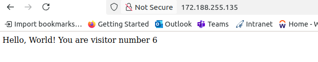
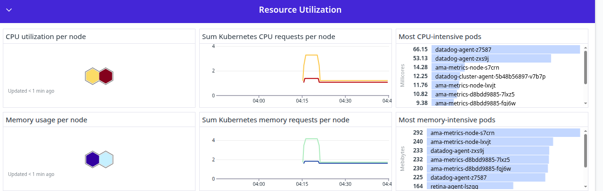

Enable Datadog for AKS
---

- Provision AKS
- Run below command to get into aks
```bash
sudo az aks install-cli

# login to azure
az loin

# to get .kube/config 
az aks get-credentials --resource-group <resource-group-name> --name <cluster-name>

kubectl get nodes
NAME                                STATUS   ROLES    AGE     VERSION
aks-agentpool-27452892-vmss000000   Ready    <none>   7m45s   v1.32.6
aks-agentpool-27452892-vmss000001   Ready    <none>   7m37s   v1.32.6
```

- Create configmap and secrets

```bash
kubectl apply -f configmap.yml
kubectl apply -f secret.yml
```

- Deploy nodejs app and services

```bash
kubectl apply -f deployment.yml
kubectl apply -f services.yml
kubectl apply -f redis-deployment.yml
kubectl apply -f redis-service.yml
```

- For NodeJS , LoadBalancer service willl created. To access this app use LB External IP.

```bash
http://LB_External_Ip
```


Enable Datadof agent for aks
---

- Go to UI > Agents > Choose K8s > AKS


- To install dd-agent

```bash
helm repo add datadog https://helm.datadoghq.com

helm install datadog-operator datadog/datadog-operator

kubectl create secret generic datadog-secret --from-literal api-key=XXXXXXXXXXXXXXXXXXXXXXXXXXXXXXXX
```

- datadog-agent.yml will provided by Datadog.

```yml
kind: "DatadogAgent"
apiVersion: "datadoghq.com/v2alpha1"
metadata:
  name: "datadog"
spec:
  global:
    site: "ap1.datadoghq.com"
    credentials:
      apiSecret:
        secretName: "datadog-secret" # Created earlier by cli
        keyName: "api-key"
  features:
    apm:
      instrumentation:
        enabled: true
        targets:
          - name: "default-target"
            ddTraceVersions:
              java: "1"
              python: "3"
              js: "5"
              php: "1"
              dotnet: "3"
              ruby: "2"
    logCollection:
      enabled: true
      containerCollectAll: true
  override:
    clusterAgent:
      containers:
        cluster-agent:
          env:
            - name: "DD_ADMISSION_CONTROLLER_ADD_AKS_SELECTORS"
              value: "true"
```

- Run this to deploy dd-agent

```bash 
kubectl apply -f dd-agent.yml
```


- Go to kubernetes


- Default dashboard for k8s overview


- Top cpu and memory usage



- Configure metric monitor for nodes are unavailable

  - configure it

  

  - configure threshold

  

  - configure alert for if nodes are unavailable below 90% - warning and below 80% - P1 Alert

  

  - Configure for cpu and memory usage for all pods.

