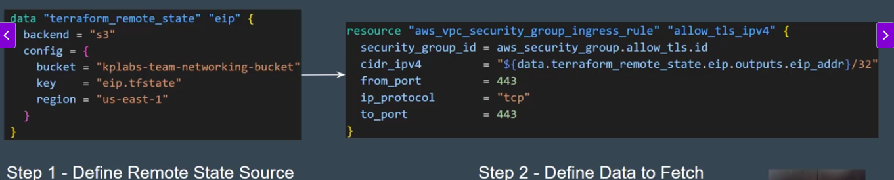
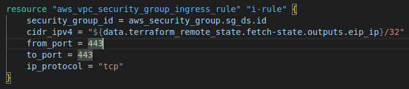

- Create two folders for networkging-team and security-team.

- Create Elatic IP resource in Networking team and Store the state file in S3 Bucket. Output values should have informations of EIP.

- In Security Team, use Terraform remote state data source to connect to the tfstate file of Networking Team.

- Use the Remote state file to fetch EIP and whitelit it in the Security Group Rule.

**Introducing Remote State Data Source**

- The **teraform_remote_state** data source allows us to fetch output values from terraform.tfstate files in remote state like S3, dynamodb.

- Usefull while A Team want to fetch details from remote state file for updatin or modifying security group cidr blocks of elastic ip which is saved in remote state files.

- Usefull while a lot of times your infra is updated manually or by another teams. You will have to fetch those modified details via **terraform_remote_state** block.

- If Security Team want to fetch details from remote state, then they have to use **terraform_remote_state** and in this block they have to define backened path like s3, dynamodb, its name, its regions etc.

- You have to write outputs.<Your_resource_name_of_aws_eip>

