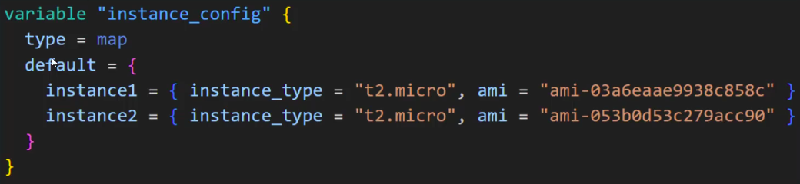

You will be provided with a variable name **instance_config**.

The variable type is map

Conditions to Meet
---

1. Based on the value specified in map, EC2 instances should be created accordingly.

2. If key/value is removed from the map, EC2 instance should also deleted accordingly.

Ex. If you add new instance , instance3 with its ami and instance_type, that instnace3 should create.

If you removed instance1 , that instance EC2 should also deleted.

