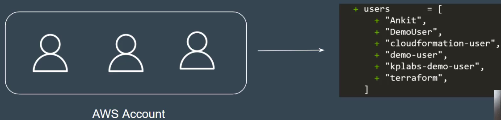

Condition 1
---

- Clients wants a code that can create IAM user in AWS with following syntax:

`admin-user-{account_number_of_aws}`

AWS: 12345

Output should like this - **admin-user-12345**.


Condition 2
---

Client wants to have a loginc that will show names of ALL Users in AWS account in the output.



Condition 3
---

Aling with list of users in AWS, client also wants terraform to show Total number of users in AWS.

Ex. If there are 100 users , Output should like in numeric like 200.

Hints
---

**Hints 1**

- To fetch aws account number and all existing IAM Users in aws account, use **Data Sources**.

Solutions
---

1. How to fetch account number ?

```h
data "aws_caller_identity" "current" {}

// Create user with account number
resource "aws_iam_user" "iam" {
    name = "admin-user-${data.aws_caller_identity.current.account_id}"
}
```

2. List of all users name

```h
data "aws_iam_users" "iu" {

}

output "list_of_users" {
    value = data.aws_iam_users.iu.names
}
```

3. Print Total count of all users

```h
output "Total_count_of_users" {
    value = length(data.aws_iam_users.iu.names)
}
```


