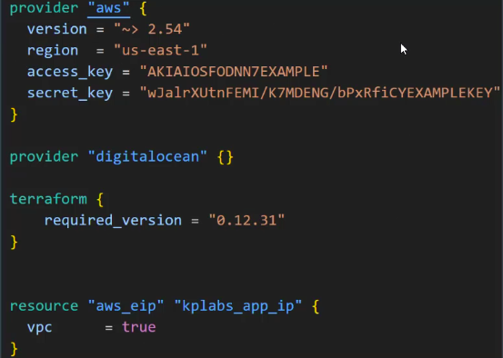
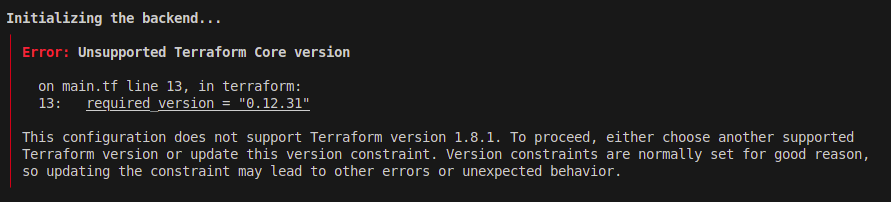
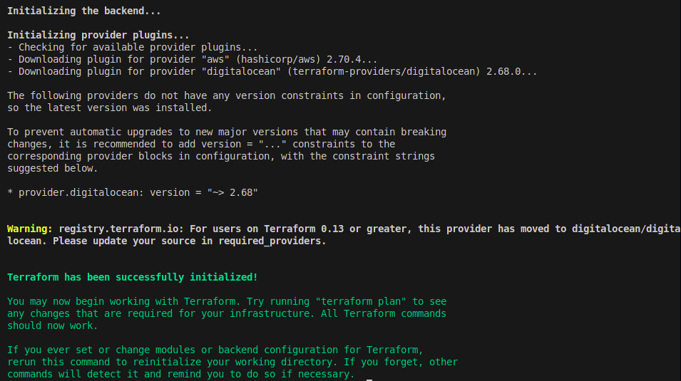
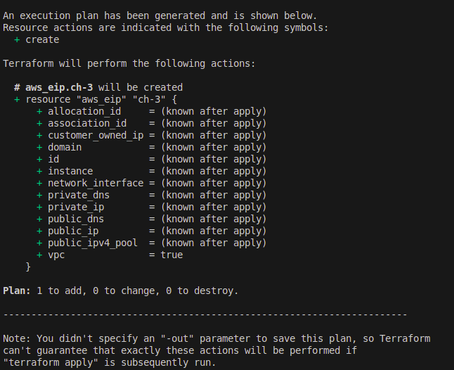
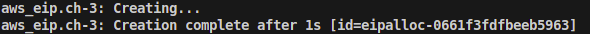
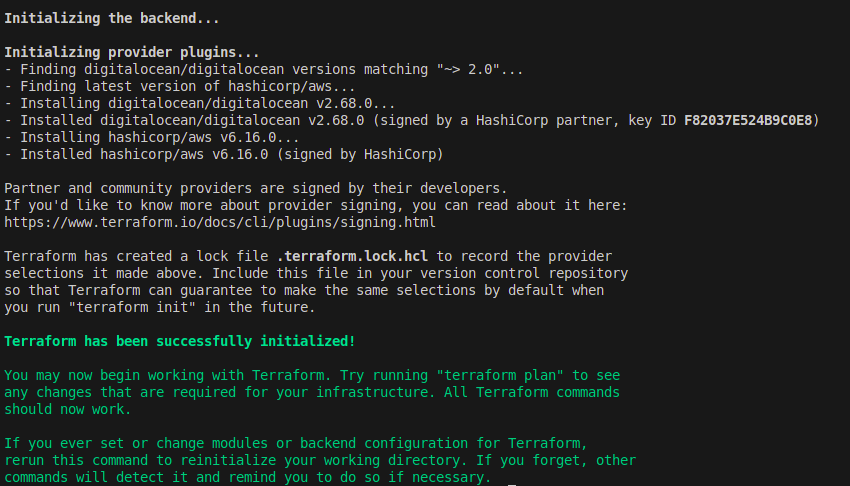
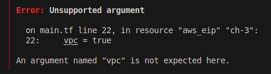
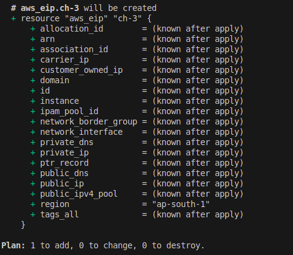

A Developer at sample small corp had created a Terraform File for creating certain resources.

The code was written a few years back based on the old terraform versions.

The sample code is.



You have to do ?

1. Create Infrastructure using the provided code **(Without Modifications)**.

2. Verifyif the code works in the latest version of terraform and providers.

3. Modify and Fix the code so that it works with latest version of Terraform.

Hints
---

**1. Create Infrastructure using the provided code **(Without Modifications)**.**

```bash
terraform init
```



- It is failed bcz, Now latest terraform version is not supported older verions of terraform "0.12.31".

- But you should create infrastructure without modification code like modify **required_version = "latest_version**

- So, You have to install that older version of terraform in your local.


**Use Access key and Secret Key securly**

- Currently in code Access/Secret key is hardcoded which is not recommended.

- Configure aws cli and provide your Access/Secret key by 

```bash
aws configure
```

- In code you can provide your .aws/ path where your secrets is stored.

- Download terraform version `0.12.31` from this URL

[Download Terraform 0.12.31](https://releases.hashicorp.com/terraform/0.12.31/)

- If you installed this older version of terraform in current dir where your main.tf.
- Execute terraform for older version, run this command

```bash
./terraform init
```



```bash
./terraform plan
```



```bash
./terraform apply
```




**2. Verifyif the code works in the latest version of terraform and providers**.

- To create all resource by terraform with latest version of terraform, You have to **Modify the Provider block** To use Latest version of **AWS Providers**.

- Add Latest verion of aws provider is `6.16.0`.

```h
provider "aws" {
//    Older versions.
    // version ="~>2.54"

// Latest Versions
    // version = "6.16.0" or ">6.0"
    // Or just remove that line of version = "~> 2.54"
    region = "ap-south-1"
}

// Modify and update the digitalocean providers.
terraform {
  required_providers {
    digitalocean = {
      source  = "digitalocean/digitalocean"
      version = "~> 2.0"
    }
  }
}
```



```bash
terraform plan
```



- In latest version of terraform and providers , a line `vpc = true` is not required.
- Remove it and do plans.

