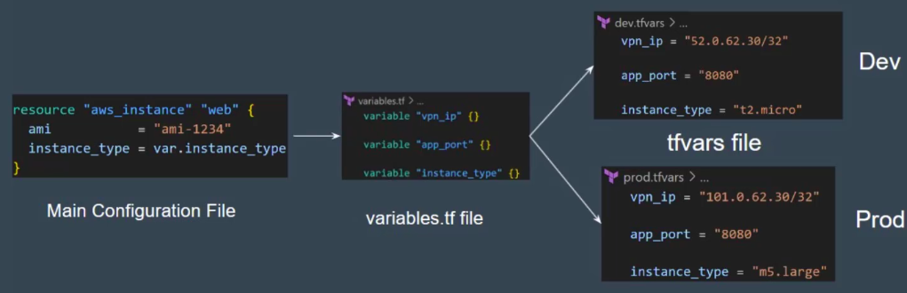

Providers in AWS
---

- A provider is responsible for understanding API interactions and exposing resources.

- When we run **terraform init**, plugins required for the provider are automatically downloaded and saved locally to a **.terraform** directory.

```bash
.terraform
└── providers
    └── registry.terraform.io
        └── hashicorp
            └── aws
                └── 6.16.0
                    └── linux_amd64
                        ├── LICENSE.txt
                        └── terraform-provider-aws_v6.16.0_x5
```

Intereting Questions
---

1. Is provider block { .. } mendatory to be added as part of your terraform configurations ?

YES ?
NO ?

**Ans. NO**.

- Bcz, While you want to use a specific provider versions. you have to mentioned in provider block.

- While you want a latest version of provider , You dont required to write in provider block.

Alias in Providers
---

- Alias can be used for using the same provider with diff configurations for diff resources.


What is diff between provider block and required_providers block ?
---

```h
terraform {
    required_providers {
        aws = {
            source = "hashicorp/aws"
            versino = "~> 1.0.4"
        }
    }
}

provider "aws" {
    region = "us-east-1"
    access_key = ""
    secret_key = ""
}
```

| **Options That Can be Defined** |
| ------------------------------- |
| Required Terraform Versions |
| Required Provider and Versions |
| BackEnd Configurations |
| Experimental Features |

**NOTE** - You can't define cofigurations related to Regions, Access/Secret Keys inside **required_provider** block.

Versioning Constraints
---

- Version Constraint allows you to specify mix of multiple operators to select a suitable version of terraform and provider plugins.


Provider Tiers
---

There are 3 primary type of provider tiers.

| **Provider Tiers** | **Descriptions** |
| ------------------ | ---------------- |
| Official | Owned and Maintained by HashiCorp. |
| Partner | Owned and Maintained by Technology Company that maintains direct partnership with HashiCorp |
| Community | Owned and Maintained by Individual Contributors. |

Terraform Init
---

Which command will initial current directory/ initialize backend/ initialize providers ?

**Ans**. `terraform init`

`terraform init` will install the Providers Plugins, Backend Initializations, Copy Source Modules etc

This is the first command that should be run after writing a new terraform cofigurations.

It is safe to run multiple times.

Terraform Init Upgrade
---

The `terraform init -upgrade` install the latest module and provider versions allowed within configured constraints.

If you have latest provider plugins installed and if you define new version constraints that matches diff versions, you will have to run the `terraform init -upgrade` command.


Terraform Format
---

`terraform fmt` is use to rewrite terrafrom configurations files to a **canonical formate and style**. It will directly perform `write` operatinos and not `read`.

**Terraform Fmt -flags ?**

| -check | Check if input is formatted but Files are not modified. |
| ------ | -------------------- |
| -recursive | Also process files in subdir. |


```bash
terraform fmt -check
```
before fmt -check, i modify the indentations of conf files like below.


After fmt -check, It performed formatted but not modify and not updated indentatinos.


Terraform Validate
---

- `terraform validate` will validate the config files in a dir.

- Requires an initialized working directory with any referenced plugins and modules installed.

- terraform plan uses implied validations check.

- If you doesn't use `terraform validate` and just performed `terraform plan` so terraform plan will validate the config files.

- If you did not install provider's plugins, `terraform validate/terraform plan will not executes`.


Terraform Refresh
---

- `terraform refersh` will reads the current settings from all managed remote objects and updates the terraform state to match.

- It will not modify your remote object , It will modify your `terraform.tfstate`.

State Management
---

The `terraform state` is used for advanced state management like


Debugging in Terraform
---

- Terraform has detailed logs that can be enabled by setting the `TF_LOG` Env var to any values like **TRACE**, **DEBUG**, **INFO**, **WARN** or **ERROR**.

- To persist logged output, You can set `TF_LOG_PATH`.

Import
---

Allows importing the existing resource in terraform.

Automatic code generation for imported resource by `terraform plan -generate-config-out="resource.tf`.

```h
import {
    to = aws_security_group.mysg
    id = "sg-1234"

// terraform plan -generate-config-out="sg.tf"

// terraform apply -auto-approve
}
```

Local Values
---

- Locals are used when you want to **Avoid repeating the same EXPRESSIONS** multiple times.

- Local values are created by a `locals` block, but you reference them as attributes on an object named `local` 

WorkSpace
---

Terraform worksapces enable us to manage multipile sets of deployments from the same of configuration files.

`state file directory = **terraform.tfstate.d**`.

**NOT SUITABLE** for isolation for strong separation between workspace (stage/prod).

Modules sourced from local paths do **NOT support** `versions`.

```h
module "ec2_instance" {
  source = "./modules/ec2"
  version = "1.0.0"
}
```

When you run this, Terraform will show the error: `Modules sourced from local paths do NOT support versions.`

**Why?**

- Because the version argument is **only supported for remote modules (like from the Terraform Registry or GitHub)**.
For local modules, Terraform just uses the files directly from your disk — there’s no versioning system.

**Supports Version of Modules in Remote modules**

```h
module "ec2_instance" {
  source  = "git::https://github.com/bhavin/ec2-module.git?ref=v1.0.0"
}

```

#### Modules OutPut

A child modules can use output to expose the output of that modules resources / subset of its resources attributes to a parent module.


Formate: **<MODULE NAME>.<OUTPUT NAME>**.

```bash
modules.ec2.instance_id
```

**Remote Modules Versioning**

When using modules installed from a terraform module registy, HashiCorp Recommends **Explicitly constraining the acceptable versioning numbers** `to avoid unexpected or unwanted changes`.

It is **Not Mandatory** to specify a version arguments.


Functions
---

**NO SUPPORT** for `User-Defined` Functions.


**- 1. Lookup Functions**

lookup will retrives the value of a single elements **from a map by refering its Key**.

If the given key doesn't exists, the given default value is returned instead.


**- 2. ZipMap Functions**

Zipmap constructs a map from a list of keys and a corresponding list of values.


**- 3. Index Functions**


Index will finds the element index for a givne values in a list.


Here, given values is "b", it find the index for b is "1".

**- 4. Element Functions**

Elements retrives a single element from a list.


**- 5. File Functions**

File functions can redce the overall terraform code size by loading contents from external sources during terraform operations.


Metadata Arguments
---


**1. Lifecycle Meta-Arguements**

Some details of the default resource behavior can be customized using the special nested lifecycle block within a resource block.


- In lifecycle you can use this arguments


**2. Count and Count Index**

- The count argument accepts a whole number, and creates that many instances of the resource.

`count.index` - Is the index number starts with `0`.

Sentinel
---

Sentinel is an embedded policy-as-code framework integrated with the HashiCorp Enterprise products. Sentinel is a proactive service.

Sentinel can be used for various use-cases like:
  
  - Verify if EC2 instances has tags.

  - Verify if the S3 Bucket has encryptions enabled.


**Sentinel is runs after** `terraform plan` but **before** `terraform apply`.

Terraform Graph
---

Terraform graph refers to a `visual representations of the dependency relationships` between resources defined in your terraform configurations.


The **OutPut** of `terraform graph` is the **DOT formate**, which can easily be converted to an image.

Input Variables
---

**1. variable.tf**

Terraform Input Variables are used to pass certain values from outside of the configurations.

- Just use **var.var_name**.

**2. TFVARS**

`terraform.tfvars` file can be used to define the value to all the variables.



- You can use *.tfvars file during executions.

```bash
terraform plan -var-file="prod.tfvars"
```

- If you want to pass variable values during RunTime.

```bash
terraform plan -var="instance_type=m5.large"
```

**Varible use as Env Variables**

Terraform searches the env of its own process for env varialbes named **TF_VAR_variable_name**.

```bash
export TF_VAR_instance_type=m5.large
```

**Variable Precedences**

1. Variable.tf
2. Env Vars - TF_VAR / TF_VAR_PATH
3. .tfvars
4. .tfvars.json
5. .atuo.tfvars
6. Runtime -var / -var-file

**NOTE** - If you have variables with `undefined value`, it will **ASK TO PUT VAR VALUES** in Run time. It will **NOT** give `error`.

There is preserved words that you can't add in varaibles.

    - count
    - depends_on
    - for_each
    - lifecycle
    - providers
    - source


Dependencies Lock Files
---

- Terraform dependency lock file allows us to lock to a specific varsion of the provider name is `terraform.lock.hcl`. For tracking provider dependencies.

- If a particular provider already has a selection recorded in the lock file, terraform will always re-select that version for install, even if a **newer version has become available**.

You can OVERWRITE that behavior by `terraform init -upgrade`.

Terraform Enterprise
---

Terraform Enterprise provides serveral added advantages compaired to Terraform Cloud.

  - Single Sign-On
  - Auditing
  - Private Data Center Networking
  - Clustering


Recreating the Resources
---

- The `-replace` option with terraform apply to force terraform to replace an object even though there are no configuratins changes that would require it.

