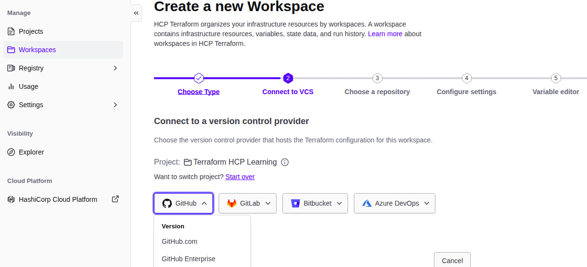

- HCP Terraform is GUI Managed with various feature like access controls, private registry for sharing modules, policy contorls and other.

- HCP is central management for your diff project like azure devops services.

- You can store your tf code in your git repo. 

- HCP Terraform will automatically fetch the updated code from github and it will plan and apply etc.


- It will ask to confirmation during terraform apply itself.


- Create HCP Free Tier Account.

- Create Org and Project

- Create workspace and chosse version control workflow for that workspace.

- Create a new git repo to used by HCP version control workflow.


- Set Git as version control providers and authenticate HCP to use git repo.



HCP Provision Resource from Git
---

```h
resource "aws_instance" "hcp-ec2" {
    ami = "ami-00111452cb3c5dda0"
    instance_type = "t2.micro"

    tags = {
      Name = "HCF_EC2"
      Owner = "Bhavin"
    }
}
```

- Here, This will be push into git repo.
- The HashiCorp Cloud Plateform HCP will fetch this latest code from git repo and auto plan and apply.

- But, This much is not enough to create resource usig git.
- HCP will required AWS credentials bcz HCP is cloud SaaS Service.
- Thatsfor HCP is diff from terraform server where installed TF.

- You have to add variables in HCP Terraform.

- Variables may be like variable.tf, *auto.tfvars files for basic variables like ec2 instance type , tags.

- But for sensitive values like passwd, secrets, A better way is use environmet variables.


- Create Environment variables for access key, secret key as sensitive and aws_regions.

CLI Driven Workflow WorkSpace
---

- You doesn't need to go to HCP GUI to run terraform plan and apply.
- Just by CLI, so use workspace as CLI Driven Workflows.

- Update in your backend.tf

```h
terraform { 
  cloud { 
    
    organization = "your_org" 

    workspaces { 
      name = "Cli_Driven_WF_WS" 
    } 
  } 
}
```

- Now to run terraform plan and apply, just run below command

```bash
terraform login
```

- It will save your terraform token into this path `/home/user/.terraform.d/credentials.tfrc.json`.

------------------------------------------------
------------------------------------------------

Air Gappped Environments
---

An `air gap` is a network security measure employed to ensure that a secure computer network is physically isolated from unsecured networks, such as the public internet.


- In Air Gap Networks, Not attached Internet gateway, so That all EC2 will not connect to Internet.

but It will internally connected to each other like private ip.

Where this Air Gap env is used ?
---

- Military/Governmental computer networks systems.

- Financial computer systems, such as stockexchanges.

- Industrial control systems, such as SCADA in Oil & Gas filds.

**So, There is no internet connectivity in Air Gapped Env, so How they are doing OS Patching, Pkg Installations ?**


Terraform Enterprise
---

Terraform Enterprise installs using either an online or air gapped method 

For Online method - requires internet connectivity.

For Air Gapped Method - Doesn't required Internet Connectivity.

If you Choose **Air Gapped Method** to install terraform.

You will see 2 options.

  - 1. Provide Path,
  - 2. Upload AirGap Bundel


Sentinal
---

- This Sentinel is a policy-as-code framework integrated with the HashiCorp Enterprise.

- It allows you to enforce rules on your Terraform deployments.

- Policies are written in a language called Sentinel, which is separate from HCL.

**Purpose**

- To enforce governance, compliance, and security rules before Terraform applies infrastructure changes.

**Example rules:**

- Prevent creating AWS EC2 instances outside a specific region.

- Ensure S3 buckets are always encrypted.

- Limit instance types to approved sizes.


- Here, Policy about if your code create ec2 without tags, then it will not create in plan and apply.

**NOTE** - Sentinel policies are paid feature.

**Sentinel Code for Restrict Create EC2 without tags**

```h
import "tfplan"

# Define the rule
main = rule {
    all tfplan.resources.aws_instance as _, instances {
        all instances as _, r {
            # Check if the instance has tags defined
            r.applied.tags is not null and length(r.applied.tags) > 0
        }
    }
}
```

**Explainations**

**1. Import "tfplan"**

- Sentinel needs to read the Terraform plan to enforce policies.

- tfplan is a built-in Sentinel import that gives access to all resources in the Terraform plan.

- Through tfplan, you can inspect every resource before it’s applied.

**2. main = rule { .. }**

- `main` is the entry point of the policy. Sentinel evaluates this rule.

- If it returns true, the plan passes the policy.

- If it returns false, the plan is blocked.

**3. all tfplan.resources.aws_instance as _, instances { ... }**

- tfplan.resources.aws_instance

- Selects all EC2 instances defined in the Terraform plan.

- all ... as _, instances { ... }

  - Iterates over all EC2 instances.

  - `_` is a placeholder for the key (we don’t need it here).

  - instances is a list of EC2 instance objects.

**4. all instances as _, r { ... }**

- Now we loop over each EC2 instance object r.

- We will check every single instance for tags.

5️⃣ r.applied.tags is not null

r.applied represents the final values Terraform plans to apply.

r.applied.tags is the tags attribute for the EC2 instance.

is not null ensures that tags exist for this instance.

6️⃣ length(r.applied.tags) > 0

Checks that the tags object is not empty.

Even if tags exists, this ensures at least one tag is provided.

7️⃣ Combined condition

```bash
r.applied.tags is not null and length(r.applied.tags) > 0
```

The instance must have tags and cannot be empty.

If any EC2 instance fails this check, the all statement will return false and the plan is blocked.

8️⃣ Overall behavior

This policy will prevent Terraform from creating any EC2 instance that doesn’t have tags.

Works in Terraform Cloud or Enterprise with Sentinel enabled.

You can extend it to enforce specific tags (like Owner, Environment) if needed.