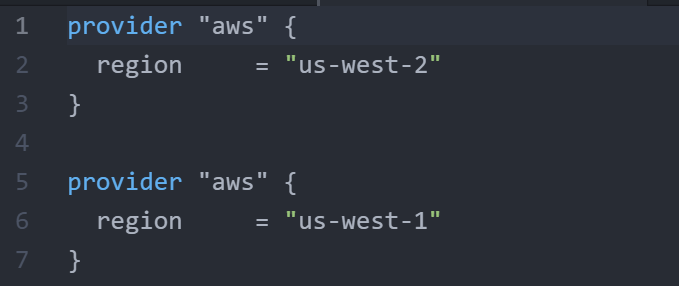
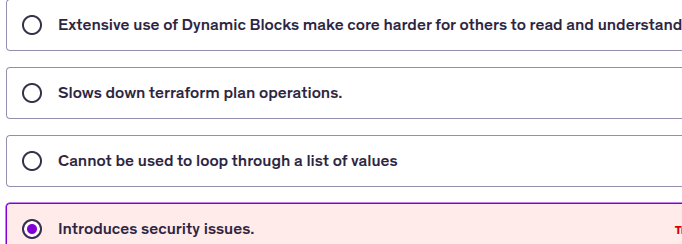
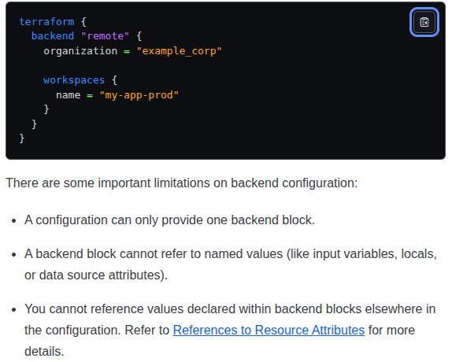

Q-1. Matt has a requirement to reference a local value to another local value in the same terraform code.

Is this feature supported in Terraform?

Ans. **YES**

Yes, referencing a local value to another local value in the same Terraform code is fully supported and is a common practice.

```h
locals {
  # Base local values
  first_name = "Matt"
  last_name  = "Smith"

  # A local value referencing the base local values
  full_name = "${local.first_name} ${local.last_name}"

  # Another local value referencing the 'full_name' local value
  greeting = "Hello, ${local.full_name}!"
}
```


Q-2 Bob intends to pull the Terraform Module associated with AWS VPC.

In the line 3, there is a version argument that is defined. Is it a mandatory requirement to specify version while pulling code from Terraform Registry?


```h
module "vpc" {
  source  = "terraform-aws-modules/vpc/aws"
  version = "3.14.2"
}
```

Ans. **NO**.

It is not a mandatory requirement to specify the version argument when pulling a module from the Terraform Registry.

However, it is strongly recommended to always specify a version.

Q-3 Based on the following Terraform code, what is the name of IAM User that will be created?


```h
variable "elb_names" {
  type = list
  default = ["dev-loadbalancer", "stage-loadbalanacer","prod-loadbalancer"]
}
 
resource "aws_iam_user" "lb" {
  name = var.elb_names[count.index]
  count = 2
  path = "/system/"
}
```

Ans. dev-loadbalancer", "stage-loadbalanacer".

Q-4 Matthew has studied that "terraform apply" is capable of performing wide variety of operations.

However, which is the following type of operation that "terraform apply" cannot do?

Ans. `Import Infrastructure Objects`.

Q-5 17 Enterprise Corp has started using Terraform Cloud.

There are multiple teams that makes use of Terraform and every team is using their custom Terraform resource configuration and settings for resources like EC2 Instances, IAM users and others.

You want to enforce standardization of the resources across the enterprise. What should be your approach?

Q-6 Refer to the following CLI Code:

```h
locals {
  db_password = {
    admin = "password"
  }
}
 
output "db_password" {
  value = local.db_password
}
```

Whenever a terraform apply operation runs, the value of password is shown in the CLI.

Ans. `Use a sensitive parameter`.

Q-7 When a terraform apply operation is performed, which of these operations are performed?

Ans. Terraform will match the current state to desired state.

Q-8 There are 3 team members working in DevOps Team. From the Terraform documentation, they read that if there are multiple writes happening in Terraform state file from different users, it can corrupt the state.

To prevent this, Terraform state file lock must be used.

Is there an additional terraform code required to implement this functionality with the backend that supports state locking?

Ans. NO

Q-9 Alice has written a Terraform code for creating a new EC2 instance.

There is a requirement that before EC2 instance is created, a Public IP resource must first be created.

What functionality of Terraform must be used to ensure this?

Ans. **depends_on**

**Suppose** - Public IP resource is **Elastic IP**. So, we have to explicitly define the dependencies.

Q-10 Matt wants to quickly validate syntax error in the Terraform code that he has written.

Initially, Matt used to run a "terraform plan", but it took a lot of time.

Will the terraform validate command be useful in this use-case?

Ans. **TRUE**.

**WHY ?**
- While we do `terraform plan` it also check for validation of config files itself at same time. But, It **will delay to validations** due to checking API Calls.

- `terraform validate` - will just quickly validate the config files without call to API and without giving plans.

Q-11 Alice is writing a module, and within the module, there are multiple places where she has defined the same set of Terraform expression.

Whenever there is modification required in the expression, Alice has to go through multiple places in the code and modify everywhere.

What is a better approach to dealing with this?

Ans. **Local Values**

Q-12 Enterprise Corp has a Terraform State file that contains details related to 100s of resources that are currently created in their Cloud Infrastructure.

There is a requirement to quickly list all the resources that are part of the state file.

What is the best way to achieve this?

Ans. `terraform state list`

Q-13 Matthew has created an EC2 instance via Terraform. Matthew has defined the following rules within the security group:

Port 443 allowed from 0.0.0.0/0
Port 22 allowed from 125.36.50.23/32
John has added the following rule manually:

Port 80 allowed from 0.0.0.0/0

Next time when Matthew runs a terraform plan, what will happen?

Ans. **`terraform plan` will show output to remove the manually created rule**.

Q-14 Medium Corp is using the Terraform Workspace feature.

After the "terraform apply" is completed, the terraform.tfstate file does not appear in the main project directory.

In which directory is the terraform.tfstate file created?

Ans. `terraform.tfstate.d`

Q-15 James has decided not to use the terraform.tfvars file, instead, he wants to store all data in custom.tfvars file? Is it possible?

Ans. James has decided not to use the terraform.tfvars file, instead, he wants to store all data in custom.tfvars file? Is it possible?

Ans. YES

Q-16 Where do we define provisioner block in Terraform?


```h
resource "aws_instance" "myec2" {
  ami           = "ami-082b5a644766e0e6f"
  instance_type = "t2.micro"
}
```

Ans. **Inside the resource block**.

Q-17 Following is the sample Child module configuration:


```h
resource "aws_instance" "myec2" {
  ami           = "ami-082b5a644766e0e6f"
  instance_type = var.instance_type
}
```

variable instance_type {}
If this module is called from a ROOT module, can the user set the value associated with variable of instance_type?

Ans. YES

Q-18 Matthew has referred to a child module that has the following code. 


```h
resource "aws_instance" "myec2" {
   ami = "ami-082b5a644766e0e6f"
   instance_type = "t2.micro
}
```

Can Matthew override the instance_type from t2.micro to t2.large from the ROOT module directly?

Ans. NO - Bcz, That is used as hard-coded, you have to use of var.var_name.

Q-19 James has decided to not use the terraform.tfvars file, instead, he wants to store all data into custom.tfvars file?  

How can he deal with this use-case while running terraform plan?

Ans.
```bash
terraform plan -var-file="custom.tfvars"
```

Q-20 John is an intern, and he had recently created an EC2 instance manually.

Can he import the EC2 instance to Terraform without having to write a Terraform configuration file for that EC2 instance from scratch?

Ans. YES

```bash
terraform import aws_instance.<RESOURCE_NAME> <INSTANCE_ID>
```

Q-21 Matthew has written the configuration file of a manually created EC2 instance in Terraform. Following is the code:

```h
resource "aws_instance" "myec2" {
  ami = "ami-bf5540df"
  instance_type = "t2.micro"
  vpc_security_group_ids = ["sg-6ae7d613", "sg-53370035"]
  key_name = "remotepractical"
  subnet_id = "subnet-9e3cfbc5"
 
  tags {
    Name = "manual"
  }
}
```

The instance id of the manually created EC2 instance is i-041886ebb7e9bd20 How he can import data of that EC2 to the state file and link it with the resource block?

Ans. 
```bash
terraform import aws_instance.myec2 i-041886ebb7e9bd20
```

Q-22 Alice has added a simple variable definition in Terraform code.

```h
variable "kpnumber" { 
default = 3
}
```

Alice also has defined the following environment variable: **TF_kpnumber=6**, **TF_VAR_kpnumber=9**.

There is also a terraform.tfvars file with the following contents

`kpnumber = 7`

When you run the following apply command, what is the value assigned to the number variable?

```bash
terraform apply -var kpnumber=4
```

Ans. **4** Why ?

Terraform precedence

1. Runtime -var / -var-file
2. .auto.tfvars
3. .tfvars.json
4. .tfvars
5. Env Vars TF_VAR_kpnumber=4
6. variable.tf

Q-23 Matthew is trying to achieve a use-case that is not directly supported by default Terraform functions that are available.

Can Matthew create his own set of function that his team can use for custom use-cases?

Ans. **FALSE** Why ?

**The Terraform doesn't suppprt user-defined functions, and so only the functions built in to the language are available to use**.

Q-24 Matthew has created a new workspace named "DEV".

Does Matthew needs to manually switch to the DEV workspace in order to start using it?

Ans. **FALSE** . During creating new worksapce , user will automatically in that workspace.

Q-25 Are there any different ways to destroy the resources without needing to run terraform destroy command?

Ans. **YES** . Just Uncomment your config resource block.

Q-26 If a user directly runs terraform apply without running the terraform plan, will the apply operation fail?

Ans. **NO**.

Q-27 Due to some issues, the state file is in a locked state, and users are not able to perform terraform apply operations further.

What actions can be taken to overcome this?

- a. Edit the state file and remove lock related content.

- b. Use the `terraform force-unlock`.

- c. Contact HashiCorp Support.

- d. NA.


Ans. **If you are absolutely certain that no other operation is running and the lock is stale (e.g., the previous terraform apply crashed)** Use this, `terraform force-unlock <LOCK_ID>`.

**If you need to confirm the state is actually locked and see who/what owns the lock**. Use this, `terraform force-unlock -force <LOCK_ID>`.

Q-28 Do all the backends that are supported in Terraform has the state locking functionality?

Ans. **NO**.

Only Supports 

## Table 1: Backends Supporting State Locking

| Backend | State Locking Mechanism | Notes |
| :--- | :--- | :--- |
| **S3 (AWS)** | **DynamoDB** (traditional) or **S3 Native Locking** (`use_lockfile = true` for Terraform v1.10+) | Uses a dedicated locking service or S3's object features. |
| **Azurerm (Azure)** | **Azure Blob Storage Lease** mechanism. | Uses the inherent locking features of the Azure storage service. |
| **GCS (Google Cloud)** | **GCS Native Locking** (via object preconditions). | Uses a mechanism like conditional writes to enforce a lock. |
| **Remote (Terraform Cloud/Enterprise)** | **Native** (Session-based, built-in) | State locking is automatically handled by the HashiCorp service. |
| **Consul** | **Consul's Key/Value store API** for sessions and locks. | Provides reliable session-based locking. |
| **PostgreSQL (`pg`)** | **Database Advisory Locks** (e.g., row-level locking or transactions). | Uses the underlying database's transaction mechanism. |

***

## Table 2: Backend Not Supporting State Locking

| Backend | State Locking Mechanism | Notes |
| :--- | :--- | :--- |
| **Local** | **None** (File-based only) | The default backend stores the state file on your local machine and **does not** prevent concurrent operations. |


Q-29 Does terraform refresh perform any kind of modification on the running infrastructure?

Ans. **NO**.

Q-30 James needs to make use of the module within his terraform code.

Should the module always need to  be public and open-source to be able to be used?

Ans. **NO**.

Q-31 If there is any disperency between the current and desired state of the infrastructure, can terraform validate command display the issue?

Ans. **NO**.

Q-32 Following are the output values defined in Child and Root Module:

Child Module

```h
output "child_module" {
  value = "This is Child Module"
}
Root Module:

output "root_module" {
  value = "This is ROOT Module"
}
```

On a terraform apply, which output values will be displayed?

Ans. `OutPut values of Root Module`.

Only the Root Module output values will be displayed by default after a terraform apply. The output values defined in the Child Module are not automatically promoted to the main output.

Displayed Output

When you run terraform apply, Terraform only displays the values defined in the top-level configuration (the Root Module).

Q-33 Alice has started to make use of Terraform Cloud Workspace and has linked a Git Repository to it.

Whenever a new code change is committed to the version control repository, will Terraform automatically run the terraform plan operation?

Ans. **TRUE**.

Q-34 A variable name "update" must only support boolean value.

How can we define the type of value that is expected for a specific variable?

Ans. **Use `type` in variable block**.

Q-35 Will this code result in an error ?



Ans. **YES**. You have two AWS providers defined without an alias. Terraform doesn't know which provider should use. You have to define alias for same providers.

Q-36 After creating an EC2 instance, Yash wants to automatically install certain software packages like Nginx inside that EC2 instance.

What is the way to achieve it?

A. Make use of Local provisioner
B. Make use of Remote Provisioner
C. Make use of Null provisioner
D. Perform the installation part manually after EC2 is created.

Ans. B. **Make use of Remote Provisioner**.

Q-37 There is an outdated provider version in the `.terraform` directory that needs to be updated to the latest version.

Which terraform command can be used to achieve this easily?

Ans. `terraform init -upgrade`

Q-38 Matthew is performing some write operation and the Terraform state file is currently `locked`.

If Bob runs the `terraform fmt ` command on the same project, will the action be allowed or blocked?

Ans. **Allowed**.

Bcz, `terraform frm` doesn't write to the terraform state file, so it can be run safely.

Q-39 Supratik has joined a Security Architect in Enterprise Corp.

He has mandated that all the Terraform configuration that creates an S3 bucket must have encryption feature enabled. What is the best way to achieve it?

Ans. **Make use of `Sentinel Policies`**.

Q-40 There are 3 resources that have been created using Terraform.

1 resource among them has been deleted manually from the AWS console.

What will happen in the next `terraform apply` operation?

Ans. `The Deleted resoruce will be created agains`.

Q-41 Enterprise Corp has recently tied up with multiple small organizations to exchange database information.

Due to this, the firewall rules are increasing, and there are more than 100 rules.

This is a leading firewall configuration file that is difficult to manage.

What is the way this type of configuration can be managed easily?

A.Terrafrom functions 
B.Conditional expressions 
C.Spat Expressions 
D.Dynamic block

Ans. `D. Dynamic Block`.

**WHY ?**

You had created 100+ rules which is outside of tf. `data block` can't usable for 100+ rules, code will lengthy.

Create 100+ rules in tf as each resoruce will be lengthy.

Valid is - `create local values` and group all 100+ rules into this `local values`.

Now, `create dynamic block and use **for_each** with **local_values**`.

- Creating Local Values

```h
locals {
  rules = jsondecode(file("firewall_rules.json"))
}
```

- Create Dynamic block and use Local values.

```h
resource "aws_security_group" "example" {
  dynamic "ingress" {
    for_each = local.rules
    content {
      from_port   = ingress.value.from_port
      to_port     = ingress.value.to_port
      protocol    = ingress.value.protocol
      cidr_blocks = ingress.value.cidr_blocks
    }
  }
}
```

Q-42 Alice works for Enterprise Corp and they have recently started to use Terraform Cloud.

What is the way in which the log output of terraform plan and apply operation that are running in Terraform Cloud be streamed in the local terminal?

A. Terraform Modules
B. Remote Backends
C. Terraform Cloud OutPuts
D. Terraform Backends

Ans. **Remote Backends**

- Configure remote backend to use terraform cloud HCP
```h
terraform {
  backend "remote" {
    organization = "enterprise-corp"

    workspaces {
      name = "my-workspace"
    }
  }
}
```

- Login into HCP,  And plan and appluy

```bash
terraform login
terraform plan
terraform apply
```
Q-43 James has created a variable and has explicitly defined the type as a string. Following is the snippet:

```h
variable "myvar" {
  type = string
}
```

Which of the following value will be accepted?

A. 2
B. "2"

Ans. **"2"**

Q-44 Alice has created 10 different AWS resources from a single terraform configuration file named large.tf

Due to some manual modification to one of the EC2 instances, she wants to destroy and recreate the EC2 instance.

What is the ideal way to achieve it?

A. `terraform destroy`
B. `terraform recreate`
C. `terraform taint`
D. `terraform plan -replace`

Ans. **`terraform plan -replace`**.

Q-45 Matthew is currently running a write operation on a terraform project, and the state file is currently locked.

If Bob runs a "terraform apply" command on the same project, will the action be allowed or blocked?

Ans. **Blocked**.

Q-46:
Matthew is currently running a write operation on a terraform project, and the state file is currently locked.

If Bob runs a "terraform validate" command on the same project, will the action be allowed or blocked?

Ans. **Allowed**.

Q-47 Matthew has recently subscribed to the Terraform Cloud Trial version.

As part of POC, he is testing the Sentinel feature. At what stage does the Sentinel feature run in Terraform Cloud?

A. `Before Apply Op`
B. `After Apply Op`
C. `Before Init Op`
D. `Before Pla Op`.

Ans. **Before Apply Op**. Why ?

Bcz, It will apply **After Plan** `but` **Before Apply**.

Q-48 Alice wants to create a DOT file in Terraform.

Which terraform command can be used to create it?

A. `terraform dot`.
B. `terraform dot init`.
C. `terraform graph`.
D. `terraform graphviz`.

Ans. **terraform graph**.

Q-49 There is a requirement to save a terraform plan to a specific file.

Which of the following command can be used to achieve this use-case?

Ans. `terraform plan -out="file_name"`.

Q-50 Enterprise Corp is using the count parameter to create 50 set of IAM users from a specific list.

Following is a sample configuration code:

```h
resource "aws_iam_user" "lb" {
  name = var.elb_names[count.index]
  count = 50
  path = "/system/"
}
```

There is an attribute associated with the resource of aws_iam_user named arn.

There is a requirement that the ARN associated with all 50 IAM Users should be shown in the CLI .

What of the following syntax can be used as initials to achieve this?

A. `resource.aws_iam_user.lb[*].arn
B. `aws_iam_user.lb[*].arn`.

Ans. **B. aws_iam_user.lb[*].arn**.

Q-51 Matthew is currently running a write operation on a terraform project and the state file is currently locked.

If Bob runs a "terraform destroy" command on the same project, will this action be allowed or blocked?

Ans. **Blocked**.

Q-52 James has run the terraform taint command in his terraform project as he wants to recreate the resource to it's base configuration.

By running the terraform taint command, will the affected resource be terminated immediately?

True or False ?

Ans. **False**

Bcz, While you run `terraform taint or -replace` it will mark that resource as taint Only.

Q-53 John has run the terraform validate command on his project.

What are the type of errors that terraform validate command can report?

A. Formatting issue in terraform code
B. Multiple resource block with same local name that are defined twice.
C. Deprecated Terraform block.
D. Diff between Desired and Current State.

Ans. **A, B, C**

For C. Deprecated terraform block

```h
provider "aws" {
  region = "us-east-1"
  # access_key and secret_key are deprecated
  access_key = "AKIA..."
  secret_key = "SECRET..."
}
```

It will give error:

```bash
Warning: "access_key" is deprecated
  Terraform provider AWS no longer recommends setting credentials directly in the provider block.
  Use environment variables or a shared credentials file instead.
```

Q-54 Why does HashiCorp NOT recommend using dynamic block extensively within Terraform configuration?

What is one of the downsides of using dynamic blocks in a Terraform configuration?



Ans. **A**.

Q-55 Matthew is currently running a write operation on a terraform project, and the state file is currently locked.

If Bob runs a terraform state list command on the same project, will this action be allowed or blocked?

Ans. **ALLOWED**.

Q-56 Developers in Medium Corp are facing a few issues while writing complex expressions that involve interpolation. They have to run the terraform plan every time and check whether there are errors, and also verify the terraform apply to print value as a temporary output for the purpose of debugging

What can be achieved to avoid this?

Ans.

When developers want to test or debug Terraform expressions, variables, or interpolations without running a full terraform plan or terraform apply, they can use:

```bash
terraform console
```

Q-57 Which of the following block allows setting the credentials required while defining Terraform provisioners?

A.terraform block
B. credentials block
C. connection block.
D. NA

Ans. **C. connection block**.

```h
resource "aws_instance" "example" {
  ami           = "ami-0c55b159cbfafe1f0"
  instance_type = "t2.micro"

  provisioner "remote-exec" {
    inline = [
      "echo Hello from Terraform!"
    ]
  }

  connection {
    type        = "ssh"
    user        = "ubuntu"
    private_key = file("~/.ssh/id_rsa")
    host        = self.public_ip
  }
}
```

**Q-58 How is the Terraform remote backend different than other state backends such as S3, Consul, etc.?**
A
It can execute Terraform runs on dedicated infrastructure on premises or in Terraform Cloud
B
It doesn't show the output of a terraform apply locally
C
It is only available to paying customers
D
All of the above

Ans. **A. It can execute terraform runs on dedicated infrastructure on premises or in terraform cloud.**

Terraform workspaces is defined by **remote** and use your **org name used in your HCP account**.

```h
terraform {
  backend "remote" {
    organization = "example_corp"

    workspaces {
      name = "my-app-prod"
    }
  }
}
```

**Q-59 One remote backend configuration always maps to a single remote workspace. ?**
TRUE or False ?

Ans. **TRUE**




**Q-60 The terraform.tfstate file always matches your currently built infrastructure.?**
TRUE or FALSE

Ans. **TRUE**

**Q-61 You run a local-exec provisioner in a null resource called null_resource.run_script and realize that you need to rerun the script. Which of the following commands would you use first ?**
A
terraform taint null_resource.run_script
B
terraform apply -target=null_resource.run_script
C
terraform validate null_resource.run_script
D
terraform plan -target=null_resource.run_script

Ans. **A. ```terraform taint null_resource.run_script```**.

**Q-62 Which provisioner invokes a process on the resource created by Terraform?**
A
remote-exec
B
null-exec
C
local-exec
D
file

Ans. **A. remote-exec**.

**Q-63 Which of the following is not true of Terraform providers?**
A
Providers can be written by individuals
B
Providers can be maintained by a community of users
C
Some providers are maintained by HashiCorp
D
Major cloud vendors and non-cloud vendors can write, maintain, or collaborate on Terraform providers
E
None of the above

Ans. **E. None of the above**.

**Q-64 You have deployed a new webapp with a public IP address on a cloud provider. However, you did not create any outputs for your code.**
What is the best method to quickly find the IP address of the resource you deployed?
A
Run terraform output ip_address to view the result
B
In a new folder, use the terraform_remote_state data source to load in the state file, then write an output for each resource that you find the state file
C
Run terraform state list to find the name of the resource, then terraform state show to find the attributes including public IP address
Most Voted
D
Run terraform destroy then terraform apply and look for the IP address in stdout

Ans . **C `Run terraform state list to find the name of the resource, then terraform state show to find the attributes including public IP address`**.

**Q-65 What is not processed when running a terraform refresh?**
A
State file
B
Configuration file
C
Credentials
D
Cloud provider

Ans. **B Configuration file**.

**Q-66 Which of the following is not a valid string function in Terraform?**
A
split
B
join
C
slice
D
chomp

Ans. **C - Slice**. Slice is only for list.

| Function      | Purpose                                                   | Valid?                     |
| ------------- | --------------------------------------------------------- | -------------------------- |
| **`split()`** | Splits a string into a list using a delimiter             | ✅                          |
| **`join()`**  | Joins a list of strings into one string using a delimiter | ✅                          |
| **`chomp()`** | Removes trailing newline characters from a string         | ✅                          |
| **`slice()`** | Used for **lists**, not **strings**                       | 🚫 (Not a string function) |

**Q-67 You have provisioned some virtual machines (VMs) on Google Cloud Platform (GCP) using the gcloud command line tool. However, you are standardizing with Terraform and want to manage these VMs using Terraform instead.**
What are the two things you must do to achieve this? (Choose two.)
A
Provision new VMs using Terraform with the same VM names
B
Use the terraform import command for the existing VMs
C
Write Terraform configuration for the existing VMs
D
Run the terraform import-gcp command

Ans. **B, C**.

**Q-68