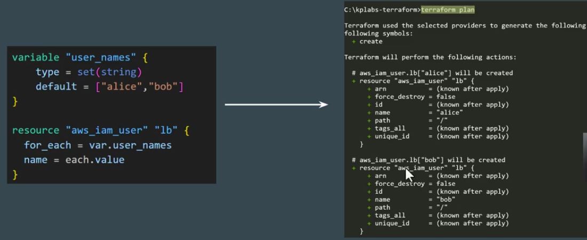
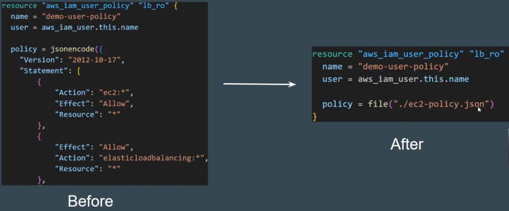
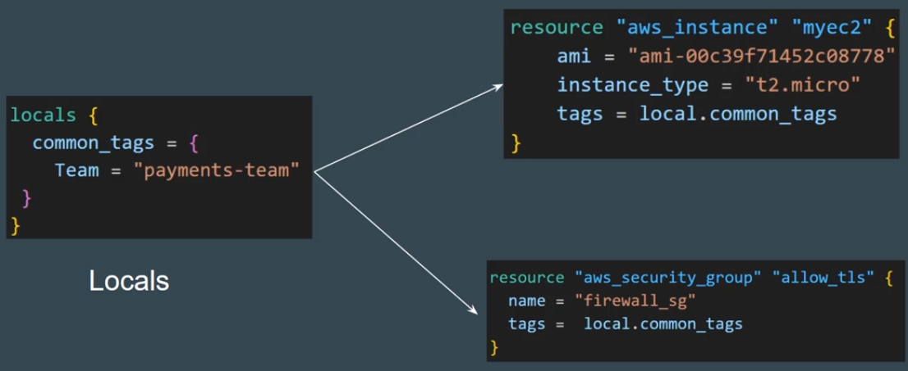
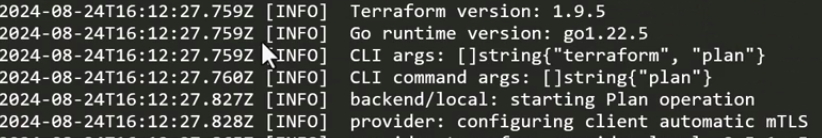
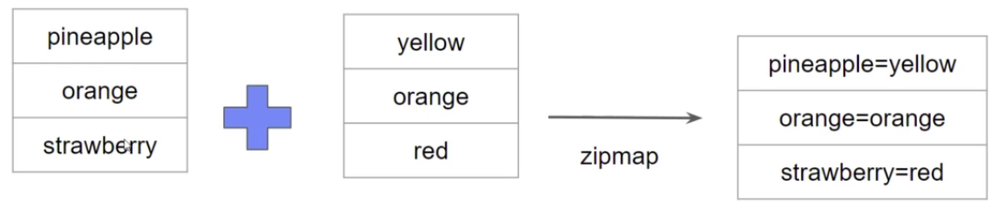
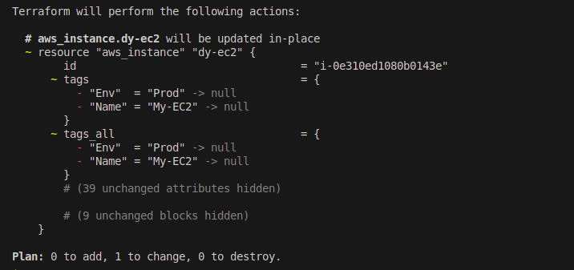
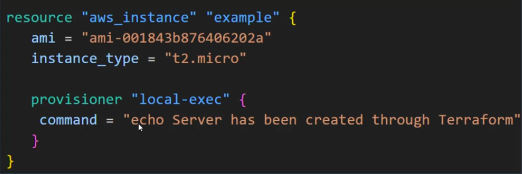
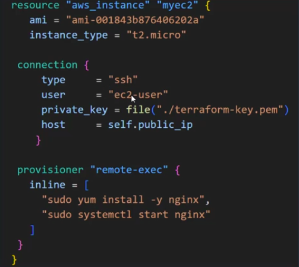
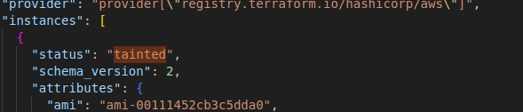
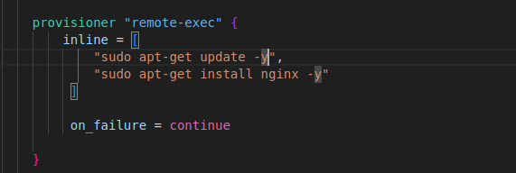

Providers
---

| Providers Tiers | Descriptions |
| --------------- | ------------ |
| Official | Owneed & Maintained by HashiCorp |
| Partner | Owned and Maintained by Technology company that maintains direct partnership with HashiCorp |
| Community | Owned and Maintained by Individual Contributors |

Provider Namespace
---

- Namespace are used to help users identify the org or publisher responsible for the integrations.

| Tier | Descriptions |
| ---- | ------------ | 
| Official | HashiCorp |
| Partner | Third-Party Org Ex. MongoDB/MongoDBAtlas |
| Community | Maintainer's individual or org account. Ex. DeviaVir/Gsuite |

Important Learnings
---

- To use Provider which is not maintained by HashiCorp, You have to explicit define the source info, using a new syntax in the `required_providers` nested block inside the terraform configurations block.

```t
# Default providers
provider "aws" {
    region = "ap-south-1"
    access_key = " "
    secret_key = " "
}

# External Providers

terraform {
    required_providers {
        digitalocean = {
            source = "digitaloceab/digitalocean"
        }
    }
}

provider "digitaloceab" {
    token = " "
}
```

##### Example for github providers

```t
terraform {
    required_providers {
        github = {
            source = "integrations/github"
            version = "~> 5.0"
        }
    }
}

provider "github" {}
```

To Delete/Destroy only specific resouces only during Terraform destroy
---

- Use `target`"resouce_type"."resource_name"

```tf
terraform destroy -target aws_instance.myec2
```

- If you provisioned resouces by terraform, and manually deleted that resouce.
- While you plan and want to apply , what will happens ?
- Will it create new resouces which is manually deleted ?
- Will it not create that resouces bcz .tfstate show still existing ?

- During terraform plan, after deleted manually, it will read resouces from resouces.tf and .tfstate , and also check with terraform refresh before terraform apply.
- So, here, .tfstate has existing resouce, but in terraform refresh, it doesn't exist.

- So, it will recreate that deleted resource.


To use diff version of aws provider and install it
---

- By default you use aws provider for latest version of 6.14
- You want to use aws provider version of 6.12
- Make chagne in provider.tf

```t
terraform {
    required_providers {
        github = {
            source = "integrations/github"
            version = "~> 5.0"
        }
# Added this aws provider for specific versions
        aws = {
            source = "hashicorp/aws"
            version = "6.12.0"
        }
    }
}
```

**Use diff versions with range.**

| Version Number Arguments | Descriptions |
| ------------------------ | ------------ |
| >=1.0 | Greater then or equal to version 1.0 will install |
| <=1.0 | Less then or equal to version 1.0 will install |
| ~>2.0 | Any versions in the range of > 2.0 range will install like 2.1 to 2.9 |
| >=2.10, <=2.30 | Any version between the range of 2.10 to 2.30 will install |


- If you simply use `terraform init` it will not install new version of aws provider.
- You will have to use install forcefully.

- Run this command to apply this new version forcefully
```bash
terraform init -upgrade
```

If you change/modify resouces manually after terraform apply, What will behavior of terraform ?
---

- You had deployed ec2 by tf, its have default security group.
- We will attach new security group to this EC2.

- If you see .tfstate after attache new SG to that EC2
- It will not updated new SG into it, It will show default SG only.

- Bcz, It will not update it directly.
```bash
terraform show terraform.tfstate
# OR
terraform plan
```


- To update into `terraform.tfstate` use this

```bash
terraform refresh
```


Dependency Lock File
---
- `.terraform.lock.hcl` file has info about which provider with which version has been installed.
- Ex. aws provider has version of 1.12.0, after 1 year there is new version is available for 1.14.1
- So terraform will not update to this newer version itself. Bcz, `.terraform.lock.hcl` will not allow to update the provider versions.

- To update provider version, use this command

```bash
terraform init -upgrade
```

**terraform refresh**

- If you made a changes on any resouces which had deployed by tf.
- You want to bring that changes into your terraform.tfstate file.
- Use `terraform.tfstate` command.

- **It is dangerous while,**

1. after deployed resouces by tf, you made changes in resouce.tf like you changed region from `us-east-1` to `ap-south-1`.
  - Then you run `terraform refresh`, you all data within `terraform.tfstate` file will be deleted.
  - So, you don't have to use this command in prod.

- But, still you can recover data of `terraform.tfstate` file, by `terraform.tfstate.backup` file.

Better approach for AWS Authentication for Terraform
---

```t
provider "aws" {
    access_key = "Your_Key"
    secret_key = "Your_Secrets"
    region = "us-east-1
}
```

- Here, you put your cred as hard coded.
- In many case, users are commits this secrets while pushing code into github. Your cred will leak.

- This is not approach.

1. Give your creds path

```t
provider "aws" {
    shared_config_files = ["/home/user1/.aws/config"]
    shared_credentials_files = ["/home/user1/.aws/creds"]
    profile = "customprofile" # This is for define which aws cli profiles to use config and creds.
}
```

Control multiple values with variables
---

- Use variable to change multiple values in main conf files to passing multiple values.

- create variable.tf 
- define varialbes like below

```t
variable "HTTPS" {
    default = "445"
    description = "Establish ssh"
}
```

- Use this varialbes in main config files via use of `var.ssh.port`.

```t
resource "aws_vpc_security_group_ingress_rule" "inbound_rule" {
  security_group_id = aws_security_group.my-sg.id
  # cidr_ipv4 = aws_vpc.main.cidr_block
  cidr_ipv4   = "${aws_eip.lb.public_ip}/32"
  from_port   = var.HTTPS_from
  to_port     = var.HTTPS_to
  ip_protocol = "tcp"

}
```

- You can make this multiple values as dynamics via using `terraform.tfvars` files.
- This `terraform.tfvars` will give variables values into `variable.tf` files.
- Then `variable.tf` file will put variable vaules into main config files.


- You have to use this `terraform.tfvars` file by

```bash
terraform plan -var-file="terraform.tfvars"
```

Which Precedence first ? variable.tf or terraform.tfvars ?
---

1. If variable.tf and terraform.tfvars has defined variables diff.

```t
# variable.tf
variable "HTTPS_from" {
  default = "22"
}

variable "HTTPS_to" {
  default = "22"
}

# terraform.tfvars
HTTPS_from = 443
HTTPS_to = 443
```

- Then, always `terraform.tfvars` will take first precedence.

**OUTPUT**


2. If `variable.tf` has defined value and `terraform.tfvars` is empty
- Alwasy `variable.tf` will take precedence.

```t
# variable.tf
variable "HTTPS_from" {
  default = "22"
}

variable "HTTPS_to" {
  default = "22"
}

# terraform.tfvars
// HTTPS_from = 443
// HTTPS_to = 443
```

**OUTPUT**


3. If You keep empty `variable.tf` and **not use** `terraform.tfvars` or **use `prod.tfvars`**.

- It will ask you for enter value.

```t
# variable.tf
variable "HTTPS_from" {
}

variable "HTTPS_to" {
}

# terraform.tfvars
// HTTPS_from = 443
// HTTPS_to = 443
```

**OUTPUT**


4. Define variables while in CLI & while in case of you did not specify variabels in `variable.tf` files.

```bash
terraform plan -var="HTTPS_from=445"
```

- To Pass multiple variables

```bash
terraform plan -var="HTTPS_from=445" -var="HTTPS_to=445"
```


Variable Definition Precedence
---

Terraform loads variables in the following order.

1. Variables - variable.tf
2. Environment variables - `export TF_VAR_instance_type=t2.micro`.
3. terraform.tfvars file, if present.
4. terraform.tfvars.json file, if present.
5. Any ***.auto.tfvars** or, ***.auto.tfvars.json** files,
6. Any **-var** and **-var-file** during runtime.

Data Types
---

| Data Types | Defined By | Descriptions |
| ---------- | ---------- | ------------ |
| string | "instance_id" | The character representing some text , like "hello". |
| numner | 1234 | A Numeric values |
| bool | true or false | Boolean values is defined by true or false |
| list | ["us-east-1", "ap-south-1"] | Defined by [""] to define list of values |
| set | et(string) | To define unique values | 
| map | {"key1=value1", "key2=value2"} | To define map values like tags |
| null | 


**List Example**

```t
variable "listdt" {
  type = list(string)
}

output "list_output" {
  value = var.listdt
}
```

**OutPut**
```bash
Changes to Outputs:
  + list_output = [
      + "listA",
      + "listB",
    ]
```

Fetching Data from Maps and List in variables
---

- If you have list of instance_type with `t2.micro`, `t3.medium`, `t2.small` in **map(list)** and want to use one of them instnace_type in resource of `aws_instance`.

- Refer **key** from that map.

```t
resource "aws_instance" "listec2" {
    ami = "ami-02d26659fd82cf299"
    instance_type = var.type_instance["ap-south-1"]
}

variable "list_instnace" {
    type = list
    default = ["m5.large", "m5.xlarge", "t2.medium"]
}

variable "type_instance" {
    type = map
    default = {
        us-east-1 = "t2.micro"
        ap-south-1 = "t2.nano"
        us-east-2 = "t2.small"
    }
}
```

- If you want to fetch data from MAP , Use Map's **key** as above.

- If you want to fetch data from list, use **[index_number]** of list as below

```t
resource "aws_instance" "listec2" {
    ami = "ami-02d26659fd82cf299"
    instance_type = var.list_instnace[0]
}
```

Create multiple EC2 by using `count`

- Just use `count=2` , so 2 diff ec2 instance will be created but with same tags and same EC2 instance name.

```t
resource "aws_instance" "listec2" {
    ami = "ami-02d26659fd82cf299"
    instance_type = var.type_instance["ap-south-1"]
    # instance_type = var.list_instnace[]
    count = 2

    tags = {
      Name = "EC2"
    }
}
```

**OutPut**
```bash
Terraform will perform the following actions:

  # aws_instance.listec2[0] will be created
  + resource "aws_instance" "listec2" {
      + ami                                  = "ami-02d26659fd82cf299"
      + arn                                  = (known after apply)
      + associate_public_ip_address          = (known after apply)
      + availability_zone                    = (known after apply)
      + disable_api_stop                     = (known after apply)
      + disable_api_termination              = (known after apply)
      + ebs_optimized                        = (known after apply)
      + enable_primary_ipv6                  = (known after apply)
      + force_destroy                        = false
      + get_password_data                    = false
      + host_id                              = (known after apply)
      + host_resource_group_arn              = (known after apply)
      + iam_instance_profile                 = (known after apply)
      + id                                   = (known after apply)
      + instance_initiated_shutdown_behavior = (known after apply)
      + instance_lifecycle                   = (known after apply)
      + instance_state                       = (known after apply)
      + instance_type                        = "t2.nano"
      + ipv6_address_count                   = (known after apply)
      + ipv6_addresses                       = (known after apply)
      + key_name                             = (known after apply)
      + monitoring                           = (known after apply)
      + outpost_arn                          = (known after apply)
      + password_data                        = (known after apply)
      + placement_group                      = (known after apply)
      + placement_group_id                   = (known after apply)
      + placement_partition_number           = (known after apply)
      + primary_network_interface_id         = (known after apply)
      + private_dns                          = (known after apply)
      + private_ip                           = (known after apply)
      + public_dns                           = (known after apply)
      + public_ip                            = (known after apply)
      + region                               = "ap-south-1"
      + secondary_private_ips                = (known after apply)
      + security_groups                      = (known after apply)
      + source_dest_check                    = true
      + spot_instance_request_id             = (known after apply)
      + subnet_id                            = (known after apply)
      + tags                                 = {
          + "Name" = "EC2"
        }
      + tags_all                             = {
          + "Name" = "EC2"
        }
      + tenancy                              = (known after apply)
      + user_data_base64                     = (known after apply)
      + user_data_replace_on_change          = false
      + vpc_security_group_ids               = (known after apply)
    }

  # aws_instance.listec2[1] will be created
  + resource "aws_instance" "listec2" {
      + ami                                  = "ami-02d26659fd82cf299"
      + arn                                  = (known after apply)
      + associate_public_ip_address          = (known after apply)
      + availability_zone                    = (known after apply)
      + disable_api_stop                     = (known after apply)
      + disable_api_termination              = (known after apply)
      + ebs_optimized                        = (known after apply)
      + enable_primary_ipv6                  = (known after apply)
      + force_destroy                        = false
      + get_password_data                    = false
      + host_id                              = (known after apply)
      + host_resource_group_arn              = (known after apply)
      + iam_instance_profile                 = (known after apply)
      + id                                   = (known after apply)
      + instance_initiated_shutdown_behavior = (known after apply)
      + instance_lifecycle                   = (known after apply)
      + instance_state                       = (known after apply)
      + instance_type                        = "t2.nano"
      + ipv6_address_count                   = (known after apply)
      + ipv6_addresses                       = (known after apply)
      + key_name                             = (known after apply)
      + monitoring                           = (known after apply)
      + outpost_arn                          = (known after apply)
      + password_data                        = (known after apply)
      + placement_group                      = (known after apply)
      + placement_group_id                   = (known after apply)
      + placement_partition_number           = (known after apply)
      + primary_network_interface_id         = (known after apply)
      + private_dns                          = (known after apply)
      + private_ip                           = (known after apply)
      + public_dns                           = (known after apply)
      + public_ip                            = (known after apply)
      + region                               = "ap-south-1"
      + secondary_private_ips                = (known after apply)
      + security_groups                      = (known after apply)
      + source_dest_check                    = true
      + spot_instance_request_id             = (known after apply)
      + subnet_id                            = (known after apply)
      + tags                                 = {
          + "Name" = "EC2"
        }
      + tags_all                             = {
          + "Name" = "EC2"
        }
      + tenancy                              = (known after apply)
      + user_data_base64                     = (known after apply)
      + user_data_replace_on_change          = false
      + vpc_security_group_ids               = (known after apply)
    }

Plan: 2 to add, 0 to change, 0 to destroy.
```

- So, To create multipl EC2 with Diff name of tags.
- Use `count.index` , this will create EC21, EC22 by indexing your tags `Name`.

```t
resource "aws_instance" "listec2" {
    ami = "ami-02d26659fd82cf299"
    instance_type = var.type_instance["ap-south-1"]
    # instance_type = var.list_instnace[]
    count = 2

    tags = {
      Name = "EC2${count.index}"
    }
}
```

**OutPut**


To create multiple EC2 or IAM User with diff name
---

- Use **[count.index]** as below as resouce block of `aws_iam_user` as list.
- write count = 4

- create variable with list(string) and define all 4 diff users
- Refer this list variable as var in `aws_iam_user` resouce block.

```t
resource "aws_iam_user" "my-user" {
  name = var.iam_user[count.index]
  count = 4
}

variable "iam_user" {
  type = list(string)
  default = [ "john", "blob", "micheal", "rick" ]
}
```

**OutPut**


For_Each Loops
---

- If a resource block includes a `for_each` meta-arguments whose value is a map or a set of strings, Terraform creates one instance for each memeber of that map or set.

- While you want to keep all things configuration same but only slightly changes with attributes like create multipple users, ec2 with diff name then `for_each` should use.



for_each with Map
---

```h
variable "mymap" {
  type = map
  default = {
    dev = "ami-1234"
    prod = "ami-5678"
  }
}

resource "aws_instance" "web" {
  for_each = var.mymap
  ami = each.value
  instance_type = "t3.micor"
  
  tags = {
    Name = each.key # here, `each.key` will read the key from var.mymap as like **dev** and **prod** and add into tags.
  }
}
```
Map Data Types
---


Object Data Types
---

- Object is also a collection of key-value pairs, but each value can be of a diff type.

- A proper structure is required while defining object data type.

- You can define diff data types within this Object data types like, `string`, `number` etc.

```h
variable "my-object" {
  type = object({Name = string, userID = number})
}
```


Conditional Expressions
---
```bash
conditions ? true_value:false_value
```

- If your condtions meets , then it will use true_value
- If your conditios doesn't meets, then it will use false_value

Conditional Expressions with multiple variables
---

- If 2 or more conditions are match then, it will use true_value.

```t
variable "region" {
    default = "ap-south-2"
}

variable "env" {
    default = "prod"
}

resource "aws_instance" "mult-var" {
    instance_type = var.env == "prod" && var.region == "ap-south-1" ? "t3.medium" : "t2.micro"
    ami = "ami-02d26659fd82cf299"
}
```

**OutPut**


Terraform Console (For Functions)
---

- Go to terraform console
```bash
terraform console

>
```

1. max() - find max values from inputs
```bash
max(10,20,30,40)

#OutPut
> 40
```

2. file() - Reads the contents of a file at the given path and returns them as a string.

```bash
> file("input.txt")
<<EOT
# OutPut
input 1
input 2

EOT
```

#### Importance of File Functions

  - You have to create and attach your own iam policy to iam user.
  - Which may be line of 20 or 50 lines.
  - You terraform code will becom a big and lengthy code.

  - We want to neat and clean code which is understable and made easy to configurations.

  - Instead of creat a new policy , if you have that file in you local or anywhere you can read that file and input it as in command.




Functions
---

`lookup()` - retrieves the value of a single element from a map, given its key. If the given key does not exist, the given default value is returned instead.

```bash
> lookup({a="ay", b="bee"}, "a", "what?")
ay
> lookup({a="ay", b="bee"}, "c", "what?")
what?
```

`element` retrieves a value from a list given its index.

```bash
element(list, index)

> element(["a", "b", "c"], 1)
"b"
```

`length` - determines the length of a given list, map, or string.

```bash
> length([])
0
> length(["a", "b"])
2
> length({"a" = "b"})
1
> length("hello")
5

> length("👾🕹️")
2
```

`formatdate` converts a timestamp into a different time format.

```bash
formatdate(spec, timestamp)
```

Challenge Functions
---

```t
provider "aws" {
    region = var.region
}

variable "region" {
  default = "us-east-1"
}

variable "tags" {
  type = list
  default = ["firstec2", "secondec2"]
}

variable "ami" {
  type = map
  default = {
    "us-east-1" = "ami-0360c520857e3138f"
    "us-west-1" = "ami-00271c85bf8a52b84"
    "ap-south-1" = "ami-02d26659fd82cf299"
  }
}


resource "aws_instance" "app-dev" {
    ami = lookup(var.ami, var.region)
    instance_type = "t2.micro"
    count = length(var.tags)

    tags = {
        Name = element(var.tags, count.index)
        CreationDate = formatdate("DD MM YYYY hh::mm:ZZZ",timestamp())
    }
}
```

- `ami` will use of **us-east-1** as input is given as **var.regions**.

`count` has length of 2 **firstec2** and **secondec2** so 2 diff vm will create

In **tags = {}** - `element` is used for Name key. so it will **fetch 2 diff tags as index from list**. and also used count.index to fetch auto index value from tags. so i dont get here will 2 diff tags will use for diff 2 vm or 2 diff tags will use in same vm ?

`element(var.tags, count.index)` → picks one value from the list per instance:

- First instance (count.index = 0) → "firstec2"

- Second instance (count.index = 1) → "secondec2"

- So each VM gets a different Name tag from your var.tags list.

- CreationDate will be same or slightly different depending on execution time.


Local Values
---

**Use Case**

You have lot of variables like ec2 tags, which will use for all 4 ec2.
You are generally use variable.tf and define all required vars into it.

Whenever you want to use this vars in your config file. you have to declare that vars like `var.instance_type` or `"${var.instance_name}-name-is-${var.tags.default}"`

- You have to declare this type of vars everytime which may be cause to **type error** and made a code lengthy and complex.

- You can use `local values` which is easy way to declare lot of or combination of vars into single value.

- 


Data Source
---

- Data sources allow to use / fetch information defined outside of terraform.
- Ex. Default VPC, local scripts , config files of nginx, secret files of k8s.

Fetch aws ami id for ubuntu in ap-south-1 regions.
---

```t
data "aws_ami" "ami" {
  region = var.Region
  most_recent = true
  owners = ["amazon"]

  filter {
    name   = "name"
    values = ["ubuntu-pro-minimal/images/hvm-ssd/ubuntu-jammy-amd64-pro-minimal-*"]
  }
}

output "ami-id" {
  value = data.aws_ami.ami.id
}
```

**OutPut**
```bash
Outputs:

ami-id = "ami-07a1a65fd30536aea"
```

- Use this ami id as ref to create a new ec2.

```h
resource "aws_instance" "ref-ami-id" {
  ami = data.aws_ami.ami.image_id
  instance_type = "t2.micro"
}
```


Debugging in terraform
---

- When you do terraform apply , due to some reason you got a error cause couldn't create a resource.
- In cli, we use -v to -vvvv for debug.
- For terraform, we have to enable debug by `export TF_LOG="Log_Level"`, which will gives all details during execution of terraform.

- To save this output in a file and dont want to see all details during execution, just give a file_path, `export TF_LOG_PATH="Your_file_path"`.

```bash
export TF_LOG=INFO

terraform plan
```

**OutPut**


- save logs into file

```bash
export TF_LOG_PATH="terraform-log.txt"

terraform plan
```

**NOTE**
- This `TF_LOG` and `TF_LOG_PATH` is just a `temporary solutions` for debugging.
- Whenever you **`start a new sessions`**, that debugging will **`not work`**, you have to export and set it again everytime.


Dynamic Block
---

- If you want to create a security group/ec2 with same configuration but with diff requirememts like diff ports, diff cidr block etc.

- You should use `dynamic block` 

- Suppose you want to make iteration over port for from_port and to_port for list of ports like 8000, 8001 etc.

```h
variable "sg_ports" {
    type = list(number)
    description = "list of ingress ports"
    default = [ 8200, 8201, 9000, 9200 ]
}

resource "aws_security_group" "dyn-sg" {
    name = "Dynamic_SG_TF"
    
    dynamic "ingress" {
        for_each = var.sg_ports
        content {
          from_port = ingress.value
          to_port = ingress.value
          protocol = "tcp"
          cidr_blocks = ["0.0.0.0/0"]
        }
      
    }
}
```

Taint the resources
---

- The `-replace` optino with terraform apply to force terraform to replace an object even though there are no configurations changes that would require it.

```h
terraform apply -replace="aws_instance.web
```

- This will delete that ec2 then re-create it.

| Approach                              | Usage                                                         | Status          |
| ------------------------------------- | ------------------------------------------------------------- | --------------- |
| `terraform taint <resource>`          | Marks resource tainted → needs 2 steps (`taint` then `apply`) | **Deprecated**  |
| `terraform apply -replace="resource"` | One-step → destroy + recreate that resource during apply      | **Recommended** |


Splat Expressions
---

- Splat Expressions allows us to get a list of all the attributes.

- Splat Expression is indicated by `[*]`.

```h
resource "aws_iam_user" "iam-u" {
  count = 3
  path = "/system/"
}

output "arns-iam" {
  value = aws_iam_user.iam-u.[*].arn
}
```

**OutPut**
```bash
Outputs:

arns-iam = [
  "arn:aws:iam::*********:user/system/user-0",
  "arn:aws:iam::*********:user/system/user-1",
  "arn:aws:iam::*********:user/system/user-2",
]
```

Terraform output
---

- The terraform output command is used to extract the value of an output variable from the state file.

```h
resource "aws_iam_user" "iam-u" {
  count = 3
  path = "/system/"
  name = 
}

output "arns-iam" {
  value = aws_iam_user.iam-u.[*].arn
}
```

**OutPut**
```bash
arns-iam = [
  "arn:aws:iam::*********:user/system/user-0",
  "arn:aws:iam::*********:user/system/user-1",
  "arn:aws:iam::*********:user/system/user-2",
```


Overview of zipmap functions
---

- The zipmap function constructs a map from a list of keys and a corresponding list of values.



```h
> zipmap(["pineapple", "oranges", "strawberry"], ["yellow", "oragnes", "red"])
{
  "oranges" = "oragnes"
  "pineapple" = "yellow"
  "strawberry" = "red"
}
>  
```

Terraform Resource behavior and meta arguments
---

**Terraform Refresh**

- If you had created ec2 via tf and then you create tags for that ec2 like `Name = My-EC2` and `Env = Prod`.

- During next execution of terraform, what will happens ?

- Terraform will refresh those manualy changes.
- This chagnes is not given in your conf file and doesn't match with `terraform.tfstate` and `terraform.tf` files.

- So, it will delete/remove those changes.




**Now you want to kepp those manually added tags, just want to ignore it**

**add lifecycle block**

```h
resource "aws_instance" "ec2" {
  instance_type = "t2.micor"
  ami = "ami-1234"

  tags = {
    Name = "My-EC2"
  }

  lifecycle {
    ignore_changes = [tags]
  }
}
```

Basic of Lifecycle Meta-Arguments
---

- There are Four argument available within the lifecycle block.

| Arguments | Descriptions |
| --------- | ------------ |
| **create_before_destroy** | New replacement object is created first, and the prior object is destroyed after the replacement is created |
| **prevent_destroy** | Terraform to reject with an error any plan that would destroy the infrastructure object associated with the resource |
| **ignore_changes** | Ignore certain changes to the live resource that does not match the configurations |
| **replace_triggered_by** | Replaces the resources when any of the referenced items change |


By default, when terraform must changes a resource arguments that can't be updated in-place due to remote API limitations, Terraform will instead destroy the existing object and then create a new replacement object with the new configured arguments.

Explainations
- When you modify resource on cloud provider portal manually, Terraform will update those changes or destroy and re-create that resources based on what did you changed ?

Ex. Changed instance_type from "t2.micro" to "t3.medium" for scaling. it will updated.

- If you changed its AMI, AWS will not allow to change resource, Terraform will recreate with that new AMI.


Dependencies
---

- `depends_on` - meta-arguments instructs terraform to complete all actions on the dependency object befor performing actions on the object declaring the dependency.

```h
resource "aws_instance" "example" {
  ami = "ami-1234"
  instance_type = "t2.medium"
  depends_on = [aws_s3_bucket.example]
}

resource "aws_s3_bucket" "example" {
  bucket = "s3_bucket"
}
```

 **case 1** `during executions` - While you make dependency for EC2, It will create first - S3 Bucket and then it will creat EC2.
 **case 2** `during destroy` - It will reverse order, first delete EC2 then it will delete S3 bucket.


Implicit vs Explicit Dependencies
---

`1. explicit dependencies` - are declared using the `depends_on` meta-arguments.

- You use this when there is no direct attribute reference, but you still need to control the order of resource creations.

- Terraform builds a dependency graph before creating resources.

- An implicit dependency means Terraform automatically understands that one resource depends on another without you explicitly telling it.

- This happens whenever you reference attributes of one resource inside another resource.

```h
resource "aws_vpc" "my_vpc" {
  cidr_block = "10.0.0.0/16"
}

resource "aws_subnet" "my_subnet" {
  vpc_id     = aws_vpc.my_vpc.id   # <-- reference creates implicit dependency
  cidr_block = "10.0.1.0/24"
}
```


Provisioners
---

- Provisioners are used to **execute script on a local and remote machines** as part of resource creation or destructions.

#### Types of Provisioners
1. local-exec
2. remote-exec

1. local-exec - Invokes a local executabble after a resource is created.

Ex. After launched EC2, fetch the IP address and Store it in file server_ip.txt

Ex. Run ansible playbook from local to remote.



2. remote-exec - Invoke script or run commands directly on the remote server

Ex. Establish SSH over EC2.

- Add connection block to define SSH to establish SSH over Server.

- Then write a Remote-Exec block to run multiple commands.




Basic of Creation-Time Provisioners
---

- Bydefault, Provisioners run when the resource they are defined within is  created.

- Create-Time Provisioners are **Only run during creations**, not during updating or any other lifecycle.

- The provisioners which is defined within resource block, so while your resource has been created after that your provisioner will runs. That is called **Creation-Time-Provisioners**.

Ex.
```h
resource "aws_instance" "life" {
    ami = "ami-00111452cb3c5dda0"
    instance_type = "t2.micro"

    provisioner "local-exec" {
      command = "echo ${self.private_ip} > private_IP.txt"
    }
}

output "private_IP" {
  value = aws_instance.life.private_ip
}
```

**If a creation-time provisioners `fails`, the resource is marked as `tainted`**.



At this tijme, Tainted resource will be planned for destroy and recreate during next terraform apply.

If you want to Not Marked Resource as Tainted if Provisioner fails ?
---

- You can use of **on_failure** settings can be used change the default bahavior.

| **Allowed Values** | Descriptions |
| ------------------ | ------------ |
| continue | Ignore the error and continue with creation or destructions |
| fail (default value) | Raise an error and stop applying. If this is a creation provisioner, taint the resources. Resource will marked as **tainted** .Terraform will stop and **show error**.|

- If provisioner fails , still resource will be created/ignored error



Destroy-Time Provisioners
---

- Destroy provisioners are run before the resource is destroyed.

Ex. Remove and De-Link Anti-Virus software before EC2 gets Terminated.

```h
resource "aws_instance" "life" {
    ami = "ami-00111452cb3c5dda0"
    instance_type = "t2.micro"

    provisioner "local-exec" {
        
        when = destroy

# when = destroy defined , that will run after destroy this resource and print "Destroy-Time Provisioners"

        command = "echo 'Destroy-Time Provisioners'"
    }
}
```
