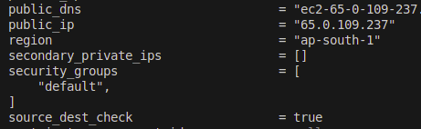

Providers
---

| Providers Tiers | Descriptions |
| --------------- | ------------ |
| Official | Owneed & Maintained by HashiCorp |
| Partner | Owned and Maintained by Technology company that maintains direct partnership with HashiCorp |
| Community | Owned and Maintained by Individual Contributors |

Provider Namespace
---

- Namespace are used to help users identify the org or publisher responsible for the integrations.

| Tier | Descriptions |
| ---- | ------------ | 
| Official | HashiCorp |
| Partner | Third-Party Org Ex. MongoDB/MongoDBAtlas |
| Community | Maintainer's individual or org account. Ex. DeviaVir/Gsuite |

Important Learnings
---

- To use Provider which is not maintained by HashiCorp, You have to explicit define the source info, using a new syntax in the `required_providers` nested block inside the terraform configurations block.

```json
# Default providers
provider "aws" {
    region = "ap-south-1"
    access_key = " "
    secret_key = " "
}

# External Providers

terraform {
    required_providers {
        digitalocean = {
            source = "digitaloceab/digitalocean"
        }
    }
}

provider "digitaloceab" {
    token = " "
}
```

##### Example for github providers

```json
terraform {
    required_providers {
        github = {
            source = "integrations/github"
            version = "~> 5.0"
        }
    }
}

provider "github" {}
```

To Delete/Destroy only specific resouces only during Terraform destroy
---

- Use `target`"resouce_type"."resource_name"

```tf
terraform destroy -target aws_instance.myec2
```

- If you provisioned resouces by terraform, and manually deleted that resouce.
- While you plan and want to apply , what will happens ?
- Will it create new resouces which is manually deleted ?
- Will it not create that resouces bcz .tfstate show still existing ?

- During terraform plan, after deleted manually, it will read resouces from resouces.tf and .tfstate , and also check with terraform refresh before terraform apply.
- So, here, .tfstate has existing resouce, but in terraform refresh, it doesn't exist.

- So, it will recreate that deleted resource.


To use diff version of aws provider and install it
---

- By default you use aws provider for latest version of 6.14
- You want to use aws provider version of 6.12
- Make chagne in provider.tf

```json
terraform {
    required_providers {
        github = {
            source = "integrations/github"
            version = "~> 5.0"
        }
# Added this aws provider for specific versions
        aws = {
            source = "hashicorp/aws"
            version = "6.12.0"
        }
    }
}
```

**Use diff versions with range.**

| Version Number Arguments | Descriptions |
| ------------------------ | ------------ |
| >=1.0 | Greater then or equal to version 1.0 will install |
| <=1.0 | Less then or equal to version 1.0 will install |
| ~>2.0 | Any versions in the range of > 2.0 range will install like 2.1 to 2.9 |
| >=2.10, <=2.30 | Any version between the range of 2.10 to 2.30 will install |


- If you simply use `terraform init` it will not install new version of aws provider.
- You will have to use install forcefully.

- Run this command to apply this new version forcefully
```bash
terraform init -upgrade
```

If you change/modify resouces manually after terraform apply, What will behavior of terraform ?
---

- You had deployed ec2 by tf, its have default security group.
- We will attach new security group to this EC2.

- If you see .tfstate after attache new SG to that EC2
- It will not updated new SG into it, It will show default SG only.

- Bcz, It will not update it directly.
```bash
terraform show terraform.tfstate
# OR
terraform plan
```



- To update into `terraform.tfstate` use this

```bash
terraform refresh
```


Dependency Lock File
---
- `.terraform.lock.hcl` file has info about which provider with which version has been installed.
- Ex. aws provider has version of 1.12.0, after 1 year there is new version is available for 1.14.1
- So terraform will not update to this newer version itself. Bcz, `.terraform.lock.hcl` will not allow to update the provider versions.

- To update provider version, use this command

```bash
terraform init -upgrade
```

**terraform refresh**

- If you made a changes on any resouces which had deployed by tf.
- You want to bring that changes into your terraform.tfstate file.
- Use `terraform.tfstate` command.

- **It is dangerous while,**

1. after deployed resouces by tf, you made changes in resouce.tf like you changed region from `us-east-1` to `ap-south-1`.
  - Then you run `terraform refresh`, you all data within `terraform.tfstate` file will be deleted.
  - So, you don't have to use this command in prod.

- But, still you can recover data of `terraform.tfstate` file, by `terraform.tfstate.backup` file.

Better approach for AWS Authentication for Terraform
---

```json
provider "aws" {
    access_key = "Your_Key"
    secret_key = "Your_Secrets"
    region = "us-east-1
}
```

- Here, you put your cred as hard coded.
- In many case, users are commits this secrets while pushing code into github. Your cred will leak.

- This is not approach.

1. Give your creds path

```json
provider "aws" {
    shared_config_files = ["/home/user1/.aws/config"]
    shared_credentials_files = ["/home/user1/.aws/creds"]
    profile = "customprofile" # This is for define which aws cli profiles to use config and creds.
}
```

Control multiple values with variables
---

- Use variable to change multiple values in main conf files to passing multiple values.

- create variable.tf 
- define varialbes like below

```json
variable "HTTPS" {
    default = "445"
    description = "Establish ssh"
}
```

- Use this varialbes in main config files via use of `var.ssh.port`.

```json
resource "aws_vpc_security_group_ingress_rule" "inbound_rule" {
  security_group_id = aws_security_group.my-sg.id
  # cidr_ipv4 = aws_vpc.main.cidr_block
  cidr_ipv4   = "${aws_eip.lb.public_ip}/32"
  from_port   = var.HTTPS_from
  to_port     = var.HTTPS_to
  ip_protocol = "tcp"

}
```

- You can make this multiple values as dynamics via using `terraform.tfvars` files.
- This `terraform.tfvars` will give variables values into `variable.tf` files.
- Then `variable.tf` file will put variable vaules into main config files.


- You have to use this `terraform.tfvars` file by

```bash
terraform plan -var-file="terraform.tfvars"
```

Which Precedence first ? variable.tf or terraform.tfvars ?
---

1. If variable.tf and terraform.tfvars has defined variables diff.

```json
# variable.tf
variable "HTTPS_from" {
  default = "22"
}

variable "HTTPS_to" {
  default = "22"
}

# terraform.tfvars
HTTPS_from = 443
HTTPS_to = 443
```

- Then, always `terraform.tfvars` will take first precedence.

**OUTPUT**


2. If `variable.tf` has defined value and `terraform.tfvars` is empty
- Alwasy `variable.tf` will take precedence.

```json
# variable.tf
variable "HTTPS_from" {
  default = "22"
}

variable "HTTPS_to" {
  default = "22"
}

# terraform.tfvars
// HTTPS_from = 443
// HTTPS_to = 443
```

**OUTPUT**


3. If You keep empty `variable.tf` and **not use** `terraform.tfvars` or **use `prod.tfvars`**.

- It will ask you for enter value.

```json
# variable.tf
variable "HTTPS_from" {
}

variable "HTTPS_to" {
}

# terraform.tfvars
// HTTPS_from = 443
// HTTPS_to = 443
```

**OUTPUT**


4. Define variables while in CLI & while in case of you did not specify variabels in `variable.tf` files.

```bash
terraform plan -var="HTTPS_from=445"
```

- To Pass multiple variables

```bash
terraform plan -var="HTTPS_from=445" -var="HTTPS_to=445"
```


Variable Definition Precedence
---

Terraform loads variables in the following order.

1. Variables - variable.tf
2. Environment variables - `export TF_VAR_instance_type=t2.micro`.
3. terraform.tfvars file, if present.
4. terraform.tfvars.json file, if present.
5. Any ***.auto.tfvars** or, ***.auto.tfvars.json** files,
6. Any **-var** and **-var-file** during runtime.

Data Types
---

| Data Types | Defined By | Descriptions |
| ---------- | ---------- | ------------ |
| string | "instance_id" | The character representing some text , like "hello". |
| numner | 1234 | A Numeric values |
| bool | true or false | Boolean values is defined by true or false |
| list | ["us-east-1", "ap-south-1"] | Defined by [""] to define list of values |
| set | et(string) | To define unique values | 
| map | {"key1=value1", "key2=value2"} | To define map values like tags |
| null | 


**List Example**

```json
variable "listdt" {
  type = list(string)
}

output "list_output" {
  value = var.listdt
}
```

**OutPut**
```bash
Changes to Outputs:
  + list_output = [
      + "listA",
      + "listB",
    ]
```

Fetching Data from Maps and List in variables
---

- If you have list of instance_type with `t2.micro`, `t3.medium`, `t2.small` in **map(list)** and want to use one of them instnace_type in resource of `aws_instance`.

- Refer **key** from that map.

```json
resource "aws_instance" "listec2" {
    ami = "ami-02d26659fd82cf299"
    instance_type = var.type_instance["ap-south-1"]
}

variable "list_instnace" {
    type = list
    default = ["m5.large", "m5.xlarge", "t2.medium"]
}

variable "type_instance" {
    type = map
    default = {
        us-east-1 = "t2.micro"
        ap-south-1 = "t2.nano"
        us-east-2 = "t2.small"
    }
}
```

- If you want to fetch data from MAP , Use Map's **key** as above.

- If you want to fetch data from list, use **[index_number]** of list as below

```json
resource "aws_instance" "listec2" {
    ami = "ami-02d26659fd82cf299"
    instance_type = var.list_instnace[0]
}
```

Create multiple EC2 by using `count`

- Just use `count=2` , so 2 diff ec2 instance will be created but with same tags and same EC2 instance name.

```json
resource "aws_instance" "listec2" {
    ami = "ami-02d26659fd82cf299"
    instance_type = var.type_instance["ap-south-1"]
    # instance_type = var.list_instnace[]
    count = 2

    tags = {
      Name = "EC2"
    }
}
```

**OutPut**
```bash
Terraform will perform the following actions:

  # aws_instance.listec2[0] will be created
  + resource "aws_instance" "listec2" {
      + ami                                  = "ami-02d26659fd82cf299"
      + arn                                  = (known after apply)
      + associate_public_ip_address          = (known after apply)
      + availability_zone                    = (known after apply)
      + disable_api_stop                     = (known after apply)
      + disable_api_termination              = (known after apply)
      + ebs_optimized                        = (known after apply)
      + enable_primary_ipv6                  = (known after apply)
      + force_destroy                        = false
      + get_password_data                    = false
      + host_id                              = (known after apply)
      + host_resource_group_arn              = (known after apply)
      + iam_instance_profile                 = (known after apply)
      + id                                   = (known after apply)
      + instance_initiated_shutdown_behavior = (known after apply)
      + instance_lifecycle                   = (known after apply)
      + instance_state                       = (known after apply)
      + instance_type                        = "t2.nano"
      + ipv6_address_count                   = (known after apply)
      + ipv6_addresses                       = (known after apply)
      + key_name                             = (known after apply)
      + monitoring                           = (known after apply)
      + outpost_arn                          = (known after apply)
      + password_data                        = (known after apply)
      + placement_group                      = (known after apply)
      + placement_group_id                   = (known after apply)
      + placement_partition_number           = (known after apply)
      + primary_network_interface_id         = (known after apply)
      + private_dns                          = (known after apply)
      + private_ip                           = (known after apply)
      + public_dns                           = (known after apply)
      + public_ip                            = (known after apply)
      + region                               = "ap-south-1"
      + secondary_private_ips                = (known after apply)
      + security_groups                      = (known after apply)
      + source_dest_check                    = true
      + spot_instance_request_id             = (known after apply)
      + subnet_id                            = (known after apply)
      + tags                                 = {
          + "Name" = "EC2"
        }
      + tags_all                             = {
          + "Name" = "EC2"
        }
      + tenancy                              = (known after apply)
      + user_data_base64                     = (known after apply)
      + user_data_replace_on_change          = false
      + vpc_security_group_ids               = (known after apply)
    }

  # aws_instance.listec2[1] will be created
  + resource "aws_instance" "listec2" {
      + ami                                  = "ami-02d26659fd82cf299"
      + arn                                  = (known after apply)
      + associate_public_ip_address          = (known after apply)
      + availability_zone                    = (known after apply)
      + disable_api_stop                     = (known after apply)
      + disable_api_termination              = (known after apply)
      + ebs_optimized                        = (known after apply)
      + enable_primary_ipv6                  = (known after apply)
      + force_destroy                        = false
      + get_password_data                    = false
      + host_id                              = (known after apply)
      + host_resource_group_arn              = (known after apply)
      + iam_instance_profile                 = (known after apply)
      + id                                   = (known after apply)
      + instance_initiated_shutdown_behavior = (known after apply)
      + instance_lifecycle                   = (known after apply)
      + instance_state                       = (known after apply)
      + instance_type                        = "t2.nano"
      + ipv6_address_count                   = (known after apply)
      + ipv6_addresses                       = (known after apply)
      + key_name                             = (known after apply)
      + monitoring                           = (known after apply)
      + outpost_arn                          = (known after apply)
      + password_data                        = (known after apply)
      + placement_group                      = (known after apply)
      + placement_group_id                   = (known after apply)
      + placement_partition_number           = (known after apply)
      + primary_network_interface_id         = (known after apply)
      + private_dns                          = (known after apply)
      + private_ip                           = (known after apply)
      + public_dns                           = (known after apply)
      + public_ip                            = (known after apply)
      + region                               = "ap-south-1"
      + secondary_private_ips                = (known after apply)
      + security_groups                      = (known after apply)
      + source_dest_check                    = true
      + spot_instance_request_id             = (known after apply)
      + subnet_id                            = (known after apply)
      + tags                                 = {
          + "Name" = "EC2"
        }
      + tags_all                             = {
          + "Name" = "EC2"
        }
      + tenancy                              = (known after apply)
      + user_data_base64                     = (known after apply)
      + user_data_replace_on_change          = false
      + vpc_security_group_ids               = (known after apply)
    }

Plan: 2 to add, 0 to change, 0 to destroy.
```

- So, To create multipl EC2 with Diff name of tags.
- Use `count.index` , this will create EC21, EC22 by indexing your tags `Name`.

```json
resource "aws_instance" "listec2" {
    ami = "ami-02d26659fd82cf299"
    instance_type = var.type_instance["ap-south-1"]
    # instance_type = var.list_instnace[]
    count = 2

    tags = {
      Name = "EC2${count.index}"
    }
}
```

**OutPut**


To create multiple EC2 or IAM User with diff name
---

- Use **[count.index]** as below as resouce block of `aws_iam_user` as list.
- write count = 4

- create variable with list(string) and define all 4 diff users
- Refer this list variable as var in `aws_iam_user` resouce block.

```json
resource "aws_iam_user" "my-user" {
  name = var.iam_user[count.index]
  count = 4
}

variable "iam_user" {
  type = list(string)
  default = [ "john", "blob", "micheal", "rick" ]
}
```

**OutPut**


Conditional Expressions
---
```bash
conditions ? true_value:false_value
```

- If your condtions meets , then it will use true_value
- If your conditios doesn't meets, then it will use false_value

Conditional Expressions with multiple variables
---

- If 2 or more conditions are match then, it will use true_value.

```t
variable "region" {
    default = "ap-south-2"
}

variable "env" {
    default = "prod"
}

resource "aws_instance" "mult-var" {
    instance_type = var.env == "prod" && var.region == "ap-south-1" ? "t3.medium" : "t2.micro"
    ami = "ami-02d26659fd82cf299"
}
```

**OutPut**

