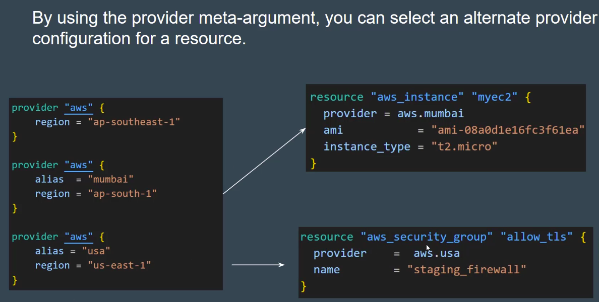
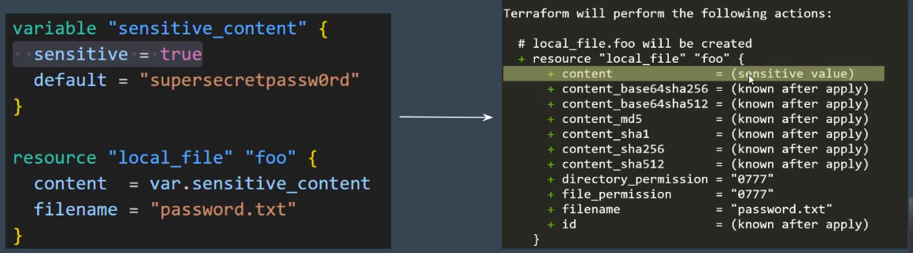
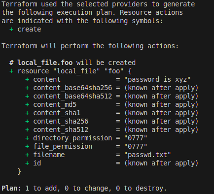
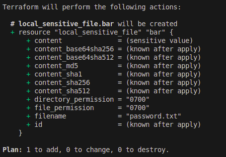
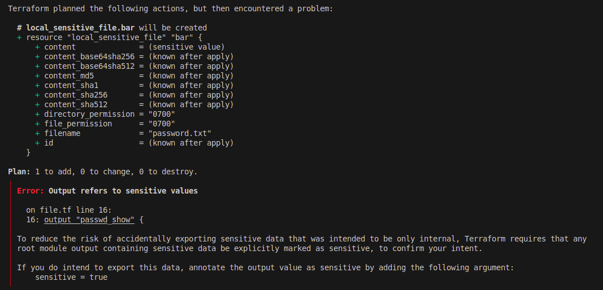
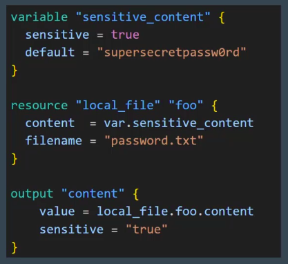
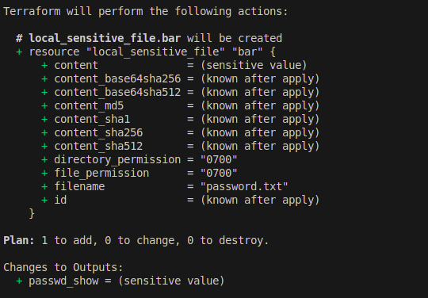
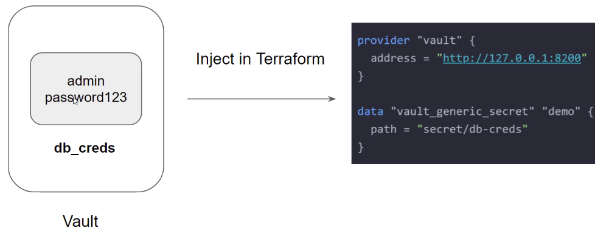
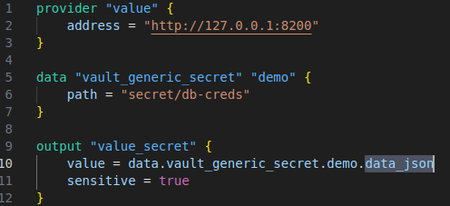
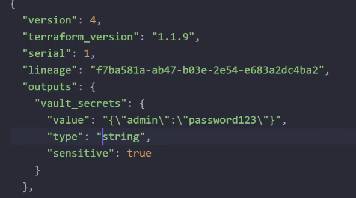

Alias
---

Use Multiple Provider block to provision resources at diff regions.

Use `provider = aws.<alias_name>` in resource block.



Sensitive Parameter
---

- Adding sensitive parameter ensures that you don't accidentally expose this data in CLI output, Log output.

- 1. Use **`sensitive = true`** to make secure and prevent from expose senesitive data.

- While you do terraform apply, the content of that resource will not visible.



- Without use of sensitive = true, it will print sensitive data during plan and apply



2. Use **`local_sensitive_file`** block instead of doesn't want to write sensitive = true in var.tf

```h
resource "local_sensitive_file" "bar" {
    filename = "password.txt"
    content = "passwd is xyz"
}
```




Sensitive Values & OutPut Values
---

- If you try to reference sensitive value in output values, Terraform will immediately give you an error.

```h
resource "local_sensitive_file" "bar" {
    filename = "password.txt"
    content = "passwd is xyz"
}

output "passwd_show" {
    value = local_sensitive_file.bar.content
  
}
```



- But You still want to pass this output into another modules.

- Just use `sensitive = true` in output.



- OutPut will be printed as sensitive.



**NOTE** - Even you speified sensitive parameter , It **WILL NOT PROTECT INFORMATION FROM STATE FILE**.

**terraform.tfstate** file will still content your sensitive data of output.


HashiCorp Vaults
---

- HashiCorp Vaults allows org to securely store secrets like tokens, paaswd, certificates along with access management for protecting secrets.

- Value can rotate and create new creds.


- To fetch your secret into vaults.

- Use provider as `vault` and define your valuts address.




- Write data block, use `valut_generic_secret` resource  give your secret path.

- The secrets is stored in ***.json**



- Show terraform.tfstate



- It is stored as key `"admin"` and value `"password123"`.

