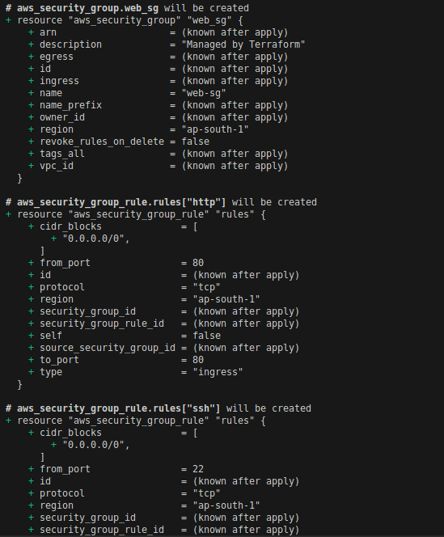
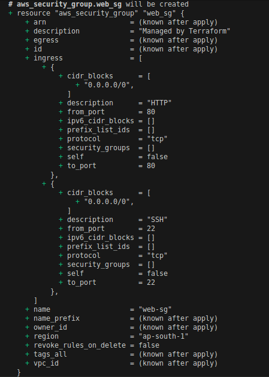

for_each use cases
---

- used to create multiple of single resource , data source or modules based on a collection `(map or set of strings).

- it will create separate resources like create separate 2 security group rules as below.

```h
locals {
  ingress_rules = {
    ssh  = { port = 22 }
    http = { port = 80 }
  }
}

resource "aws_security_group" "web_sg" {
  name = "web-sg"
}

resource "aws_security_group_rule" "rules" {
  for_each = local.ingress_rules

  type              = "ingress"
  from_port         = each.value.port
  to_port           = each.value.port
  protocol          = "tcp"
  cidr_blocks       = ["0.0.0.0/0"]
  security_group_id = aws_security_group.web_sg.id
}
```



- **Provisioning multiple identical resources:**

  - Creating multiple EC2 instances with similar configurations but different names or specific tags.
  - Deploying multiple S3 buckets for different purposes, where each bucket name is derived from a map key.
  - Spinning up multiple virtual networks, each in a different region, based on a list of regions.

- **Managing resources where order is not important:**
  - `for_each` is preferred over `count` when the `order of resources does not matter` and you need to refer to individual instances by a unique identifier (the map key or set element).

    - Ex. If your requirement should meet with this,

        - Based on the value specified in map, EC2 instances should be created accordingly.

        - If key/value is removed from the map, EC2 instance should also deleted accordingly.

        - Ex. If you add new instance , instance3 with its ami and instance_type, that instnace3 should create.
        
        - If you removed instance1 , that instance EC2 should also deleted.

    - You can you refer this case on this [for_each case](https://github.com/GitEic-Bhavin/DevOps_Tool/blob/master/Terraform-03/Challenges/1/README.md)

  - This `prevents unintended changes to remote objects` when an item is removed from the middle of a list.


Dynamic block use case
---

- `dynamic`  blocks are used to generate nested blocks within a resource or data source dynamically, based on a collection. This is `useful when the number or content of these nested blocks varies`. 

- Ex. it will create all security group rule within single resource `aws_security_group`. It will `not create seperate resource for each sg rule`.

```h
locals {
  ingress_rules = [
    { port = 22,  description = "SSH" },
    { port = 80,  description = "HTTP" }
  ]
}

resource "aws_security_group" "web_sg" {
  name = "web-sg"

  dynamic "ingress" {
    for_each = local.ingress_rules

    content {
      from_port   = ingress.value.port
      to_port     = ingress.value.port
      protocol    = "tcp"
      description = ingress.value.description
      cidr_blocks = ["0.0.0.0/0"]
    }
  }
}
```




Key Difference vs. for_each on Separate Resources
---

| Case                                        | Terraform Treats Each Rule As    | If You Delete One                                      |
| ------------------------------------------- | -------------------------------- | ------------------------------------------------------ |
| `for_each` on `aws_security_group_rule`     | **Separate resource**            | Terraform destroys that single rule resource           |
| `dynamic` block inside `aws_security_group` | **Part of the same SG resource** | Terraform updates the SG and removes that nested block |


for_each vs dynamic — When You Delete One Rule
---

| Aspect                                   | `for_each` (separate rule resources)                               | `dynamic` block (nested rules inside SG)                                          |
| ---------------------------------------- | ------------------------------------------------------------------ | --------------------------------------------------------------------------------- |
| **What’s created**                       | Multiple `aws_security_group_rule` resources                       | One `aws_security_group` with many `ingress` sub-blocks                           |
| **If you delete one rule from variable** | Terraform **destroys** that one `aws_security_group_rule` resource | Terraform **updates** the `aws_security_group` to remove that specific rule block |
| **Effect on Security Group**             | Security Group remains; only the deleted rule resource is removed  | Security Group remains; rule removed *within* the same resource                   |
| **State behavior**                       | Each rule tracked individually (easier lifecycle control)          | Rules tracked as part of the SG’s internal state                                  |
| **Terraform plan output**                | `- destroy aws_security_group_rule["rule_name"]`                   | `~ update in-place aws_security_group.web_sg` (rule block removed)                |
| **Speed & granularity**                  | More granular (each rule is independent)                           | Simpler configuration, but SG is updated as a whole                               |

**In short**

- Both remove the rule if it’s erased from the variable.

**Difference:**

- `for_each` → destroys a separate Terraform resource.

- `dynamic` → modifies the parent resource to remove that rule block.

**Example Behavior Summary**

| Action       | `for_each` Result            | `dynamic` Result               |
| ------------ | ---------------------------- | ------------------------------ |
| Add new rule | New rule resource created    | New rule block added inside SG |
| Modify rule  | That rule resource updated   | SG updated in-place            |
| Delete rule  | That rule resource destroyed | Rule block removed from SG     |
