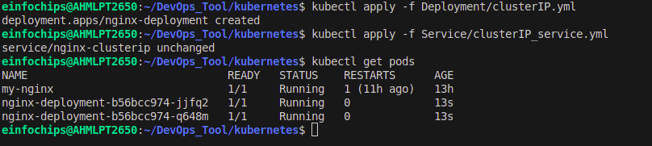
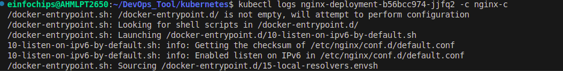
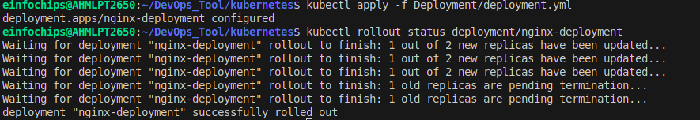
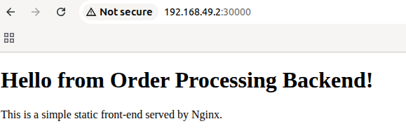

Kubernetes services types
---

1. ClusterIP
- Purpose: Internal communication only, inside the cluster.
- Accessible: Only from within the cluster.

2. NodePort

- Purpose: Expose service outside the cluster via a static port on all nodes.
- Accessible: <NodeIP>:<NodePort> from outside.
- Use case: Simple external access without load balancer.

3. LoadBalancer

- Purpose: Expose service externally via cloud provider load balancer.
- Accessible: Public IP assigned by cloud provider.
- Use case: Production apps needing external access with auto load balancing.

4. ExternalName

- Purpose: Maps service to an external DNS name.
- Accessible: Internally via service name; traffic goes to external DNS.
- Use case: Access external services from inside cluster using a service name.

1. ClusterIP Deployment.yml
```yml
apiVersion: apps/v1
kind: Deployment
metadata:
  name: nginx-deployment
spec:
  replicas: 2
  selector:
    matchLabels:
      app: nginx
  template:
    metadata:
      labels:
        app: nginx
    spec:
      containers:
      - name: nginx-c
        image: nginx:latest
        ports:
          - containerPort: 80
```

ClusterIP Service.yml
```yml
apiVersion: v1
kind: Service
metadata:
  name: nginx-clusterip
spec:
  selector:
    app: nginx
  type: ClusterIP
  ports:
  - name:  name-of-the-port
    port:  80
    targetPort:  81
```

- Create deployment and service for clusterIP
```bash
kubectl apply -f clusterIP.yml
kubectl apply -f clusterIP_service.yml

kubectl get pods
```


- To access clusterIP service, log into pods
```bash
kubectl exec -it <pod_name> /bin/bash

curl http://<cluster_service_name>
```

- To get logs for pods
```bash
kubectl logs <pod_name>
```

- To get logs of pod's container
```bash
kubectl logs <pod_name> -c <container_name>
# Container name you defined in service
```



To scale in or scale out the replicaset
```bash
kubectl scale --replicas=4 -f deployment.yml
```

Rollout
```bash
# Update your application by updating your docker image from nginx:latest to bhavin1099/orderprocess:v1

kubectl rollout status deployment/<deployment_name>
# Or you can update your img without modify your deployment.yml by using set

kubectl set image deployment/<deployment_name> <container-name>=bhavin1099/orderprocess:v1
```


- To see status of rollig out
```bash
kubectl rollout status deployment/<deployment_name>
```



- To undo existing rollout
```bash
kubectl rollout undo deployment/<deployment_name>
```

- To check history of rollout
```bash
kubectl rollout history deployment/<deployment_name>
```

- To roll back to revision number
```bash
kubectl rollout undo deployment/nginx-deployment --to-revision=1
```

